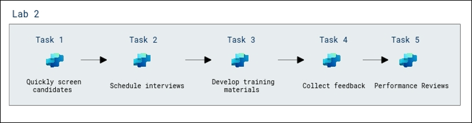

# Crear y ampliar agentes inteligentes

**Descripción general**

En este laboratorio, se concentrará en optimizar el proceso de
transición e incorporación de empleados dentro de una organización
utilizando Microsoft 365 Copilot y Copilot Studio. Aprenderá a
identificar candidatos adecuados, crear planes personalizados de
transición e incorporación, generar materiales de comunicación y
capacitación, automatizar flujos de trabajo de RR. HH., recopilar
retroalimentación y establecer mecanismos de monitoreo y revisión del
desempeño. Estas herramientas de IA permiten garantizar una transición
fluida, mejorar la movilidad interna y apoyar al empleado en su nuevo
rol.

**Objetivos**

Al finalizar este laboratorio, usted podrá:

- **Crear agentes asistentes de RR. HH. con Copilot Studio:**
  Automatizar el reclutamiento, la preselección, la creación de
  materiales de formación, la recolección de retroalimentación y las
  evaluaciones de desempeño utilizando Microsoft 365 Copilot.

- **Configurar un proyecto de IA y realizar chat completions:**
  Configurar un AI Project en Microsoft Foundry, implementar Large
  Language Models (LLMs) y modelos de embeddings, y conectar con VS Code
  para completar chat completions.

- **Crear un agente analizador de planes de seguro médico:** Crear
  agentes que procesen datos y generen visualizaciones (por ejemplo,
  gráficos de barras comparando planes de beneficios) usando Azure AI
  Services.

- **Desarrollar un sistema multiagente para la generación de reportes de
  planes de salud:** Diseñar sistemas donde agentes especializados
  (Search, Report, Validation y Orchestrator) trabajen de manera
  coordinada para realizar tareas complejas.

**Prerrequisitos**

Los participantes deben contar con:

- **Visual Studio Code (VS Code):** Dominio para codificar, depurar y
  gestionar extensiones.

- **Habilidades de desarrollo:** Conocimientos básicos en Python o
  JavaScript, experiencia con APIs y SDKs.

- **Command Line/Terminal:** Familiaridad con PowerShell y
  administración de entornos virtuales.

**Explicación de componentes**

- **Azure AI Search:** Servicio de búsqueda vectorial que permite
  implementar RAG.

- **Azure OpenAI Service:** Facilita acceso a GPT-4o y modelos de
  embeddings.

- **Large Language Models (LLMs):** Modelos avanzados para comprensión y
  generación de texto.

- **Embedding Models:** Transforman texto en vectores para búsqueda
  semántica (p. ej., text-embedding-3-large).

- **Microsoft 365 Copilot:** Herramienta de productividad basada en IA.

- **Semantic Kernel:** SDK para integrar LLMs con lenguajes y crear
  orquestación.

# Laboratorio 1: Crear un agente de asistencia de RR. HH. con Copilot studio

**Duración estimada:** 30 minutos

Descripción general  
  
En este laboratorio, se concentrará en optimizar el proceso de
transición e incorporación de empleados dentro de una organización
utilizando Microsoft 365 Copilot y Copilot Studio. Aprenderá a
identificar candidatos adecuados, crear planes personalizados de
transición e incorporación, generar materiales de comunicación y
capacitación, automatizar flujos de trabajo de RR. HH., recopilar
retroalimentación y establecer mecanismos de monitoreo y revisión del
desempeño. Estas herramientas de IA permiten garantizar una transición
fluida, mejorar la movilidad interna y apoyar al empleado en su nuevo
rol.

Objetivos del laboratorio

En este laboratorio realizará las siguientes tareas:

- Tarea 1: Filtrar candidatos rápidamente

- Tarea 2: Desarrollar materiales de capacitación

- Tarea 3: Recopilar retroalimentación

- Tarea 4: Revisiones de desempeño

Diagrama de arquitectura

## Tarea 1: Filtrar candidatos rápidamente

En esta tarea evaluará rápidamente numerosas postulaciones para el
puesto de Data Analyst utilizando Microsoft 365 Copilot para analizar
currículums y filtrar candidatos según experiencia relevante,
habilidades técnicas y formación académica. Copilot resaltará a los
mejores candidatos para revisión adicional.

1.  Abra una nueva pestaña en el navegador Edge y acceda a la aplicación
    **Microsoft 365 Copilot** usando el siguiente enlace, luego haga
    clic en **Sign in** **(2)**.

+++https://m365.cloud.microsoft/+++

2.  En la pestaña **Sign into Microsoft Azure**, verá la pantalla de
    inicio de sesión. Inicie sesión utilizando las siguientes
    credenciales:

- Username - +++@lab.CloudPortalCredential(User1).Username+++

- TAP - +++@lab.CloudPortalCredential(User1).TAP+++

3.  Si aparece la ventana emergente **Welcome to your Microsoft 365
    Copilot app**, haga clic en **Get started**.

4.  Desde el panel izquierdo, seleccione **Apps (1)**, luego haga clic
    en **OneDrive** **(2)** en la sección Apps.

**Nota:** Si aparece el mensaje emergente **Welcome to Apps**, cierre la
ventana  
haciendo clic en **X**.

5.  Vaya a **My files**, luego haga clic en el botón **+ Create or
    upload** **(1)** y seleccione **Folder upload** **(2).**

6.  Navegue a la ruta ***C:\LabFiles\Day-1\data* (1),** haga clic en la
    carpeta ***CV* (2)** y seleccione **Upload** **(3).**

7.  Seleccione **Upload** en la ventana emergente **Upload 5 files to
    this site?**

8.  Nuevamente, haga clic en **+ Create or upload** **(1)** y seleccione
    **Folder upload** **(2).**

9.  Navegue a **C:\LabFiles\Day-1 (1),** haga clic en la carpeta **data
    (2)** y luego en **Upload** **(3).**

10. Seleccione **Upload** en la ventana emergente **Upload 19 files to
    this site?**

11. Regrese a **M365 Copilot**, y desde el panel izquierdo seleccione
    **Apps** **(1)**, luego haga clic en **Copilot** **(2)**.

12. En el panel izquierdo, vaya a **Copilot**, haga clic en **Chat**
    **(1)**. Luego haga clic en el ícono **+ (Add)** **(2)** en la parte
    inferior del panel de chat y seleccione **Upload images and files**
    **(3).**

13. En la ventana del explorador de archivos, navegue a
    **C:\LabFiles\Day-1\data\CV (1)**, seleccione los primeros **3
    archivos (2)** y haga clic en **Open** **(3)**.

14. Una vez que los **3 archivos** se hayan cargado correctamente en el
    **chat de Copilot**, presione **Enter**.

15. En el chat activo de Copilot, haga clic nuevamente en el ícono **+
    (Add)** **(1)** debajo del cuadro de mensaje y seleccione **Upload
    images and files** **(2).**

16. En la ventana del explorador de archivos, navegue a
    **C:\LabFiles\Day-1\Data\CV (1)**, seleccione los últimos **2
    archivos (2)** y haga clic en **Open** **(3).**

17. Una vez que los **2 archivos (1)** se hayan cargado correctamente,
    presione **Enter** **(2).**

18. En el cuadro de chat, ingrese el siguiente **prompt (1)** y haga
    clic en **Send** **(2)**:

> Microsoft 365 Copilot, please help me filter and shortlist resumes of
> Data Analyst candidates based on required qualifications such as
> experience in SQL, Python, and data visualization tools.

19. Luego ingrese el siguiente prompt y haga clic en **Send**:

> Create a summary report of top Data Analyst candidates, including
> their skills, work experience, and educational background.
>
> 

**Resultado**: El equipo de RR. HH. identifica eficientemente a los
candidatos más calificados, ahorrando tiempo y garantizando un proceso
de selección más preciso.

## Tarea 2: Desarrollar materiales de capacitación.

En esta tarea, preparará materiales de capacitación completos para el
nuevo empleado mediante Microsoft Copilot. Creará contenido
personalizado para el proceso de incorporación, que incluirá guías
específicas del rol, políticas internas y un panorama general de las
herramientas y tecnologías utilizadas.

1.  En el cuadro de chat, ingrese el siguiente **prompt (1)** y haga
    clic en **Send** **(2)**:

> Generate a comprehensive onboarding training plan for the new Data
> Analyst, including topics like company policies, data tools training,
> and team introductions.
>
>  

2.  Luego ingrese el siguiente **prompt (1)** y haga clic en **Send**
    **(2)**:

> Create an interactive training presentation covering data analysis
> best practices and key performance metrics and generate a downloadable
> PPT.
>
> 

**Nota:** Tras ejecutar este prompt obtendrá un archivo PowerPoint
descargable. Si no aparece, busque el hipervínculo con el título de la
presentación.  
**Nota:** Si no aparece la opción de descargar, ejecute nuevamente el
prompt.

Resultado: El nuevo empleado recibe materiales de capacitación bien
estructurados, permitiéndole adaptarse rápidamente y desempeñar sus
funciones de manera eficaz.

## Tarea 3: Recopilar retroalimentación

En esta tarea, recopilará retroalimentación de nuevos empleados y
entrevistadores utilizando Microsoft Copilot para generar encuestas,
analizarlas y obtener información clave sobre las mejoras necesarias en
el proceso de reclutamiento e incorporación.

1.  En el cuadro de chat, ingrese el siguiente prompt y haga clic en
    **Send**:

> Create a feedback form for interviewers to evaluate Data Analyst
> candidates based on technical skills, problem-solving abilities, and
> cultural fit Generate a downloadable Word or PDF version of this
> feedback form.

2.  Luego ingrese el siguiente prompt y haga clic en **Send**.

> Send out a survey to new hires to gather feedback on their onboarding
> experience and identify areas for improvement Generate a downloadable
> Word or PDF version of the survey.
>
> 
>
> **Resultado:** RR. HH. obtiene retroalimentación valiosa que permite
> optimizar el proceso de selección y mejorar la experiencia de futuros
> empleados.

## Tarea 4: Revisiones de desempeño

En esta tarea realizará evaluaciones periódicas para medir el progreso
del nuevo empleado usando Microsoft Copilot para generar plantillas de
evaluación, programar reuniones, rastrear logros y recopilar
retroalimentación.

1.  En el cuadro de chat, ingrese el siguiente prompt y haga clic en
    **Send**:

> Set up a performance review schedule for the new Data Analyst, with
> quarterly reviews and goal-setting sessions and Generate a calender
> CSV file.

2.  Luego ingrese el siguiente prompt y haga clic en **Send**:

> Generate a template for performance review reports, including sections
> for achievements, areas of improvement, and future goals Generate a
> performance review template.
>
> 
>
> **Resultado:** El nuevo empleado recibe retroalimentación clara y
> soporte continuo, lo que impulsa su crecimiento profesional y éxito
> dentro de la empresa.
>
> **Resumen**
>
> En este laboratorio, creó un agente de asistencia de RR. HH.
> utilizando Microsoft 365 Copilot para optimizar los procesos de
> reclutamiento e incorporación. Aprendió a filtrar candidatos
> analizando currículums, generar planes de capacitación, crear
> presentaciones interactivas, elaborar formularios de
> retroalimentación, enviar encuestas y establecer calendarios de
> revisión de desempeño. Al emplear herramientas impulsadas por IA,
> demostró cómo automatizar los flujos de trabajo de RR. HH. y mejorar
> la eficiencia operativa.
