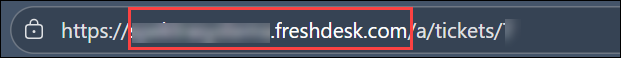

# AI 에이전트를 대규모로 관리, 보안 및 모니터링하기

**개요**

이 실습은 Azure AI 에이전트 서비스 SDK와 Microsoft Foundry를 사용하여 AI
에이전트를 대규모로 관리, 보안 및 모니터링하는 데 중점을 둡니다.
참가자들은 OpenTelemetry 통합과 Azure Application Insights를 통해 AI
에이전트를 관찰하고 관리하는 AgentOps부터 시작해 엔터프라이즈 AI 배포에
필수적인 운영 수준의 실천 방식을 깊이 있게 다룰 예정입니다. 이 워크숍은
공정성, 신뢰성, 프라이버시, 책임성 등 Microsoft의 여섯 가지 기본 원칙을
구현함으로써 혐오 발언, 폭력, 민감한 정보와 같은 유해한 출력을 감지하고
차단하는 구성 가능한 콘텐츠 안전 필터를 통해 책임 있는 AI의 중요성을
강조합니다. 또한, 참가자들은 전문 AI 에이전트가 의심스러운 활동을
분석하고 고위험 사건을 인간 분석가에게 지능적으로 전달하여 중요한
의사결정을 내리도록 하는 사기 탐지 시스템을 통해 정교한
Human-in-the-loop (HITL) 워크플로우를 구축할 것입니다. 실습 전반에 걸쳐
검색, 검증, 오케스트레이션 작업을 다루는 멀티 에이전트 시스템과
협력하며, end-to-end 추적, 맞춤형 지표 시각화, 성과 모니터링 대시보드,
실시간 워크플로우 관리 등 실무 경험을 쌓게 됩니다. 워크숍이 끝날 무렵,
참가자들은 기업 환경에서 AI 에이전트를 배치, 모니터링, 관리하는 데
필수적인 기술을 숙달하여, 조직 정책과 규제 요건을 준수하면서 대규모로
안전하고 윤리적이며 효율적으로 운영되도록 보장합니다.

**목적**

이 실습이 끝날때 다음을 수행할 수 있습니다:

- **관찰 가능성 및 모니터링 활성화**: Azure Application Insights와
  통합된 OpenTelemetry를 사용하여 AI 에이전트를 위한 end-to-end 추적 및
  텔레메트리를 구현하여 에이전트의 행동, 성과 지표, 실행 추적을
  포착합니다

- **에이전트 지표 시각화**: Application Insights에서 맞춤형 대시보드와
  워크북을 만들어 에이전트 성능, 응답 시간, 토큰 사용, 라우팅 정확도,
  시스템 상태를 실시간으로 모니터링하세요

- **책임 있는 AI 관행 구현:** Microsoft Foundry에서 콘텐츠 안전 필터를
  설정하여 유해한 출력(증오 발언, 폭력, 민감한 콘텐츠)을 감지하고
  차단하며, 윤리적이고 준수하는 AI 행동을 보장합니다

- **인간 참여 워크플로우 구축**: AI 에이전트가 경고를 분석하고 고위험
  사례를 인간 분석가에게 전달하여 검토 및 의사결정을 수행하는 사기 탐지
  시스템을 설계하고 배포합니다

- **다중 에이전트 시스템 모니터링**: 에이전트 간 통신을 추적하고, 여러
  전문 에이전트에 분산된 워크플로우를 추적하며, 복잡한 에이전트
  오케스트레이션에서 병목 현상이나 실패를 식별합니다

구성 요소 설명

- **Microsoft Foundry**: 기업용 AI 애플리케이션을 위한 중앙 집중식
  거버넌스, 관측 가능성, 준수 기능을 갖춘 AI 모델을 개발, 배포 및
  관리하는 클라우드 기반 플랫폼입니다.

- **Azure AI Hub**: 팀들이 공유 자원과 거버넌스 정책을 통해 AI
  애플리케이션을 구축, 관리, 배포할 수 있도록 중앙에서 안전하고 협력적인
  환경을 제공하는 최상위 Azure 리소스입니다.

- **Azure AI Search**: 벡터 기반 검색 서비스는 관련 문서를 인덱싱하고
  검색하여 기반 정보를 바탕으로 AI 생성 응답을 개선함으로써
  Retrieval-Augmented Generation (RAG)을 가능하게 합니다.

- **Azure AI Services**: 시각, 언어, 음성 및 의사결정 능력을 위한 사전
  구축되고 맞춤화 가능한 API와 모델을 제공하는 클라우드 기반 AI 서비스
  모음입니다.

- **OpenTelemetry**: 분산 추적, 지표, 로깅을 위한 오픈 표준으로,
  Microsoft Agent Framework에 네이티브로 통합되어 에이전트 실행 추적,
  성능 지표, 오류 추적을 포착합니다.

- **Content Safety Filters**: Microsoft Foundry에 내장된 필터링 시스템이
  증오 발언, 폭력, 성적 콘텐츠, 민감한 정보(PII) 등 다양한 범주에서
  유해한 출력물을 자동으로 감지하고 차단합니다.

- **LLMs 및 임베딩**: Large Language Models은 자연어 이해와 생성을
  제공하며, 임베딩은 AI 응용에서 텍스트 유사성, 검색 및 지식 검색에
  사용되는 벡터 표현입니다.

# 실습 10: 전제 조건 - 지식 인덱스 및 티켓팅 시스템 설정

**예상 소요 시간**: 30분

**개요**

이 필수 실습에서는 AI 기반 워크플로우를 구축하여 기업 지식을 검색하고
지원 티켓을 자동으로 생성할 수 있는 기본 구성 요소를 설정하게 됩니다. 이
작업의 초점은 검색 가능한 지식 기반을 준비하고, AI 에이전트가 MCP (Model
Context Protocol) 도구를 사용해 해당 지식을 조회할 수 있도록 하며, 하위
작업을 위한 티켓팅 시스템을 통합하는 데 있습니다.

이 작업을 완료함으로써 에이전트가:

- 색인화된 데이터에서 관련 정보를 검색합니다

- 대화나 작업 흐름에서 그 정보를 맥락에 맞게 활용합니다

- 외부 서비스에서 티켓을 생성하여 문제를 에스컬레이션합니다

이 구조는 이후 실습이 원활하게 운영되고 실제 기업 상황을 반영하도록
보장합니다.

실습 목표

이 실습네서 다음과 같은 작업을 수행하게 됩니다.

- 작업 1: 지식 인덱스 준비하기

- 작업 2: 티켓 관리를 위해 Freshworks 설정하기

## 작업 1: Azure 리소스를 생성하기

이 작업에서는 이 실험실을 수행하는 데 필요한 모든 Azure 리소스를
생성하게 됩니다.

### 작업 1.1: 스토리지 계정을 생성하기

1.  다음 자격 증명을 사용하여 Azure portal에
    +++https://portal.azure.com+++로 로그인하고 Storage accounts를
    선택하세요.

- 사용자 이름 - +++@lab.CloudPortalCredential(User1).Username+++

- TAP - <+++@lab.CloudPortalCredential(User1).TAP>+++

> 

2.  **Create**를 선택하세요.

3.  다음 정보를 입력하고 **Review + create**를 선택하세요. 다음 화면에서
    Create를 선택하세요.

- 스토리지 계정 이름 – +++aistorage@lab.LabInstance.Id+++

- 선호하는 저장 유형 – **Azure Blob Storage or Azure Data Lake Storage
  Gen2**를 선택하세요

> 
>
> 

4.  리소스가 생성해지면 **Go to resource**를 선택하세요.

5.  **Upload**를 선택하고 컨테이너를 생성하려면 **Create new**를
    선택하세요. 이름을 +++**datasets**+++로 입력하고 **Ok**를
    선택하세요.

6.  **Browse for files**을 선택하고 **C:\Labfiles\Day 2**에서 정책
    파일을 선택하고 **Upload**를 클릭하세요.

이제 스토리지 계정이 성공적으로 생성되고 정책 문서가 로드되었습니다.

### 작업 1.2: Foundry 리소스를 생성하기

이 작업에서는 Microsoft Foundry에 접근하기 위해 필요한 Foundry 리소스를
생성하게 됩니다.

1.  Azure portal(+++https://portal.azure.com+++)의 홈페이지에서
    **Foundry**를 선택하세요.

2.  왼쪽 창에서 **Foundry**를 선택하고 Foundry 리소스를 생성하려면
    **Create**를 선택하세요.

3.  다음 정보를 입력하고 **Review + create**를 선택하세요.

- Name – <+++agentic-@lab.LabInstance.Id>+++

- Default project name – <+++agentic-ai-project-@lab.LabInstance.Id>+++

4.  검증되면 **Create**를 선택하세요.

5.  리소스가 생성했는지 확인하세요.

6.  [**agentic-ai-project-@lab.LabInstance.Id**](mailto:agentic-ai-project-@lab.LabInstance.Id)를
    열고 **Go to Foundry portal**을 선택하세요.

> 

7.  Microsoft Foundry에서 왼쪽 창에서 Models + endpoints를 선택하세요. +
    **Deploy model** -\> **Deploy base model**을 선택하세요.

8.  +++gpt-4o-mini+++를 검색하고 선택하고 Confirm을 클릭하고 모델을
    배포하세요.

9.  배포 창에서 **Deploy**를 선택하세요.

10. 마찬가지로 +++text-embedding-ada-002+++를 검색하고 배포하세요.

이 작업에서는 Foundry 리소스를 성공적으로 생성하고 채팅과 임베딩 모델을
배포했습니다.

### 작업 1.3: 애플리케이션 인사이트를 생성하기

이 작업에서는 모니터링에 필요한 애플리케이션 인사이트 리소스를 생성하게
됩니다.

1.  Azure 포털의 홈페이지에서 **Subscriptions**을 선택하고 할당된 구독을
    선택하세요.

2.  왼쪽 창에서 **Resource providers**를 선택하세요.

3.  +++Operational+++를 검색하고 **Microsoft.OperationalInsights** 옆의
    3점을 선택하고 **Register**를 클릭하세요.

4.  Microsoft Foundry의 왼쪽 창에서 **Monitoring**을 선택하세요.

5.  **Create New** -\>를 선택하고 이름을
    <+++agent-insights-@lab.LabInstance.Id>+++로 입력하고 **Create**를
    선택하세요.

이 작업에서는 애플리케이션 인사이트 리소스를 생성했습니다.

### 작업 1.4: 검색 리소스를 생성하기

AI 에이전트가 기업 질문에 정확히 답하기 전에, 신뢰할 수 있는 데이터
소스에 접근해야 합니다. Azure AI Search는 정책, 계약서, 매뉴얼과 같은
문서를 색인화하여 Retrieval-Augmented Generation (RAG)을 가능하게
합니다. 인덱스는 검색 가능한 카탈로그처럼 작용하여 콘텐츠를 조각으로
나누고 메타데이터를 추가하며, 대화 중에 에이전트가 올바른 정보를 검색할
수 있게 합니다.

이 작업에서는 Azure AI 검색을 사용해 업로드된 문서를 색인화하여 검색
가능한 지식 베이스를 생성합니다.

1.  Azure 포털의 홈페이지에서 **Foundry**를 선택하세요.

2.  왼쪽 창에서 **AI Search**를 선택하고 **+ Create**를 선택하세요.

3.  다음 정보를 입력하고 **Review + create**를 선택하세요.

- Service name - +++ai-knowledge-@lab.LabInstance.Id+++

- Region - East US2

> 

4.  검증이 되면 **Create**를 선택하세요. 리소스가 생성해지면 Go to
    resource를 선택하세요.

5.  **Import data (new)**를 선택하세요.

6.  **Choose data source**에서 **Azure Blob Storage**를 선택하세요.

7.  다음 창에서 검색 기반 에이전트를 개발 중이라 **RAG** 옵션을
    선택하세요.

> 각 옵션의 목적은 다음과 같습니다 -

1)  **키워드 검색:** 정확한 키워드를 기반으로 한 전통적인 검색 경험에
    사용됩니다. 이 시스템은 텍스트를 색인화하여 사용자가 AI 추론 없이
    키워드 매칭을 통해 정보를 찾을 수 있도록 합니다.

2)  **RAG (Retrieval-Augmented Generation):** 문서 검색과 AI 생성을
    결합합니다. 텍스트(및 간단한 OCR 이미지)를 흡수하여 AI 에이전트가
    현실적이고 맥락 인식에 맞는 답변을 제공할 수 있습니다.

3)  **멀티모달 RAG:** RAG를 확장하여 다이어그램, 표, 워크플로우, 차트 등
    복잡한 시각 콘텐츠를 처리합니다. AI는 텍스트와 시각적 요소를 모두
    해석하여 더 풍부하고 통찰력 기반의 응답을 가능하게 합니다.

&nbsp;

8.  **Storage account** 및**datasets** **under Blob container**의
    <aistorage@lab.LabInstance.Id>를 선택하고 **Next**를 선택하세요.

9.  다음 정보응 입력하고 **Next**를 선택하세요.

- Kind – Azure AI Foundry (Preview)

- Azure AI Foundry/Hub project –
  <agentic-ai-project-@lab.LabInstance.Id>

- Model deployment – text-embedding-002-ada

10. **Review and create** 화면이 나타낼 때 까지 다음 화면에서 **Next**를
    선택하세요.

11. **Review and create** 화면에서 **Create**를 선택하세요.

12. Create succeeded 대화상자에서 **Close**를 선택하세요.

데이터세트를 Azure AI Search에 성공적으로 인상하고 검색 가능한 인덱스를
만들었습니다. 다음 작업에서는 AI 에이전트를 생성하고 이 인덱스를 지식
소스로 연결하세요.

# 작업 2: 티켓 관리를 위한 Freshworks 설정하기

이 작업에서는 Freshworks를 설정하고 구성하여 다중 에이전트 시스템의 티켓
관리와 엔터프라이즈 통합을 가능하게 합니다.

**Freshworks**는 고객 지원 운영을 개선하고 사용자 만족도를 높이기 위해
설계된 클라우드 기반 고객 서비스 및 참여 플랫폼입니다. 티켓 관리, 라이브
채팅, 헬프 센터 생성, 고객 셀프 서비스 등 다양한 도구를 제공합니다.
Freshworks는 Omnichannel 커뮤니케이션을 지원하여, 기업이 이메일, 채팅,
전화, 소셜 미디어 전반에 걸친 고객 상호작용을 중앙 집중식 인터페이스에서
관리할 수 있도록 합니다. 자동화 기능은 워크플로우를 간소화하고, 티켓을
할당하며, 성과 추적을 위한 분석 기능을 제공합니다. 이제 Freshworks
계정을 개설할 것입니다.

1.  URL을 복사해서 VM 내 브라우저의 새 탭에 붙여넣으면 **Freshworks**
    포털을 여세요.

    - URL:

> +++https://www.freshworks.com/freshdesk/lp/home/?tactic_id=3387224&utm_source=google-adwords&utm_medium=FD-Search-Brand-India&utm_campaign=FD-Search-Brand-India&utm_term=freshdesk&device=c&matchtype=e&network=g&gclid=EAIaIQobChMIuOK90qvLjQMV_dQWBR3JAi9VEAAYASAAEgK87_D_BwE&audience=kwd-30002131023&ad_id=282519464145&gad_source=1&gad_campaignid=671502402+++

2.  포털에서 무료 체험판을 시작하려면 **Start free trial**을 선택하세요.

3.  다음 창에서 다음 정보를 입력하고 **Try it free (6)**을 클릭하세요:

    - **First name:** LODS

    - **Last name:** User1

    &nbsp;

    - **Work
      email:** **+++@lab.CloudPortalCredential(User1).Username+++**

    &nbsp;

    - **Company name:** Zava

    - **Organization size: 1-10**을 선택하세요

> 

4.  다음 창에서 다음 정보를 **Next (4)**를 클릭하세요:

    - **What industry are you from ?:** 목록에서 **Software and internet
      (1)**을 선택하세요

    - **How many employees are there in your company?:** **1-10 (2)**를
      선택하세요

    - **I'm trying customer service software for the first time (3)**을
      선택하세요

5.  완료 후에는 제공된 URL을 복사해서 VM 내 브라우저 새 탭에 붙여넣어
    **Outlook** 열기 위해 사용하세요.

    - URL:

> +++https://go.microsoft.com/fwlink/p/?LinkID=2125442&clcid=0x409&culture=en-us&country=us+++

6.  계정 선택 창에서 이 실습에 할당된 계정을 선택하세요.

7.  Freshworks 검증 이메일에서 열고 **Activate Account**를 클릭하세요.

> 

**참고:** Freshworks의 활성화 이메일을 찾지 못하셨다면, 이메일 전달에
지연이 있을 수 있으니 잠시 기다리세요. 이메일이 도착하지 않는다면,
새로운 비공개/시크릿 창에서 무료 체험 활성화 단계를 다시 시작하는 것을
고려해 보세요. 또한, 스팸이나 스팸 메일함도 확인해 보세요. 이메일이
필터링되었을 수도 있습니다.

8.  다음 창에서 **Enter password (1)**을 입력하고 **Confirm password
    (2)**에 동일한 비밀번호를 입력하세요. **Activate your account
    (3)**을 클릭하세요.

> 

9.  포털에 들어가면 오른쪽 상단의 **Profile (1)** 아이콘을 클릭하고
    **Profile setting (2)**을 선택하세요.

10. 프로필 페이지에서 API Key를 가지려면 **View API Key**를 클릭하세요.

**참고:** 이 옵션을 찾지 못하면 **CTRL + -** 로 화면 크기를
최소화하세요**.**.

11. 다음 창에서 **CAPTCHA**를 완료했습니다.

12. API 키를 노트패드에 복사하세요. 앞으로 이 기능을 사용할 예정입니다.

13. 브라우저 탭에서 표시된 **Account URL**을 복사하고 값을 메모장에
    복사하세요. 이 기능을 더 활용할 것입니다.

**요약**

이 필수 실습을 완료함으로써 end-to-end 에이전트 워크플로우의 필수 기반을
마련한 것입니다. 검색 가능한 지식 인덱스를 준비하고, 에이전트가 **Azure
AI Search**에 구축된 MCP 도구를 통해 데이터를 조회할 수 있도록 했으며,
자동 티켓 관리를 위한 **Freshworks**를 통합했습니다.

이 기반은 에이전트가 정확한 맥락을 수집하고, 정보에 기반한 결정을
내리며, 문제를 효율적으로 에스컬레이션하여 향후 실험실에서 진행될 더
고급 에이전트 기반 시나리오를 위한 환경을 준비할 수 있도록 보장합니다.

이 실습을 성공적으로 완료했습니다. 계속하려면 Next \>\>를 클릭하세요.
