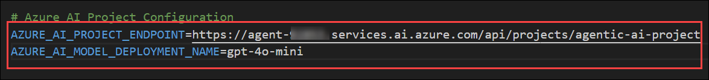

# 실습 11: AgentOps – 관찰 가능성 및 관리

**예상 소요 시간**: 60분

**개요**

이 실습에서는 운영 환경에서 AI 에이전트를 모니터링, 관리 및 관리하는
AgentOps에 집중하게 됩니다. Microsoft Agent Framework의 내장 Application
Insights와 OpenTelemetry를 통해 관측성과 텔레메트리를 활성화하는 방법을
탐구하게 됩니다.

Microsoft Agent Framework 내 OpenTelemetry 소개

Microsoft Agent Framework는 분산 추적, 지표, 로깅을 위한 오픈 표준인
OpenTelemetry와 네이티브적으로 통합됩니다. 이 기술은 스팬 트레이스, 툴
호출, 모델 응답, 워크플로우 성능 등 텔레메트리 데이터를 자동으로
캡처하여 에이전트의 행동을 종단 간 가시화합니다. 이 통합을 통해 개발자는
관측 데이터를 Azure Monitor, Application Insights 또는 기타
OpenTelemetry 호환 백엔드로 직접 내보낼 수 있습니다. 이 표준화된
접근법은 복잡한 다중 에이전트 시스템 전반에 걸쳐 모든 에이전트 행동을
추적하여 최소한의 구성으로 성능 튜닝, 문제 해결, 준수 감사를 가능하게
합니다.

실습 목표

이 실습에서 다음과 같은 작업을 수행할 것입니다.

- 작업 1: OpenTelemetry를 사용하여 에이전트의 관찰 가능성 활성화하기

- 작업 2: 에이전트 메트릭을 시각화하기

- 작업 3: Foundry Portal의 에이전트별 메트릭을 모니터링하기

## 작업 1: OpenTelemetry를 사용하여 에이전트의 관찰 가능성 활성화하기

In this task, you’ll integrate OpenTelemetry and Agent Framework
observability into your project. You’ll configure telemetry exporters,
initialize tracing with setup_observability(), and capture detailed
spans for each stage of your workflow, including agent routing, Azure AI
Search retrieval, and ticket creation. This enables unified visibility
into agent behavior and cross-system correlation using trace IDs in
Application Insights.

1.  Instead of modifying the previous code again, you’ll work in a new
    folder that already contains the updated observability-enabled
    files. Understand how telemetry, tracing, and monitoring are
    integrated using Microsoft Agent Framework Observability and
    Application Insights.

2.  In Visual Studio Code, before openening new folder, select
    the .env file and copy the content and keep it safely in a notepad.

3.  Once done, click on **file** option from top menu and select **Open
    Folder**.

4.  Open folder 창에서 C:\telemetry-codefiles로 이동하고 select folder를
    클릭하세요.

5.  열면 탐색기 메뉴의 파일들이 이와 비슷하게 보입니다.

6.  코드 파일을 살펴보고, 모든 에이전트에 Opentelemetry가 어떻게
    구현되었는지, 그리고 추적이 어떻게 이루어지고 있는지 검토하세요.

> **통합 개요**
>
> agent_framework.observability 패키지를 사용하여 에이전트 워크플로우
> 전반에 걸쳐 OpenTelemetry 추적을 통합했습니다.

- 각 중요한 작업마다 구조화된 원격 측정을 캡처하기 위해 get_tracer()를
  가져오고 OpenTelemetry span을 사용했습니다.

- 분류, 라우팅, RAG, 티켓 생성 등 주요 기능을 맥락 속성이 포함된 범위
  내에 랩핑합니다.

- setup_observability()를 이용한 통합 시작 관측 설정을 추가하여
  익스포터와 메트릭 파이프라인을 구성했습니다.

- 쿼리 텍스트, 라우팅 결정, 백업 방법 등 사용자 지정 속성을 기록하여 더
  깊은 가시성을 제공합니다.

- 예외 추적을 기록하고 각 워크플로우 실행을 추적 ID에 연결하여 시스템 간
  상관관계를 강화하는 향상된 오류 처리합니다.

> **파일 향상**
>
> main.py – End-to-End 추적 및 지표

- OpenTelemetry 추적 파이프라인과 익스포터 설정을 설정했습니다.

- 스팬 내에서 랩된 다중 에이전트 오케스트레이션을 통해 완전한 워크플로우
  가시성을 제공합니다.

- 라우팅, 데이터 검색(RAG), 에이전트 응답, 티켓 생성 등 하위 단계별
  스팬이 추가되었습니다.

> planner_agent.py – 향상된 라우팅 관측성

- 분류 논리를 모니터링하기 위해 트레이서 인스턴스(get_tracer())를
  추가했습니다.

- 원시 LLM 응답, 신뢰도 점수, 그리고 대체 키워드 지표를 span 속성으로
  포착했습니다.

- 라벨링된 스팬을 이용한 AI 기반 분류와 휴리스틱 분류의 구분
  (SpanKind.INTERNAL).

> azure_search_tool.py – RAG 관찰성

- 지연 시간과 성공률을 측정하기 위한 Azure Search API 호출용 스팬이
  추가되었습니다.

- 사용자 지정 지표로 기록된 문서 수와 페이로드 크기를 기록합니다.

- OpenTelemetry 트레이스 내에서 검색 오류와 성능 데이터를 캡처했습니다.

> freshdesk_tool.py – 티켓 생성 관찰성

- 티켓 생성 시간과 응답 상태를 추적할 수 있는 API 호출 구간이
  추가되었습니다.

- 추적 가능한 감사 로그를 위해 티켓 ID, 태그, 요청자 정보를 기록합니다.

- 외부 API 지연 및 오류 응답을 모니터링하여 더 나은 사고 추적을
  지원합니다.

7.  검토가 완료되면 **.env.example (1)** 파일을 우클릭하고 **Rename**
    **(2)**을 선택하여 파일 이름을 변경하세요.

8.  완료 후에는 **.env.example** --\> **.env**에서 이 환경 파일을 이
    에이전트에서 활성화되도록 이름 변경하세요.

9.  이제 .env 파일을 선택하고 이전에 복사한 내용을 붙여넣으세요.

10. Azure 포털에서 **agenticai** 리소스 그룹으로 이동한 후 리소스
    목록에서 **ai-knowledge-** Search 서비스를 선택하세요.

11. Settings의 왼쪽 메뉴에서 **Keys (1)**을 선택하고 복사 옵션을을
    사용하여 **Query key (2)**를 복사하세요.

12. 복사가 완료된 후에는 안전하게 메모장에 붙여넣고 Search Management
    왼쪽 메뉴에서 Indexes 를 선택한 후 **Index Name (2)**를 복사하세요.

13. Visual Studio Code 창에서 연결하려면 AI Search 키를 추가해야 하므로
    **.env** 파일을 선택하세요.

> \# Azure AI Search (MCP)
>
> AZURE_SEARCH_ENDPOINT=https://ai-knowledge--@lab.LabInstance.Id.search.windows.net/
>
> AZURE_SEARCH_API_KEY=\[Query_Key\]
>
> AZURE_SEARCH_INDEX=\[Index_Name\]

**참고:** Query_Key값과 Index_Name값은 이전에 복사한 값으로 교체해
주세요.

14. .env 파일의 내용을 아래 내용과 함께 추가하세요.

> AZURE_OPENAI_ENDPOINT=https://agentic-
> @lab.LabInstance.Id.cognitiveservices.azure.com/
>
> AZURE_OPENAI_API_KEY=\<Replace with Azure OpenAI key\>
>
> AZURE_OPENAI_RESPONSES_DEPLOYMENT_NAME=gpt-4o-mini
>
> AZURE_OPENAI_API_VERSION=2025-03-01-preview

15. .env 파일에 다음과 같은 Foundry 프로젝트 핵심 변수를 추가하세요.

> \# Azure AI Project Configuration
>
> AZURE_AI_PROJECT_ENDPOINT=**\<Microsoft Foundry endpoint\>**
>
> AZURE_AI_MODEL_DEPLOYMENT_NAME=gpt-4o-mini
>
> Overview 페이지에서 Microsoft Foundry 프로젝트 엔드포인트를 찾아
> **\<Microsoft Foundry endpoint \>** 를 해당 값으로 대체하세요.
>
> 

16. 완료 후에는 다음 App Insights 변수들을 같은 파일에 추가하세요.

> \# Observability and Monitoring Configuration
>
> APPLICATIONINSIGHTS_CONNECTION_STRING=**\<Connection string\>**
>
> ENABLE_OTEL=true
>
> ENABLE_SENSITIVE_DATA=true
>
> Azure 포털에서 Application Insight 리소스를 열고 연결 문자열을 복사한
> 후 **\<Connection string\>**을 복사된 값으로 교체하세요.
>
> 

17. .env 파일에 다음 내용을 추가하고, 앞서 복사한 Freshdesk의 API 키와
    계정 URL을 추가하세요.

> \# Freshdesk Configuration
>
> FRESHDESK_DOMAIN=\[Domain_URL\]
>
> FRESHDESK_API_KEY=\[API_Key\]

18. 최종 .env 파일은 주어진 이미지와 비슷해야 합니다.

19. 완료 후 **File  (1)**를 선택한 후 **Save (2)**을 클릭해 파일을
    저장하세요.

20. 메뉴를 확장하려면 상단 메뉴에서 **... (1)** 옵션을 선택하세요.
    **Terminal (2)**를 선택하고 **New Terminal (3)**을 클릭하세요.

21. **VS Code** Terminal에서 Azure CLI 로그인 명령어를 실행하세요:

+++az login+++

22. **Sign in** 창에서 **Work or school account**를 선택하고
    **Continue**를 클릭하세요.

23. **Sign into Microsoft** 탭에서 다음 자격 증명으로 사용하여
    로그인하세요.

- 사용자 이름 - <+++@lab.CloudPortalCredential(User1).Username>+++

- TAP - +++@lab.CloudPortalCredential(User1).TAP+++

24. 로그인 옵션이 나오면 **No, this app only**를 선택해 다른 데스크톱
    앱을 연결하지 않고 계속 진행하세요.

25. **1**을 입력하고 **Select a subscription and tenant**에 enter를
    누르세요.

26. 터미널이 열리면 명령을 실행하세요,

> +++pip install -r requirements.txt+++ 필요한 모든 패키지를 설치하기
> 위해.

27. 검색 도구의 작동 방식을 시험하려면 아래 명령어를 실행하세요.

+++python main.py+++

> 

## 작업 2: 에이전트 메트릭을 시각화하기

이 작업에서는 Azure Application Insights를 사용해 에이전트 텔레메트리
데이터를 시각화하게 됩니다. 응답 시간, 라우팅 정확도, 티켓 생성 성공률에
대한 맞춤형 지표를 탐색하게 됩니다. 그 다음, 주요 성과 지표와 추세를
표시하는 인터랙티브 Azure Monitor 대시보드를 구축합니다. 이를 통해 병목
현상을 파악하고 효율성을 측정하며 배포된 에이전트의 건강한 운영을
실시간으로 보장합니다.

1.  Azure 포털로 이동해 리소스 그룹을 열고, 리소스 목록에서
    **agent-insights-** app insight 리소스를 선택하세요.

2.  개요 페이지에 들어가면 기본 지표 일부를 확인할 수 있습니다.

3.  왼쪽 메뉴에서 **Search (1)**을 선택하고 **See all data in last 24
    hours (2)**를 클릭하세요.

4.  열면 아래에서 **Traces (1)**를 검토한 후 **View as individual items
    (2)**를 클릭하세요.

5.  완료 후에는 에이전트와 이루어진 모든 통신 세부사항과 주어진 기간
    내에 이루어진 모든 거래를 볼 수 있습니다. 시간 범위를 조정해 더 깊이
    탐험할 수도 있습니다.

6.  이 변환들을 탐색하고 검토하세요. 클릭만 하면 상세한 뷰를 열 수
    있습니다. 에이전트, 메시지, 검색 세부 정보 등 모든 세부 정보를
    어떻게 볼 수 있는지 검토하세요.

7.  다음으로 **Failures (1)**를 선택하고 **failed requests (2)**를
    검토하여 모든 실패한 실행을 중앙에서 파악하고 상세한 트레이스 분석을
    통해 근본 원인을 파악합니다.

8.  다음으로 **Performance (1)**를 선택하고 **operations and response
    times (2)**을 확인하면, 에이전트의 Performance SLA를 결정할 수
    있습니다.

9.  이제 왼쪽 메뉴의 모니터링 항목에서 **Metrics**를 선택하세요. 스팬
    전체에 게시되는 맞춤형 지표를 탐색할 수 있습니다.

10. 선택되면 **Metric Namespace (1)**에서
    azure.applicationinsights **(2)**를 선택하세요.

11. 이제 메트릭 항목에서 **gen_ai.client.operation.duration and set the
    aggregation to avg (1)**을 선택하세요. **line chart (2)**를 확인해
    **Response Time** 지표를 확인하세요. 에이전트가 사용자에게 답변하는
    데 어떤 데이터를 사용했는지.

12. 마찬가지로 **gen_ai.client.token.usage and set the aggregation to
    avg (1)**을 선택하세요. 에이전트에서 토큰 사용량을 검토하려면 **line
    chart (2)**를 확인하세요.

13. 왼쪽 메뉴에서 **Logs (1)**을 선택하고 **Queries hub (2)** 창을
    닫으세요.

14. 닫은 후에 **tables**  옵션을 클릭하고 **customMetrics** 파라미터에
    마우스를 올리면 **Run** 옵션을 클릭하세요.

15. 쿼리가 성공적으로 실행되면, 아래에 나열된 모든 맞춤형 지표가 쿼리
    결과로 표시됩니다.

16. 왼쪽 메뉴에서 **Workbooks (1)**을 선택하고 Quick start에
    있는 **Empty (2)** 워크북을 클릭하세요.

17. 열려면 **+ Add (1)**을 클릭하고 **Add metric (2)**를 선택하세요.

18. 메트릭 창이 열리면 **Add metric** 옵션을 클릭하세요.

19. **Metric**을 gen_ai.client.token.usage **(1)**로 선택하고 **Display
    name**을 Token Usage **(2)**로 선택하고 **Save (3)**을 클릭하세요.

20. **Add metric** 옵션을 다시 클릭하세요.

21. **Metric**을 gen_ai.client.operation.duration **(1)**로 선택하고
    **Display name**을 Response Time **(2)**로 입력하고 **Save (3)**을
    클릭하세요.

22. 두 지표를 선택되면  **Run Metrics**을 클릭하세요.

23. 이제 **Visualization**을 **Area Chart**로 변경하면 비슷한 시각화가
    나옵니다. 시각화의 다른 다양한 방법과 시간대도 탐색할 수 있습니다.

24. 편집이 완료되면 **Done editing**을 클릭하세요. 이 카드를 워크북에
    저장할 수 있습니다.

25. **+ Add (1)**을 다시 클릭하고 **Add query (2)**를 선택하세요.

26. Query 창에서 다음**query (1)**을 추가하고 **Run Query (2)**를
    클릭하세요.

+++customMetrics+++

27. 쿼리가 성공적으로 실행되면 결과를 확인하세요. 검토가 완료되면 **Done
    Editing**을 클릭하세요.

28. 완료 후에는 상단 메뉴에서 **Done Editing (1)**을 클릭한 후 **Save
    (2)** 아이콘을 클릭하세요.

29. Save As 창에서 Title을 agent-workbook **(1)**로 입력하고 **Save As
    (2)**를 클릭하세요.

30. 실험실 환경이기 때문에 포괄적인 모니터링을 위한 이용 가능한 데이터가
    제한적일 수 있습니다. 하지만 에이전트로부터 맞춤형 지표를 추가하고,
    특정 목표에 초점을 맞춘 맞춤형 모니터링 대시보드를 생성함으로써
    가시성을 높일 수 있습니다. 예를 들어, 다음과 같습니다:

- **에이전트 성능 대시보드**

> **지표 표시:**

- 에이전트 응답 시간 (평균 P95)

- 에이전트 유형별 성공률

- 요청 거래량 추세

- 오류율 알림

> **비즈니스 질문에 대한 답변:**

- 어떤 에이전트가 가장 잘 작동하나요?

- SLA 목표를 달성하고 있나요?

- 시스템 느려지는 원인은 무엇인가요?

&nbsp;

- **사용자 경험 대시보드**

> **지표 표시:**

- End-to-end 요청 지연

- 티켓 생성률

- 지식 검색 성공

- 사용자 만족도 프록시 지표

> **비즈니스 질문에 대한 답변:**

- 사용자들이 빠른 응답을 받고 있나요?

- 요청이 지원 티켓으로 전환되는 경우는 얼마나 자주 있나요?

- 지식 기반이 사용자에게 도움이 되고 있나요?

## 작업 3: Foundry Portal의 에이전트별 메트릭을 모니터링하기

이 작업에서는 Azure Application Insights를 사용해 에이전트 텔레메트리
데이터를 시각화하게 됩니다. Microsoft Foundry 포털에서 제공하는 맞춤형
에이전트별 지표를 탐색할 것입니다.

1.  이미 Application Insights를 Microsoft Foundry 포털에 연결하셨으니,
    다시 Foundry 포털로 돌아가 에이전트의 작동 과정을 시각화할 수
    있습니다.

2.  리소스 그룹으로 돌아가 리소스 목록에서 **agent-**foundry 리소스를
    선택하세요.

1.  다음 창에서 **Go to Foundry portal**을 클릭하세요. 이제 Microsoft
    Foundry 포털로 이동하여 첫 번째 에이전트를 생성하게 됩니다.

2.  에이전트를 테스트하기 전에 Application Insights를 연결하여 상세한
    로그와 추적 가시성을 활성화하세요.

3.  Microsoft Foundry 포털의 왼쪽 창에서 **Monitoring (1)**을 클릭하고
    **agent-insights- (2)**를 선택하고 **Connect (3)**을 클릭하세요.

4.  이제 이전에 연결된 애플리케이션 인사이트가 있던
    **Monitoring **창으로 이동해 **Resource usage** 탭을 선택하여 모든
    지표와 값을 검토하세요.

5.  왼쪽 메뉴에서 **Tracing (1)**을 선택하고 **Trace (2)** 중 하나를
    클릭한 후 에이전트 간 상호작용의 상세 트레이스를 검토하세요.

> 

**요약**

이 실습에서는 엔터프라이즈 에이전트의 관측 가능성과 모니터링을
구성했습니다. OpenTelemetry 트레이싱을 통해 모든 워크플로우 단계에 대한
상세한 실행 데이터를 캡처했고, Azure Application Insights와 통합하여
성능 지표와 에이전트 상태를 시각화하는 대시보드를 생성했습니다.

이 실습을 성공적으로 완료했습니다. 계속하려면 Next \>\>를 클릭하세요.
