# Lab 2: Setup AI Project and perform Chat Completion from VS Code

**Overview**

In this lab, you will prepare the complete development environment
required for building AI agents by creating and configuring an AI
Project in Microsoft Foundry, deploying a Large Language Model (LLM) and
an embedding model, and connecting the project to Visual Studio Code.
You will then validate the setup by running a simple chat completion
from code, ensuring that your environment is correctly configured and
ready for developing AI-powered applications.

Lab Objectives

You'll perform the following tasks in this lab.

- Task 1: Setting up the AI Project in the Microsoft Foundry

- Task 2: Deploying an LLM and embedding models

- Task 3: Install dependencies, create a virtual environment, and create
  an environment variables file

## Task 1: Setting up the AI Project in the Microsoft Foundry

In this task, you will create and configure an AI Project within
Microsoft Foundry. This involves setting up the necessary resources,
defining project parameters, and ensuring that the environment is ready
for deploying AI models. By the end of this task, you will have a fully
initialized AI Project, serving as the foundation for further
development and experimentation.

1.  On the Azure Portal page, in the Search resources box at the top of
    the portal, enter **Microsoft Foundry (1)**, and then
    select **Microsoft Foundry (2)** under Services.

2.  In the left navigation pane for the **Use with Foundry**,
    select **AI Hubs (1)**. On the AI Hubs page, click on **Create
    (2)** and select **Hub (3)** from the drop-down.

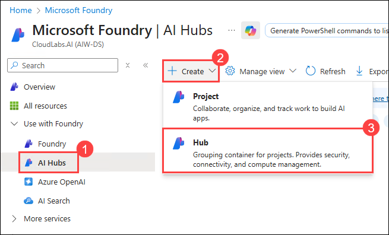

3.  On the **Create an Azure AI hub** pane enter the following details
    under **Basics** **(1)** :

    - Subscription : **Leave default subscription** **(2)**

    - Resource Group : **AgenticAI** **(3)**

    - Region : **East US2** (4)

    - Name : ** <+++ai-foundry-hub@lab.LabInstance.Id>+++ (5)**

    - Connect AI Services incl. OpenAI : Click on **Create
      New** **(6)**.

    - Connect AI Services incl. OpenAI : Provide a
      name **<+++my-ai-service@lab.LabInstance.Id>+++ (7)**.

    - Click on **Save** **(8)**, followed by **Next:Storage** **(9)**

> 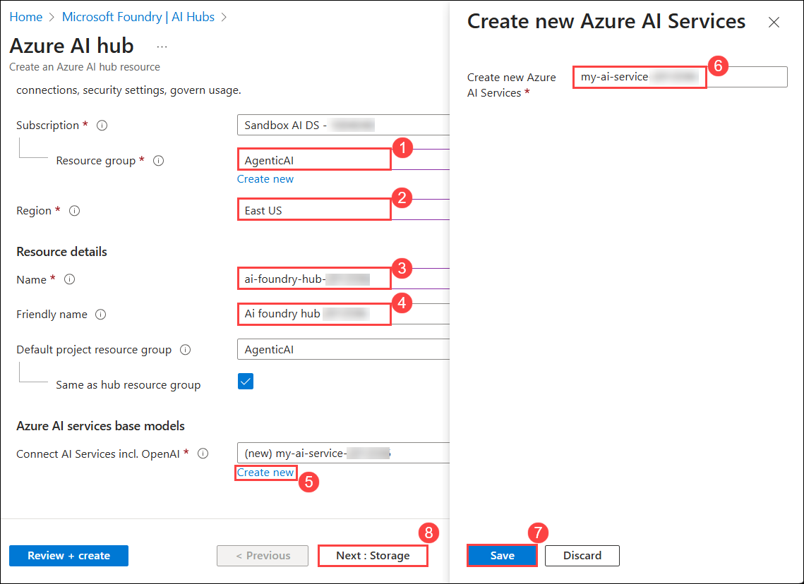

4.  Click on **Review + Create** tab followed by **Create.**

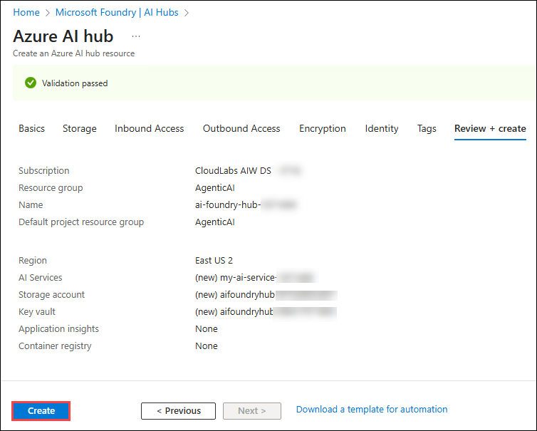

5.  Wait for the deployment to complete and then click on **Go to
    resource**.

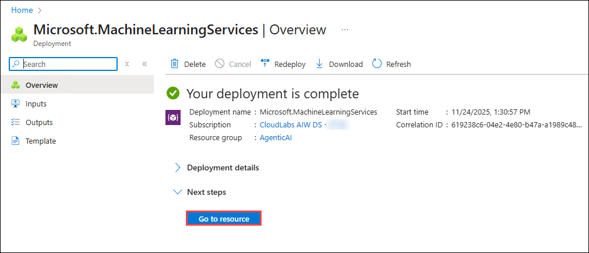

6.  On the Overview pane, click on **Launch Azure AI Foundry**. This
    will navigate you to the Microsoft Foundry portal.

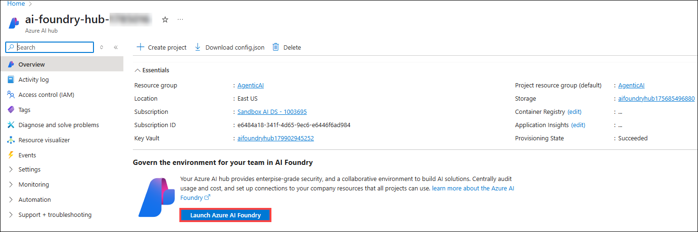

7.  Scroll down and click on **+ New project** on the Hub Overview.

8.  Provide the project name
    as **<+++ai-foundry-project@lab.LabInstance.Id>+++ ,** then click
    on **Create (2)**.

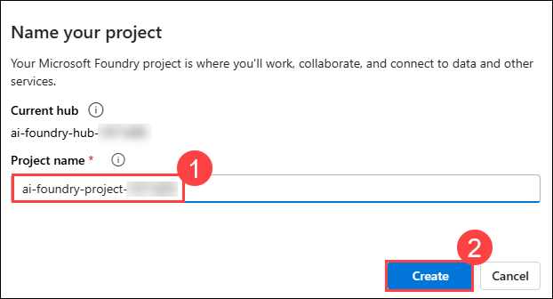

9.  Once the project is created, scroll down and copy the **Project
    connection string**, then paste them into Notepad or a secure
    location, as they will be required for upcoming tasks.

## Task 2: Deploying an LLM and embedding models

In this task, you will deploy a large language model (LLM) and an
embedding model within your Microsoft Foundry project. These models will
be used for AI-driven applications and vector-based search capabilities
in upcoming labs.

1.  In your **Microsoft Foundry project**, navigate to the **My
    assets** **(1)** section, then select **Models +
    endpoints** **(2)**. Click **Deploy model** **(3)**, and
    choose **Deploy base model** **(4)** to proceed.

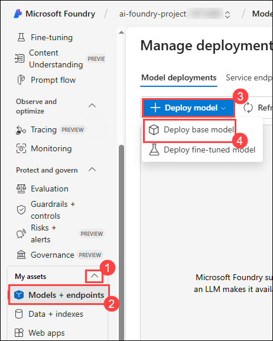

2.  On a **Select a model** window, search for **gpt-4o** **(1)**,
    select **gpt-4o** **(2)** and select **Confirm** **(3)**

3.  On **Deploy model gpt-4o** window, select **Customize**.

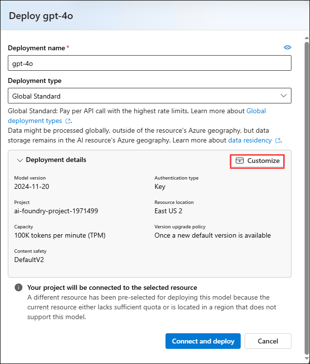

- Deployment Name: **gpt-4o** **(1)**

- Deployment type: **Global Standard** **(2)**

- Change the **Model version to 2024-08-06 (Default)** **(3)**

- Change the Tokens per Minute Rate Limit to **200K** **(4)**

- Click on **Connect and Deploy** **(5)**

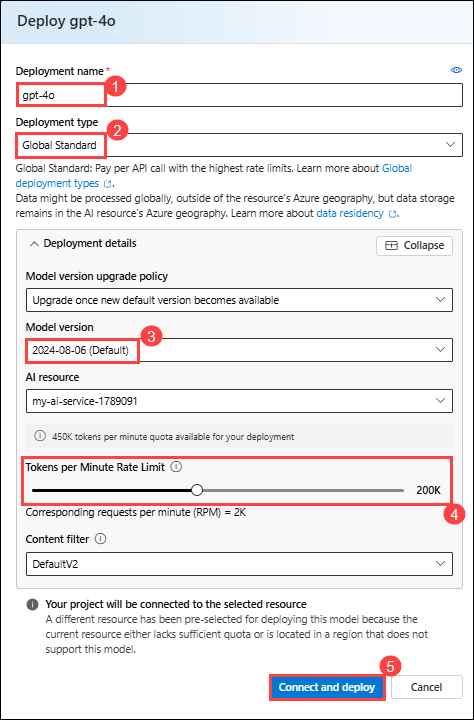

4.  Click on **Model + Endpoints** **(1)**, there you can see the
    deployed **gpt-4o** **(2)** model.

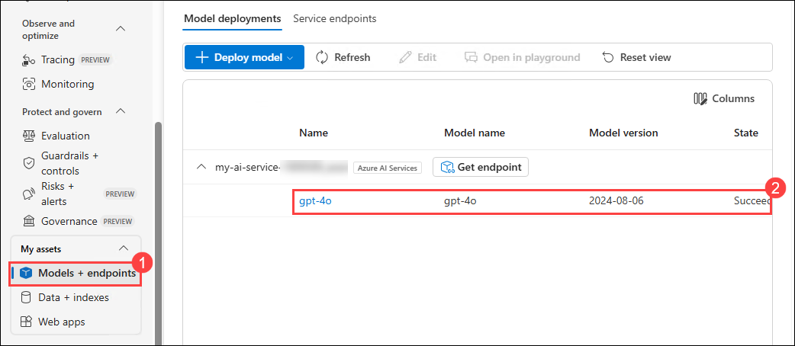

5.  Navigate back to **Azure Portal** and search for **Open
    AI** **(1)** and select **Azure Open AI** **(2)** resource.

6.  On the **Microsoft Foundry | Azure OpenAI** page, select **+
    Create** **(1)** then select **Azure OpenAI** **(2)** to create
    Azure OpenAI resource.

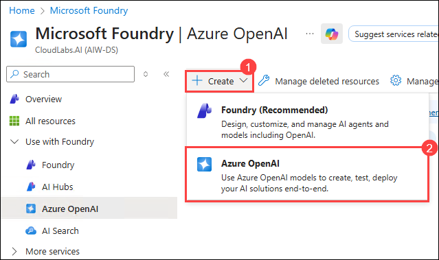

7.  On **Create Azure OpenAI** page, provide the following settings and
    click on **Next** **(6)**:

[TABLE]

> 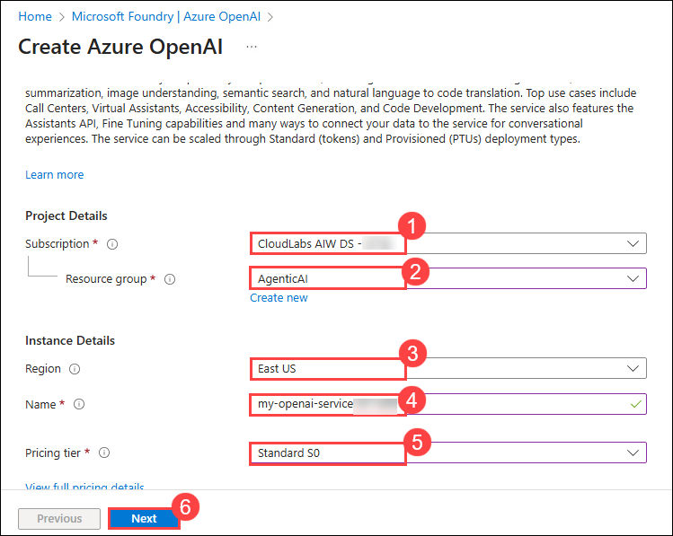

8.  Click on **Next** till Review + submit tab appears.

9.  On the **Review + submit** page, click on **Create**

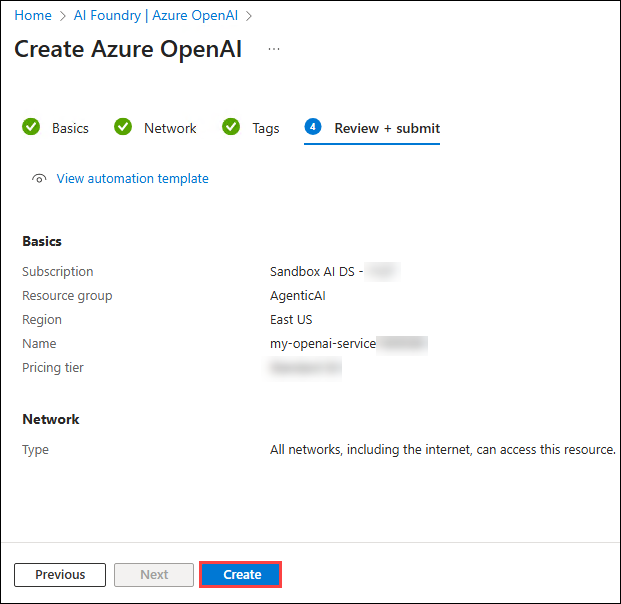

10. Wait until the deployment got succeeded and select **Go to
    resource**.

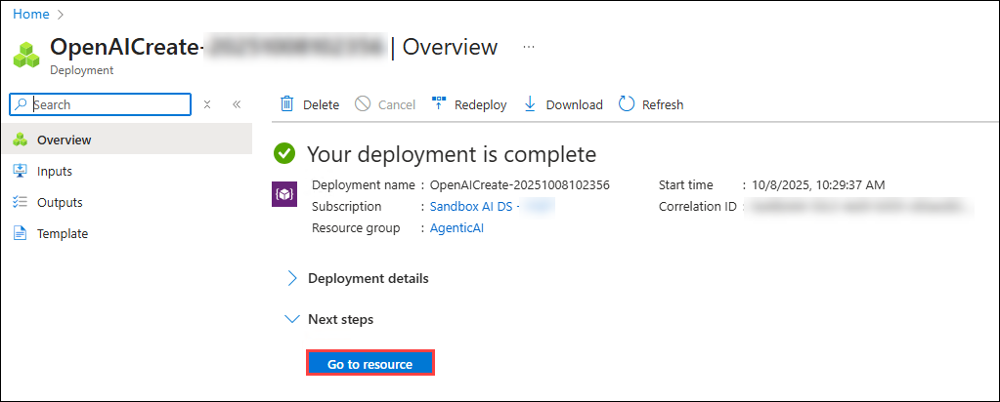

11. On the **my-openai-service** resource page, select **Go to Foundry
    portal**.

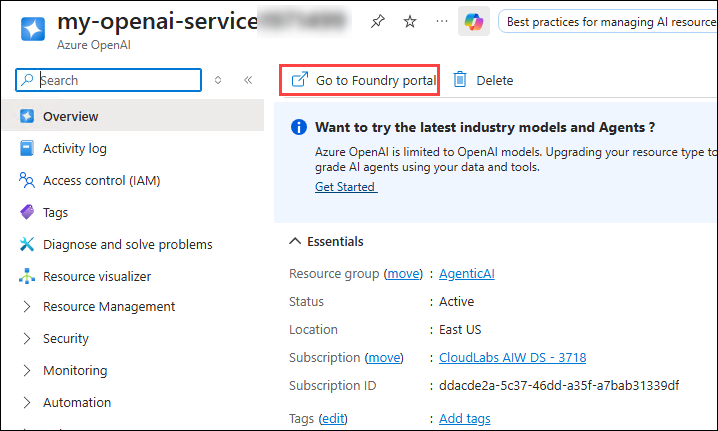

12. In your AI Foundry project, navigate to the **Shared
    resources** section, then select **Deployments** **(1)**.
    Click **Deploy model** **(2)**, and choose **Deploy base
    model** **(3)** to proceed.

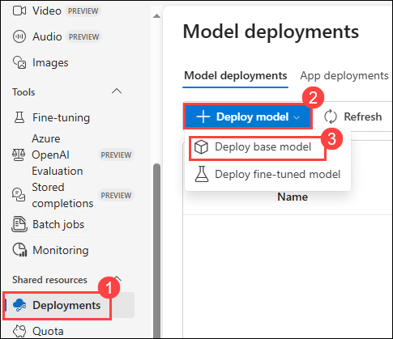

**Note**: The import and vectorize wizard in Azure AI Search, which will
be used in subsequent labs, does not yet support text embedding models
within your AI Foundry project. Because of this, we need to create an
Azure OpenAI service and deploy a text embedding model there. We will
use this text embedding model later when we create our vector index.

13. On a **Select a model** window, search
    for **text-embedding-3-large** **(1)**, then
    select **text-embedding-3-large** **(2)** and
    select **Confirm** **(3)**

14. On **Deploy model text-embedding-3-large** window,

    - Deployment type: Select **Standard (1)**

    - Tokens per Minutes Rate Limit: **120K (2)**

    - Select **Deploy (3)** to deploy the model.

15. Click on **Deployment (1)**, you can see the
    deployed **text-embedding-3-large (2)** model.

## Task 3: Install dependencies, create a virtual environment, and create an environment variables file

In this task, you will install the required dependencies, set up a
virtual environment, and create an environment variables file. This
ensures a controlled development environment and securely manages
configuration settings for your AI project.

1.  On your **Lab VM**, launch **Visual Studio Code**.

2.  Click on **File** **(1)**, then **Open Folder**.

3.  Navigate to C:\LabFiles\Day-1 \\**(1)**, select
    the **azure-ai-agents-labs** **(2)** folder and then click
    on **Select folder** **(3)**.

4.  Click on **Yes, I Trust the authors**,

5.  Click on the **elipses(...)** **(1)**, then **Terminal** **(2)** and
    then **New Terminal** **(3)**.

6.  Make sure your in **azure-ai-agents-labs** project directory. Run
    the below powershell commands to create and activate your virtual
    environment:

7.  python -m venv venv

+++venv/Scripts/activate+++

8.  Run the below powershell command. This installs all the required
    packages:

9.  pip install -r requirements.txt

+++pip install azure-ai-ml azure-identity+++

10. Run the below powershell command to install or upgrade pip to the
    latest version.

+++python.exe -m pip install --upgrade pip+++

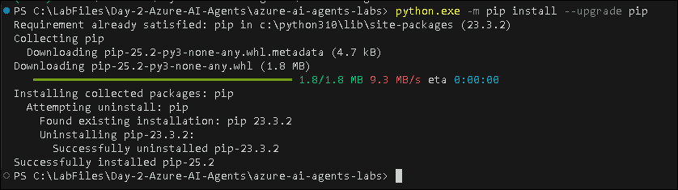

11. Run the below command to log into your Azure account.

+++az login+++

12. Select the user account to authorize.

13. Once the Authorization is completed, navigate back to the Visual
    studio code.

14. Open the **Sample.env** file and provide the necessary environment
    variables.

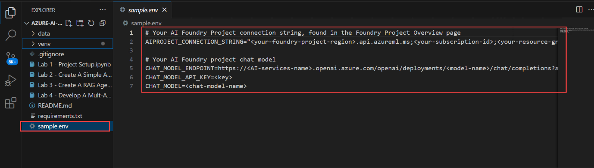

- Navigate to Microsoft foundry portal, click
  on **gpt-4o** **(2)** model from the **Models + endpoints(1)** section
  under My assets, copy the under **Endpoint** from right pane, copy and
  paste the **Target URI (1)** and **Key (2)** in a notepad

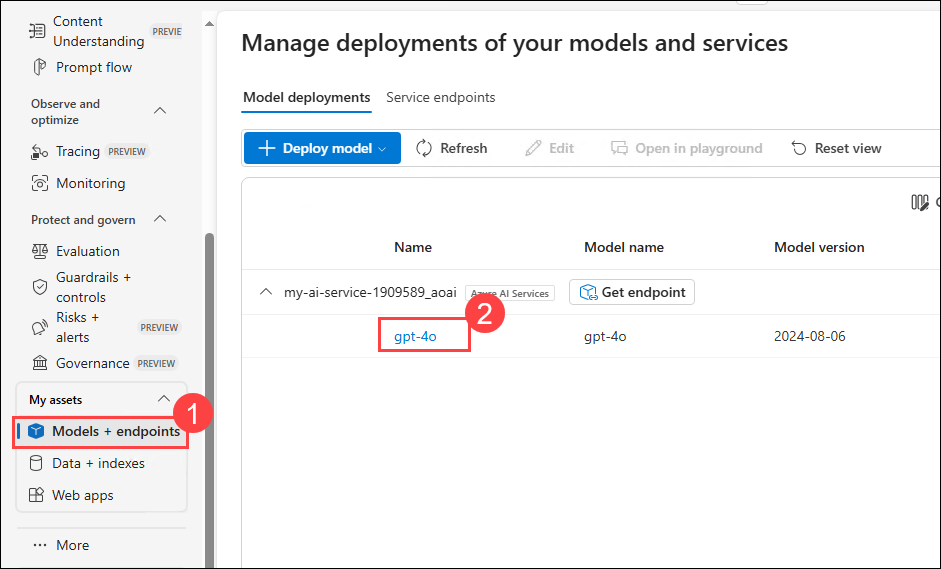

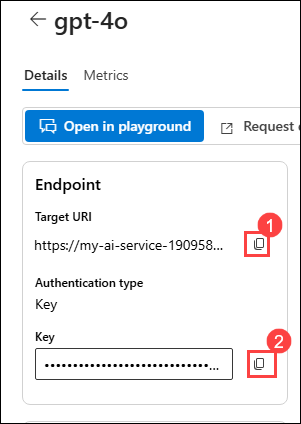

15. On the **Sample.env** file,

    - AIPROJECT_CONNECTION_STRING: Provide **Project connection
      string** value you have copied in step 9 of Task 1

    - CHAT_MODEL_ENDPOINT: Provide the **Target
      URI** of **gpt-4o** model you have copied in the previous step

    - CHAT_MODEL_API_KEY: Provide the **Key** value of **gpt-4o** model
      you have copied in the previous step

    - CHAT_MODEL: **gpt-4o**

16. Save changes to the **Sample.env** file.

17. Run the below powershell command. This creates your **.env** file:

+++cp sample.env .env+++

18. Later Open the **Lab 1 - Project Setup.ipynb** file. The **Lab 1 -
    Project Setup.ipynb** notebook guides you through setting up an AI
    Project in Microsoft Foundry, deploying an LLM and embedding models,
    and configuring VS Code connectivity. It also includes a simple Chat
    Completion API call to verify the setup. Running this notebook
    ensures that your environment is correctly configured for developing
    AI-powered applications.

19. Select the **Select kernel (1)** setting available in the top right
    corner and select **Install/enable selected extensions
    (python+jupyter) (2)**.

20. Select **Python Environments** to ensure that Jupyter Notebook runs
    in the correct Python interpreter with the necessary dependencies
    installed.

21. Select **venv (Python 3.x.x)** from the list as this version is
    likely required for compatibility with Microsoft Foundry SDK and
    other dependencies.

**Note:** If **venv (Python 3.x.x)** does not appear in the list. Close
and Open the Visual studio code.

22. Run the first cell to import necessary Python libraries for working
    with Azure AI services.

23. Run the below cell to retrieve the project connection string and
    model name from environment variables. These values are needed to
    interact with the Large Language Model (LLM) securely, without
    hardcoding sensitive information.

24. Run the below cell to connect to your Microsoft Foundry project
    using the connection string. This establishes a secure connection
    with AIProjectClient, enabling interactions with your project
    resources.

25. Run the below cell to interact with the GPT-4o model using your
    Microsoft Foundry project. This code initializes a chat client,
    sends a request for a joke about a teddy bear, and prints the
    response. Finally see the output provided from the chat model.

> **Note:** The output in this step is generated dynamically by the AI
> model and may vary each time.

**Summary**

In this lab, you successfully set up a complete AI development
environment by creating and configuring an AI Project in Microsoft
Foundry, deploying a GPT-4o Large Language Model and
text-embedding-3-large embedding model, and establishing secure
connectivity from Visual Studio Code. You installed the required
dependencies, created a virtual environment, and configured environment
variables to manage sensitive information securely. Finally, you
validated the setup by running a simple Chat Completion API call,
confirming that your environment is correctly configured and ready for
developing AI-powered applications.

You have successfully completed this lab. Kindly click Next \>\> to
proceed further.
