# 實驗2：搭建AI項目並從VS Code中完成聊天

**概述**

在本實驗室中，你將通過在 Microsoft Foundry 中創建和配置 AI
項目，部署大型語言模型（LLM）和嵌入模型，並將項目連接到 Visual Studio
Code，準備構建 AI
代理所需的完整開發環境。然後，你將通過運行代碼中的簡單聊天完成來驗證設置，確保環境配置正確，準備好開發AI驅動應用。

實驗室目標

你將在實驗室執行以下任務。

- 任務1：在Microsoft Foundry建立AI項目

- 任務2：部署大型語言模型並嵌入模型

- 任務3：安裝依賴，創建虛擬環境，並創建環境變量文件

## 任務一：在Microsoft Foundry建立AI項目

在這個任務中，你將在 Microsoft Foundry 中創建並配置一個 AI
項目。這包括設置必要資源、定義項目參數，並確保環境準備好部署AI模型。完成這項任務時，你將擁有一個完全初始化的AI項目，作為進一步開發和實驗的基礎。

1.  在 Azure Portal 頁面頂部的搜索資源框中，輸入 **Microsoft Foundry
    （1），**然後在 服務中選擇 **Microsoft Foundry （2）。**

2.  在左側導航窗格“**Use with Foundry**”中，選擇 **AI Hubs
    (1)**。在AI樞紐頁面，點擊 **Create (2)** ，從下拉菜單中選擇 **Hub
    (3)** 。

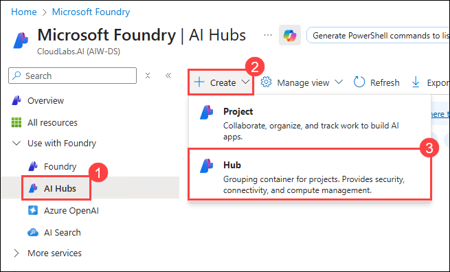

3.  在**Create an Azure AI hub **的面板中，輸入以下細節，在
    **Basics (1)** 項下。 :

    - 訂閱 : **Leave default subscription** **(2)**

    - 資源組 : **AgenticAI** **(3)**

    - 地區 : **East US2** (4)

    - 名稱 : ** <+++ai-foundry-hub@lab.LabInstance.Id>+++ (5)**

    - 連接 AI 服務，包括OpenAI：點擊 **Create New (6)。**

    - Connect AI Services，包括 OpenAI：提供名稱
      **<+++my-ai-service@lab.LabInstance.Id>+++ （7）**。

    - 點擊 **Save** **(8)**，然後點擊 **Next:Storage** **(9)**,

> 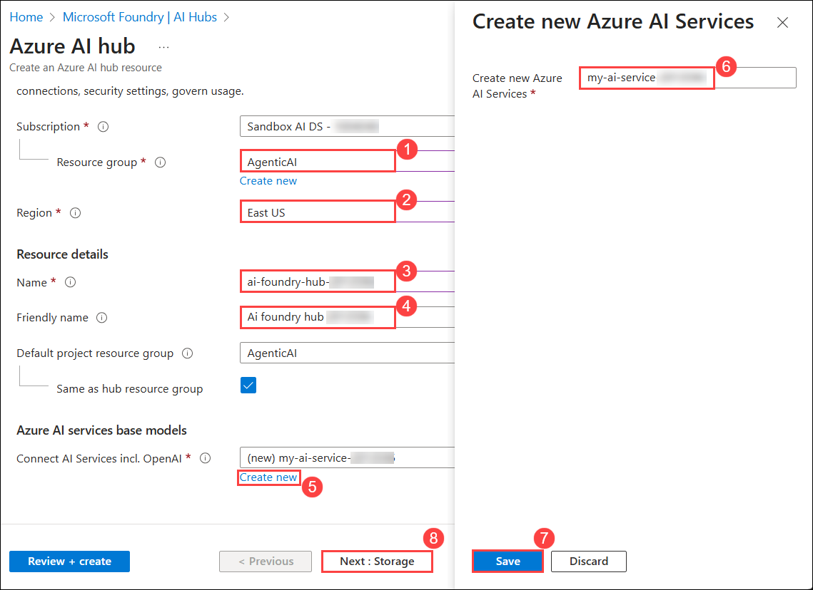

4.  點擊“**Review + Create** 標簽”，然後點擊**“Create”。**

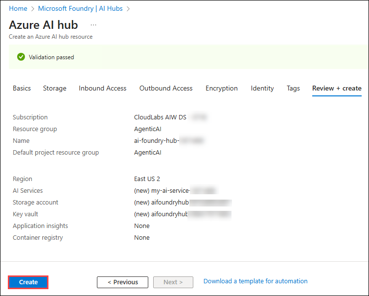

5.  等待部署完成後，點擊**“Go to resource**”。

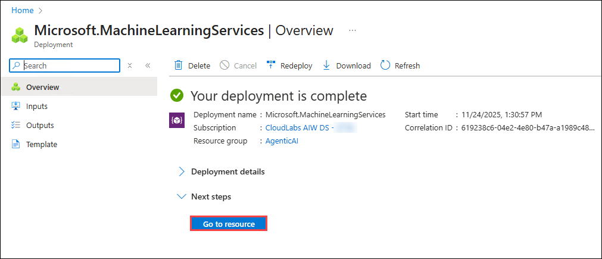

6.  在概覽面板中，點擊**“Azure AI Foundry**”。這會引導你進入 Microsoft
    Foundry 門戶。

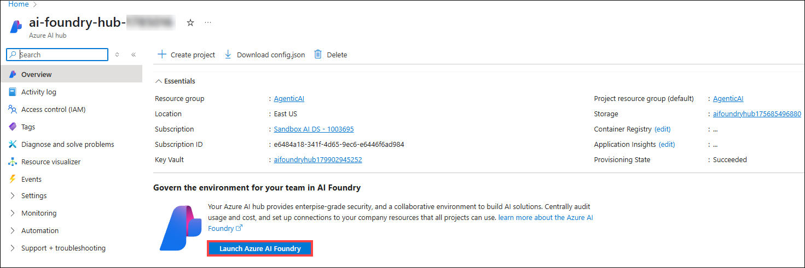

7.  向下滾動，點擊 中心概覽中的**+ New project**。

8.  輸入項目名稱為
    [**+++ai-foundry-project@lab.LabInstance.Id+++，**然後點擊](mailto:+++ai-foundry-project@lab.LabInstance.Id+++，然后点击)
    **Create (2)。**

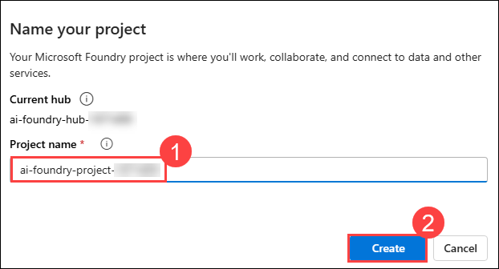

9.  項目創建後，向下滾動並複製 **Project connection
    string**，然後粘貼到記事本或安全位置，因為這些字符串將是即將完成任務的必需品。

## 任務2：部署 LLM 模型並嵌入模型

在這項任務中，你將在Microsoft
Foundry項目中部署一個大型語言模型（LLM）和一個嵌入模型。這些模型將在即將到來的實驗室中用於AI驅動應用和基於矢量的搜索功能。

1.  在你的 **Microsoft Foundry project**中，進入“**My
    assets** **(1)** ”部分，然後選擇 **Models +
    endpoints** **(2)**。點擊 **Deploy model** **(3)**，然後選擇
    **Deploy base model** **(4)** 以繼續。

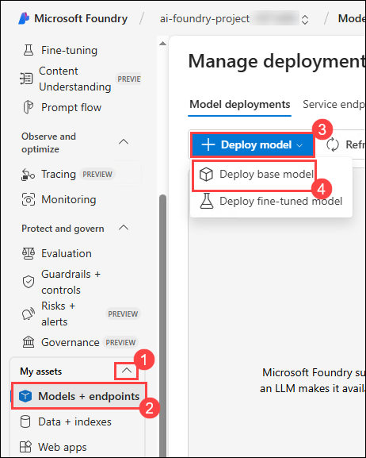

2.  在“**Select a model** ”窗口中，搜索 **gpt-4o** **(1)**，選擇
    **gpt-4o** **(2)** ，選擇 **Confirm** **(3)**

3.  在 **Deploy model gpt-4o** 窗口中，選擇 **Customize**。 

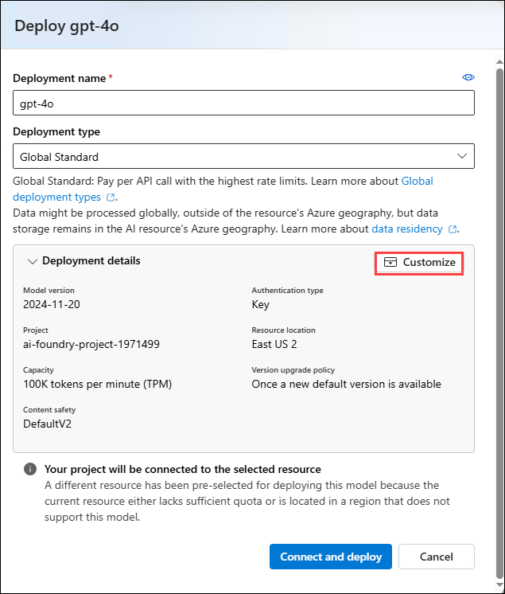

- 部署名稱: **gpt-4o** **(1)**

- 部署類型: **Global Standard** **(2)**

- 將**型號版本**更改**為2024-08-06（默認）（3）**

- 將每分鐘代幣的匯率限制改為**20萬（4）**

- 點擊 **Connect and Deploy (5)**

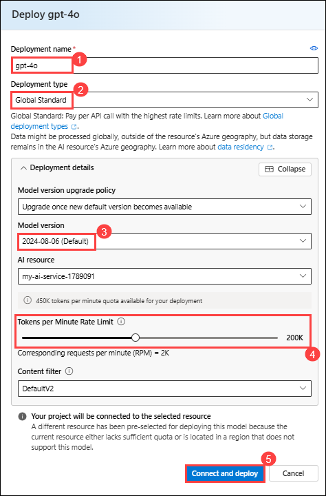

4.  點擊 **Model + Endpoints** **(1)**，你可以看到已部署的
    **gpt-4o** **(2)**  模型。 

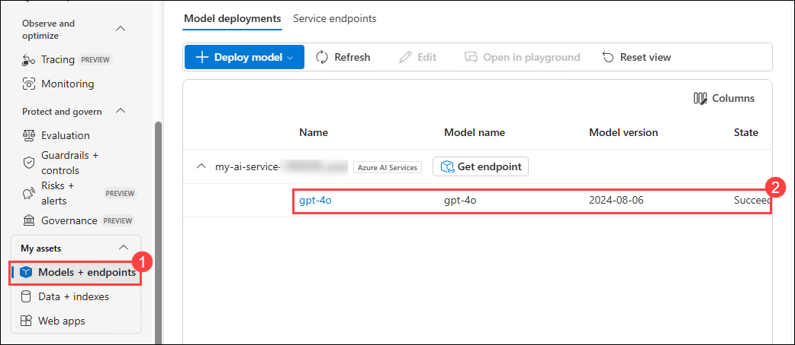

5.  返回 **Azure Portal**，搜索 **Open AI** **(1)** 並選擇 **Azure Open
    AI** **(2)** 資源。 

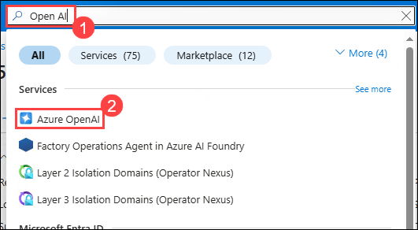

6.  關於**Microsoft Foundry | Azure OpenAI** 頁面，選擇 **+
    Create** **(1)** ，然後選擇 **Azure OpenAI** **(2)** 以創建 Azure
    OpenAI 資源。

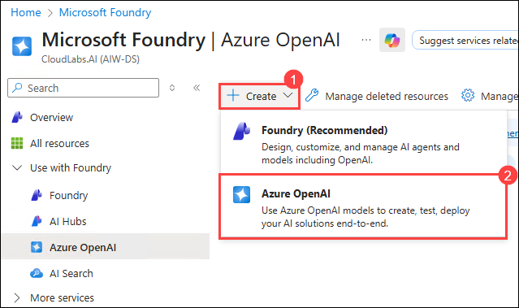

7.  在 **Create Azure
    OpenAI** 頁面，提供以下設置，點擊“**Next** **(6)**” :

[TABLE]

> 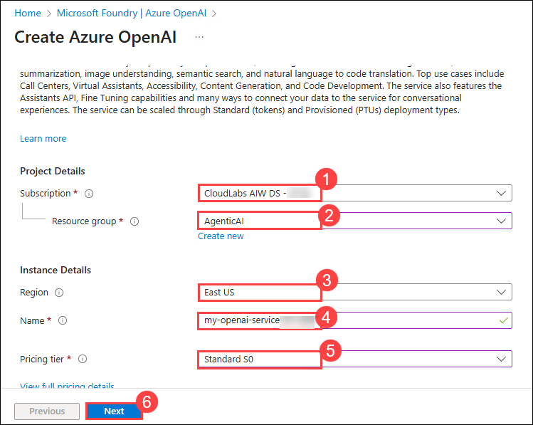

8.  點擊**“Next**”，直到出現“審核+提交”標簽。

9.  在“**Review + submit**”頁面，點擊“**Create**” 

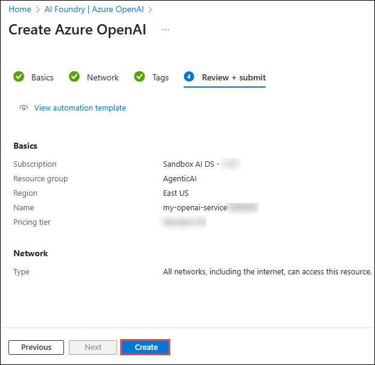

10. 等部署成功後，選擇“**Go to resource**”。

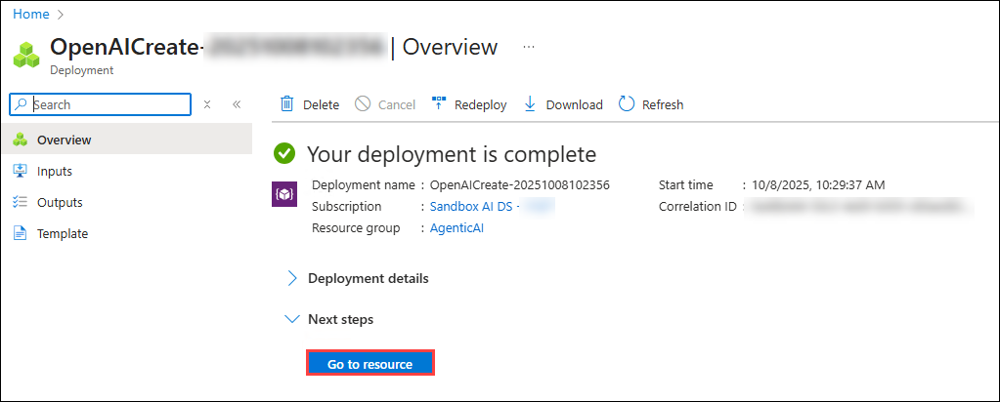

11. 在 **my-openai-service** 資源頁面，選擇 **Go to Foundry portal**。

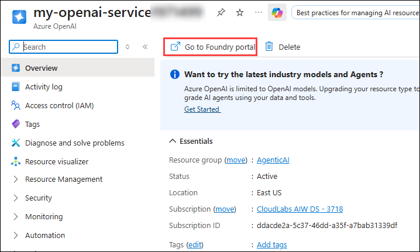

12. 在你的 AI Foundry 項目中，導航到 **Shared resources**  部分，選擇
    **Deployments** **(1)**。點擊 **Deploy model** **(2)**，然後選擇
    **Deploy base model** **(3)** 繼續。

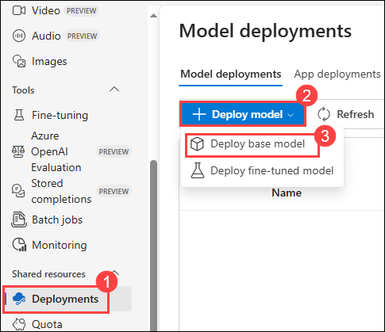

**注意**：Azure AI
Search中的導入和矢量化嚮導（後續實驗室將使用）尚未支持在您的AI
Foundry項目中嵌入文本模型。因此，我們需要創建一個Azure
OpenAI服務，並在那裡部署文本嵌入模型。我們稍後創建向量索引時會使用這個文本嵌入模型。

13. 在“**Select a model** ”窗口中，搜索
    **text-embedding-3-large** **(1)**，然後選擇
    **text-embedding-3-large** **(2)** ，選擇 **Confirm** **(3)**

14. 在 **Deploy model text-embedding-3-large** 窗口中，

    - 部署類型: 選擇 **Standard (1)**

    - 每分鐘代幣數的速率限制: **120K (2)**

    - 選擇 **Deploy (3)** 以部署該模型。

15. 點擊 **Deployment (1)**，你可以看到已部署的 **text-embedding-3-large
    (2)**  模型。

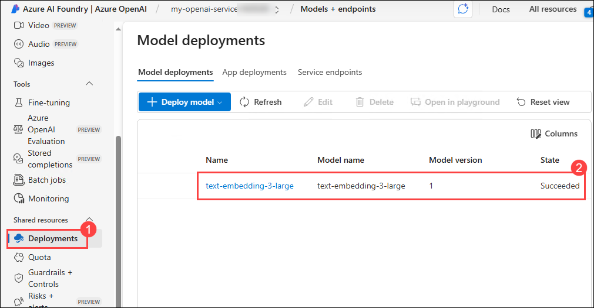

## 任務3：安裝依賴，創建虛擬環境，並創建環境變量文件

在這個任務中，你將安裝所需的依賴，搭建虛擬環境，並創建環境變量文件。這確保了受控的開發環境，並安全地管理您的
AI 項目配置設置。

1.  在你的 **Lab VM** 上，啟動 **Visual Studio Code。**

2.  點擊 **File** **(1)**，然後選擇**Open Folder**。

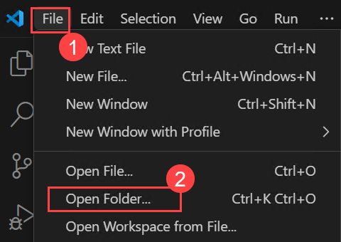

3.  進入 C：\LabFiles\Day-1 \\ **（1）**，選擇 **azure-ai-agents-labs
    （2）** 文件夾，然後點擊 **Select folder** **(3)**。

4.  點擊 **Yes, I Trust the authors**,

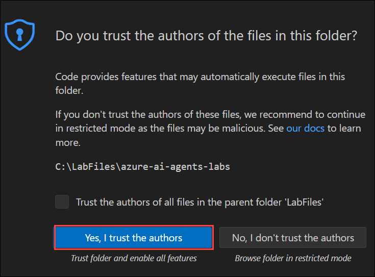

5.  點擊 **elipses(...)** **(1)**，然後是 **Terminal** **(2)** ，然後是
    **New Terminal** **(3)**。

6.  確保你在 **azure-ai-agents-labs**
    項目目錄裡。請執行以下PowerShell命令創建並激活您的虛擬環境:

7.  python -m venv venv

+++venv/Scripts/activate+++

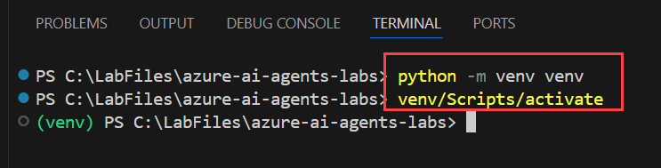

8.  運行下面的 PowerShell 命令。這樣就能安裝所有所需的軟件包:

9.  pip install -r requirements.txt

+++pip install azure-ai-ml azure-identity+++

10. 運行下面的 PowerShell 命令來安裝或升級 PIP 到最新版本。

+++python.exe -m pip install --upgrade pip+++

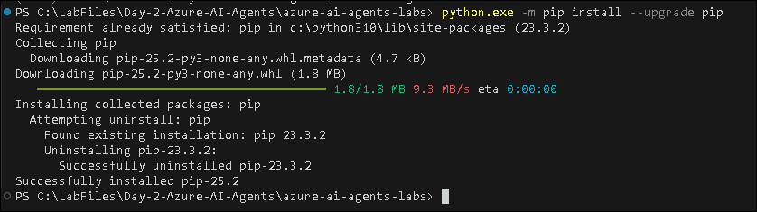

11. 執行以下命令登錄你的Azure賬戶。

+++az login+++

12. 選擇授權的用戶賬戶。

13. 授權完成後，返回Visual Studio代碼。

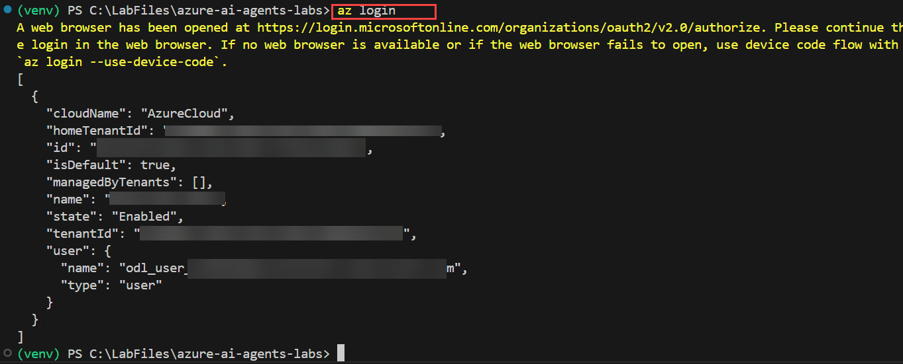

14. 打開 **Sample.env** 文件，輸入必要的環境變量。

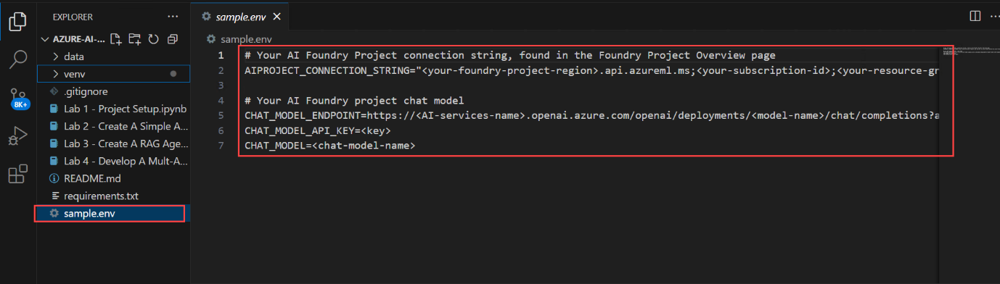

- 進入 Microsoft Foundry 門戶，在“My assets”下的 **Models +
  endpoints(1)** 部分點擊
  **gpt-4o** **(2)** 模型，從右側面板複製底下，複製粘貼 **Target URI
  （1）** 和 **Key (2)** 在記事本中**Endpoint**

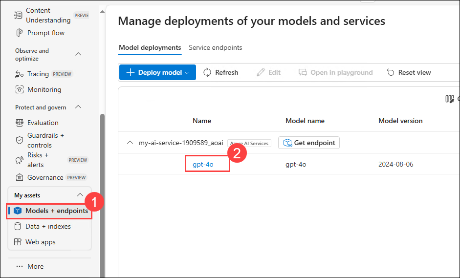

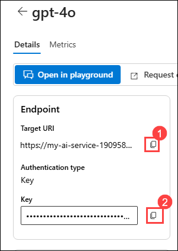

15. 在 **Sample.env** 文件中,

    - AIPROJECT_CONNECTION_STRING：提供你在任務1第9步複製的 **Project
      connection string**

    - CHAT_MODEL_ENDPOINT: 提供你在上一步複製的**gpt-4o**模型的 **Target
      URI** 

    - CHAT_MODEL_API_KEY: 提供你在上一步複製的**gpt-4o**模型的**Key** 值

    - CHAT_MODEL: **gpt-4o**

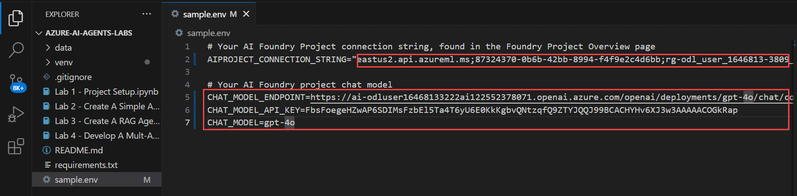

16. 將更改保存到**Sample.env**文件中。

17. 運行下面的 PowerShell 命令。這樣可以創建你的 **.env** 文件:

+++cp sample.env .env+++

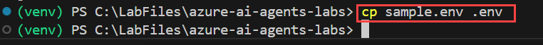

18. 稍後打開**實驗室1 - Project Setup.ipynb**文件。**實驗室 1 - Project
    Setup.ipynb** 筆記本指導你如何在 Microsoft Foundry 中搭建 AI
    項目，部署大型語言模型和嵌入模型，以及配置 VS Code
    連接。它還包含一個簡單的聊天完成API調用來驗證設置。運行此筆記本確保您的環境為開發AI驅動應用而配置正確。

19. 選擇右上角可選的“**Select kernel (1)** ”設置，並選擇
    **Install/enable selected extensions (python+jupyter) (2)**。

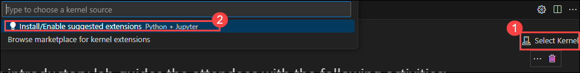

20. 選擇 **Python Environments **，確保 Jupyter Notebook 運行在正確的
    Python 解釋器和必要的依賴中。

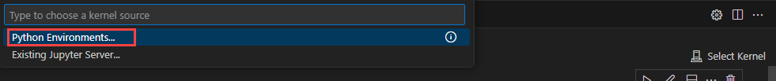

21. 從列表中選擇**venv（Python 3.x.x），**因為該版本很可能是與Microsoft
    Foundry SDK及其他依賴兼容的必要條件。

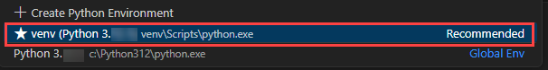

**注意：**如果 **venv（Python 3.x.x）**未出現在列表中。關閉並打開Visual
Studio代碼。

22. 運行第一個單元，導入用於使用 Azure AI 服務所需的 Python 庫。

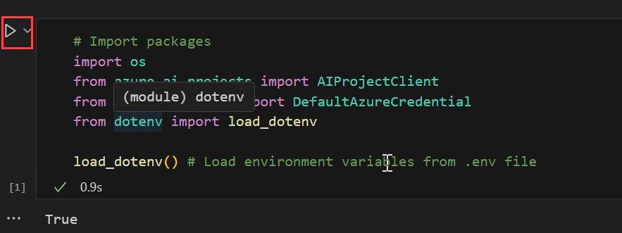

23. 運行下面的單元格，從環境變量中獲取項目連接字符串和模型名稱。這些數值對於安全地與大型語言模型（LLM）交互，無需硬編碼敏感信息。

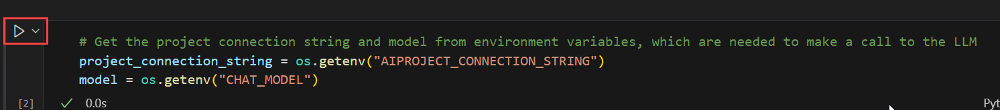

24. 運行下面的單元格，使用連接字符串連接到你的 Microsoft Foundry
    項目。這與 AIProjectClient 建立了安全連接，使您能夠與項目資源交互。

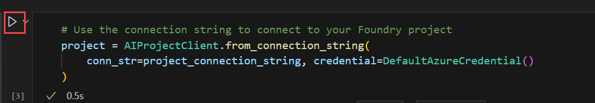

25. 運行下面的單元格，使用你的 Microsoft Foundry 項目與 GPT-4o
    模型交互。該代碼初始化聊天客戶端，發送關於泰迪熊的笑話請求，並打印回復。最後看看聊天模型提供的輸出。

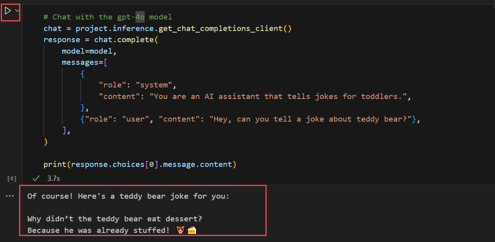

> **注意：**這一步的輸出由AI模型動態生成，每次可能有所不同。

**摘要**

在本實驗室中，你通過在Microsoft
Foundry中創建和配置AI項目，部署GPT-4o大型語言模型和文本嵌入3-large嵌入模型，並建立Visual
Studio
Code的安全連接，成功搭建了一個完整的AI開發環境。你安裝了所需的依賴，創建了虛擬環境，並配置了環境變量以安全地管理敏感信息。最後，你通過運行簡單的聊天完成API調用驗證了設置，確認環境配置正確，準備好開發AI驅動應用。

你已經成功完成了這個實驗。請點擊“Next \>\>”繼續。
