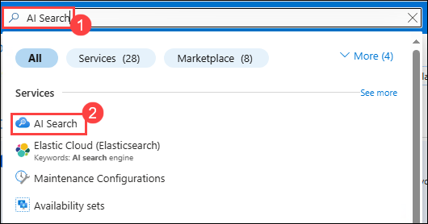
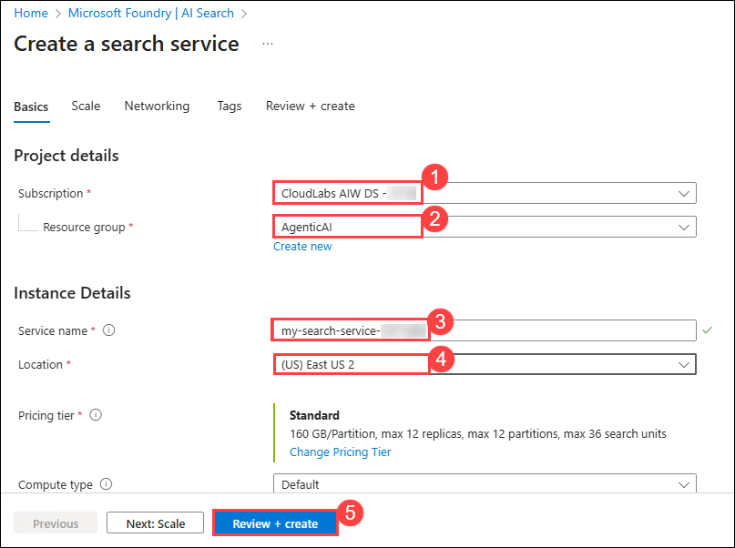
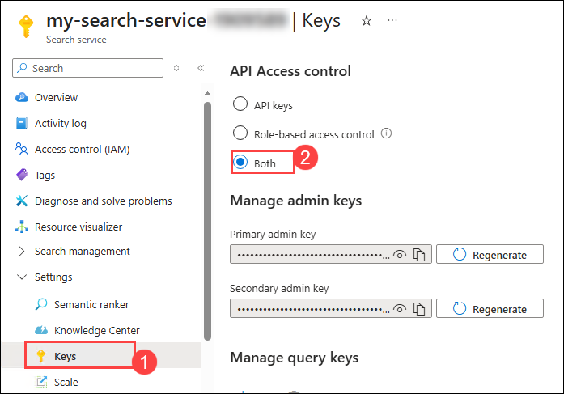
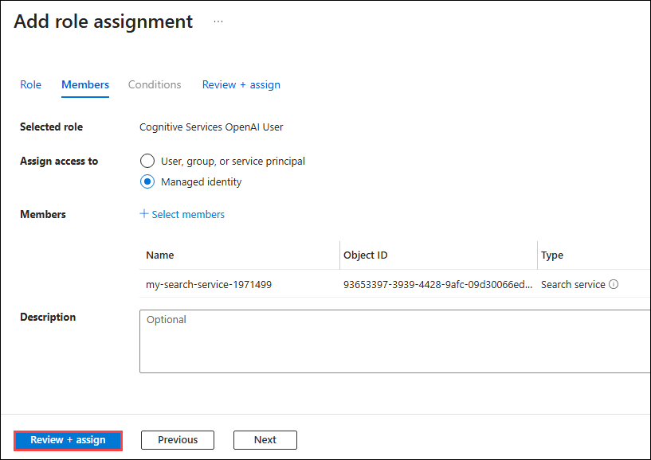
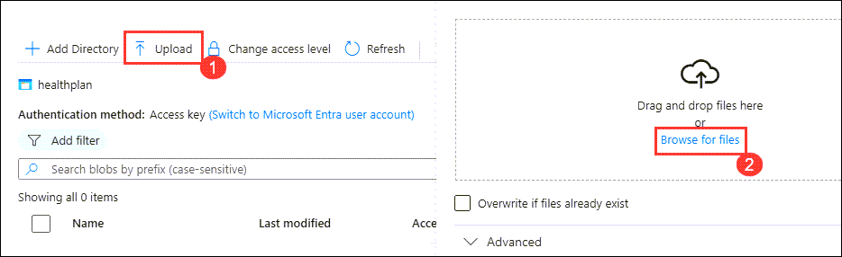
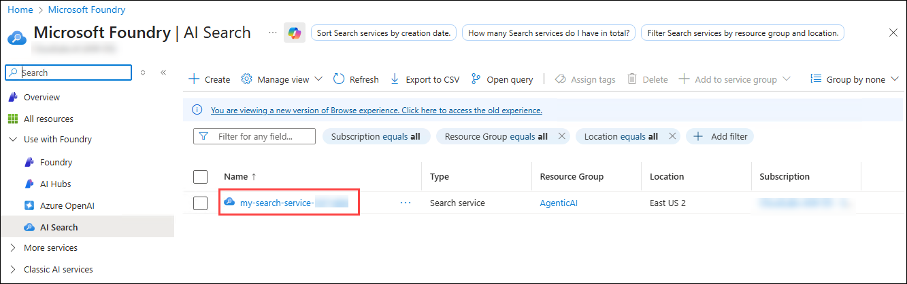
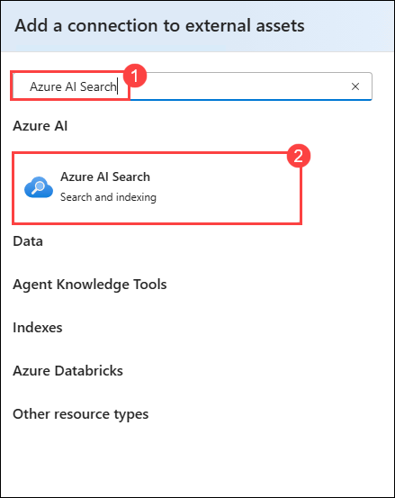
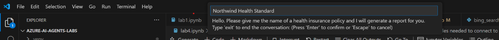

# Lab 4: Develop a Health plan report generation multi-agent system

**Overview**

In this lab, you will develop an intelligent multi-agent system
specifically designed to automate the generation of comprehensive health
plan reports. This system leverages the collaborative power of four
specialized AI agents working in coordination to retrieve, analyze,
generate, and validate detailed health insurance documentation. The
multi-agent architecture demonstrates how autonomous agents can work
together to accomplish complex tasks that would be challenging for a
single agent to handle effectively.

You will build these 4 AI Agents:

- **Search Agent** - This agent will search an Azure AI Search index for
  information about specific health plan policies.

- **Report Agent** - This agent will generate a detailed report about
  the health plan policy based on the information returned from the
  Search Agent.

- **Validation Agent** - This agent will validate that the generated
  report meets specified requirements. In our case, making sure that the
  report contains information about coverage exclusions.

- **Orchestrator Agent** - This agent will act as an orchestrator that
  manages the communication between the Search Agent, Report Agent, and
  Validation Agent.

Orchestration is a key part of multi-agentic systems since the agents
that we create need to be able to communicate with each other in order
to accomplish the objective.

We'll use the Azure AI Agent Service to create the Search, Report, and
Validation agents. However, to create the Orchestrator Agent, we'll use
Semantic Kernel. The Semantic Kernel library provides out-of-the-box
functionality for orchestrating multi-agent systems.

**Lab Objectives**

You'll perform the following tasks in this lab.

- Task 1: Create the Azure AI Search Index

- Task 2: Create the Search, Report, and Validation Agents.

## Task 1: Create the Azure AI Search Index

In this task, you will create an **Azure AI Search index** to store
vectorized representations of health insurance plan documents, enabling
efficient retrieval for AI-driven search and analysis.

1.  Navigate to **Azure portal**, search for **AI Search (1)** and
    select **AI Search (2)** resource from the services.

2.  This will navigate you to the AI Foundry, within **AI Search** (1),
    click on **Create**(2).

3.  On the **Create a Search service** pane enter the following details
    and click on **Review + Create** (4)

    - Subscription : **Leave default subscription**

    - Resource Group : Select **AgenticAI (1)**

    - Service Name : **my-search-service- (2)**

    - Location : **(3)**

4.  On the **Review + Create**, click on **Create**

5.  Wait for until the deployment is completetd and then click on **Go
    to resource**

6.  Navigate to **Keys (1)** under **Settings** in the left menu.
    Under **API Access control** select **Both(2)**.

7.  Select **Yes** for **Are you sure want to update the API Access
    Control for this serach service**.

8.  Navigate to **Identity(1)** under **Settings**. Under
    System-assigned set the Status to **On(2)** and click
    on **Save(3)**.

9.  Select **Yes** for **Enable System assigned managed identity**.

10. On the Azure portal, search for **Storage accounts (1)** and
    select **Storage accounts (2)** from the services.

11. Select the storage account that begins with **aifoundry**.

12. Select **Access control (IAM) (1)**, then click on **Add(2)**, and
    then select **Add role assignment**.

13. Under **Job function roles**, search for **Storage Blob Data Reader
    (1)**, select **Storage Blob Data Reader (2)**, and then
    select **Next (3)**.

14. On the **Add role assignment** page,

    - Under Members, select **Managed identity(1)**

    - Select **Members (2)**

    - Managed identity: **search service(1)** **(3)**

    - Then select **my-search-service-**(4) search service.

    - Click on **Select (5)**

15. Click on **Review + assign** twice.

16. Go to the **Azure OpenAI**, **my-openai-service**.

17. Select **Access control (IAM) (1)**, then click on **Add(2)**, and
    then select **Add role assignment**.

18. Under **Job function roles**, search for **Cognitive Services OpenAI
    User (1)**, select **Cognitive Services OpenAI User (2)**, and then
    select **Next (3)**.

19. On the **Add role assignment** page,

    - Under Members, select **Managed identity(1)**

    - Select **Members (2)**

    - Managed identity: **search service(1)** **(3)**

    - Then select **my-search-service-**(4) search service.

    - Click on **Select (5)**

20. Select **Review + assign** twice.

21. Navigate to **Azure Portal**, search for **Storage account (1)** and
    select the **Storage account (2)**.

22. Select the Storage account that starts with **aifoundryhub**.

23. Click on **Containers (1)** under data storage, then
    select **+Container(2)**.

24. On New Container page enter **healthplan(1)** as name and click
    on **Create (2)**.

25. Open **healthplan** container by clicking on it.

26. Click on **upload (1)** to upload the file and then Click
    on **browse for files (2)**.

> 

27. Navigate to C:\LabFiles\Day-1\azure-ai-agents-labs\data **(1)** and
    select both the PDFs to upload **(2)**, and click on **Open (3)**.

28. Click on **Upload**.

**Note:** If it ask you to select existing container, from the drop down
select healthplan.

29. Navigate to **Azure AI search** service and
    select **my-search-service-**.

30. Click on **import data (new)**.

31. Select **azure blob storage**.

32. Choose **RAG** Model.

33. On Configure your Azure Blob Storage , enter the following details
    and click on **Next(5)**:

[TABLE]

> 

34. On Vectorize your text, enter the following details and click
    on **Next (7)**:

[TABLE]

> 

35. Click on **Next** twice.

36. Enter **health-plan (1)** for **Objects name prefix** and click
    on **Create (2)**.

**Note**: The uploading of data to indexes in search service might take
5-10 minutes.

37. Click on **Start searching** on the pop-up.

38. Navigate to your **Overview** (1) page of **ai-foundry-project-**.
    and click on **Open In management center**(2).

39. Select **Connected resources** (1) and click on **New
    connection** (2).

40. Enter **Azure AI Search**(1) in search bar and select **Azure AI
    Search**(2).

41. Click on **Add connection** to proceed.

## Task 2: Create the Search, Report, and Validation Agents

In this task, you will create the Search, Report, and Validation Agents
to retrieve, generate, and validate health plan reports. These agents
will work together to ensure accuracy and compliance with requirements.
Each agent plays a distinct role in retrieving, compiling, and ensuring
the accuracy of the reports.

1.  Open the **Lab 4 - Develop A Mult-Agent System.ipynb** file,
    this **Lab 4 - Develop A Mult-Agent System.ipynb** notebook guides
    you through developing a multi-agent system with Search, Report,
    Validation, and Orchestrator Agents to generate and validate health
    plan reports. Each agent plays a distinct role in retrieving,
    compiling, and ensuring the accuracy of the reports.

2.  Select the **Select kernel (1)** setting available in the top right
    corner and select **venv (Python 3.x.x) (2)** from the list.

3.  Run this cell to develop a **multi-agent system** that integrates
    Azure AI Search, GPT-4o, and Semantic Kernel for intelligent task
    execution. This setup enables multiple AI agents to collaborate on
    retrieving information, generating responses, and handling complex
    queries.

4.  Run this cell to create the **Search Agent**, which retrieves health
    plan details from Azure AI Search using GPT-4o. This agent enables
    efficient retrieval of structured information from health plan
    documents.

5.  Run this cell to create the **Report Agent**, which generates
    detailed reports on health plans using GPT-4o. This agent enhances
    documentation by providing structured insights, coverage details,
    and exclusions for various plans.

6.  Run this cell to create the **Validation Agent**, which ensures that
    reports generated by the Report Agent meet quality standards,
    specifically checking for coverage exclusions.

7.  **Create a multi-agent system** : When you run the below cell, you
    will see a chat box pop up at the top of VS Code asking you to input
    the name of a health plan.

8.  If you recall, we uploaded two health plans to the search index.
    When prompted, type any one of the following health plans in the box
    that appears at the top and press **Enter** to begin running the
    multi-agent system:

    - **Northwind Health Standard**

    - **Northwind Health Plus**1

9.  When the box appears at the top, type exit into the box and press
    Enter to stop the running code block.

**Note**: After the successful run of the cell you will recieve the
following outcome.

> Orchestrator Agent is starting...
>
> Calling SearchAgent...
>
> SearchAgent completed successfully.
>
> Calling ReportAgent...
>
> ReportAgent completed successfully.
>
> Calling ValidationAgent...
>
> ValidationAgent completed successfully.
>
> The report for Northwind Plus has been generated. Please check the
> Northwind Plus Report.md file for the report.
>
> Orchestrator Agent is starting...

**Summary**

In this lab, you successfully developed an intelligent multi-agent
system designed to automate the generation of comprehensive health plan
reports through the coordination of four specialized AI agents. You
created an Azure AI Search index to store vectorized health insurance
documents, then built a Search Agent to retrieve policy information, a
Report Agent to generate detailed documentation, a Validation Agent to
ensure compliance with requirements, and an Orchestrator Agent using
Semantic Kernel to manage communication between all agents. By running
the multi-agent system with real health plan data, you demonstrated how
autonomous agents can collaborate effectively to accomplish complex
tasks that would be challenging for a single agent, showcasing
enterprise-grade agent orchestration patterns for practical business
applications.

Congratulations! You have successfully completed the lab.
