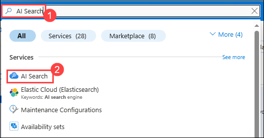
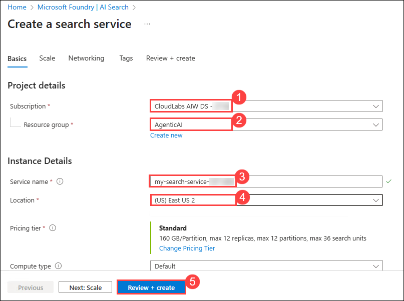
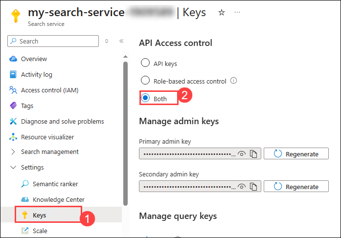
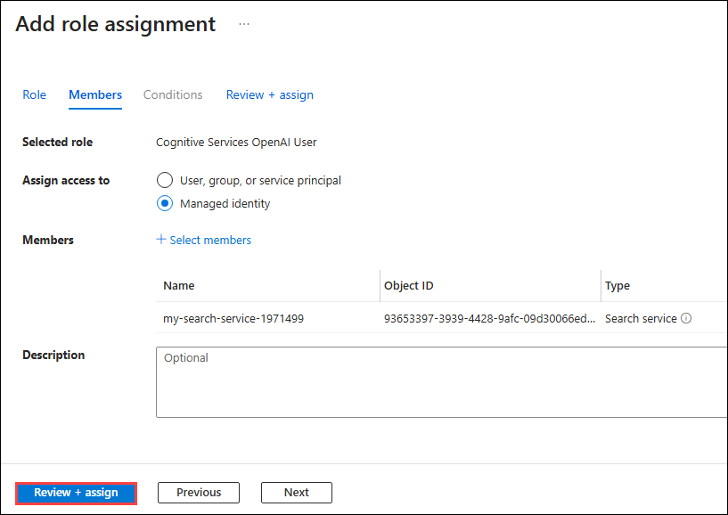
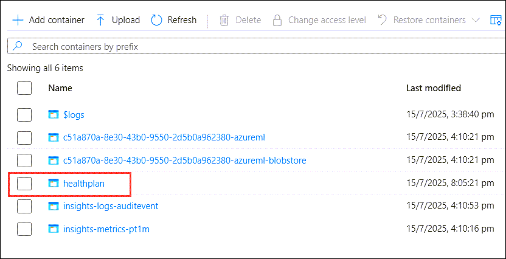
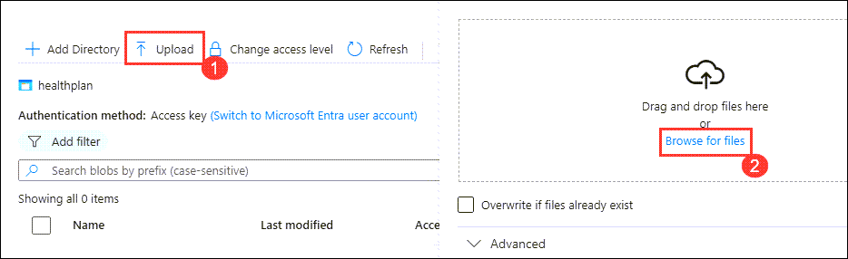
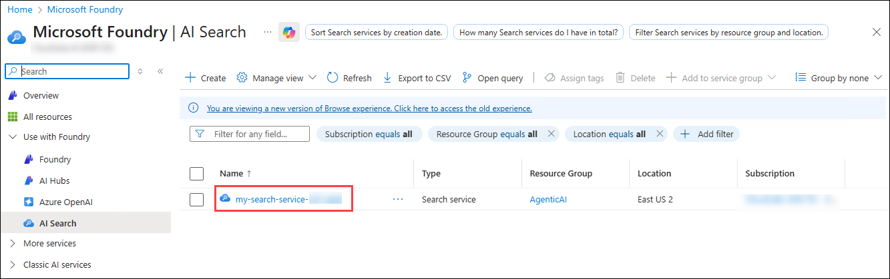
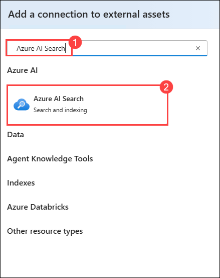
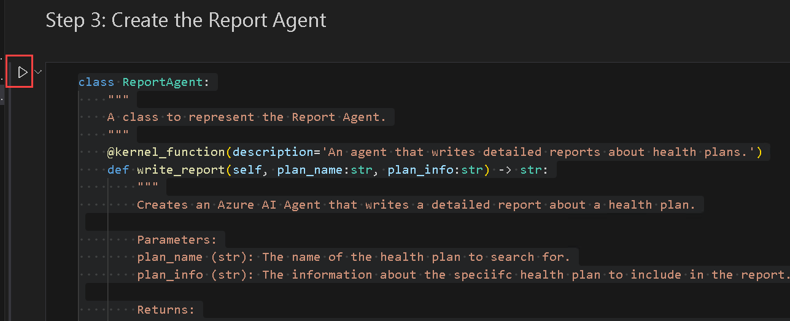
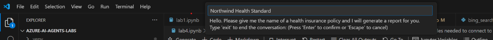

# 實驗室4：開發多代理健康計劃報告生成系統

**概述**

在這個實驗室中，你將開發一個智能多代理系統，專門設計用於自動生成全面的健康計劃報告。該系統利用四位專業AI代理協同工作的協作力量，檢索、分析、生成並驗證詳細的健康保險文件。多智能體架構展示了自主智能體如何協同工作，完成單一智能體難以有效處理的複雜任務。

你將建造這4個AI代理:

- **搜索代理**——該代理將搜索Azure
  AI搜索索引，以獲取有關特定健康計劃政策的信息。

- **報告代理人**——該代理人將根據搜索代理人返回的信息生成一份關於健康計劃政策的詳細報告。

- **驗證代理**——該代理將驗證生成的報告是否符合指定要求。在我們的案例中，確保報告包含有關保險除外條款的信息。

- **編排代理**——該代理將作為編排者，管理搜索代理、報告代理和驗證代理之間的通信。

編排是多智能體系統的關鍵組成部分，因為我們創建的智能體需要能夠相互通信以實現目標。

我們將使用 Azure AI
代理服務來創建搜索、報告和驗證代理。然而，為了創建編排代理，我們將使用
Semantic
Kernel。語義內核庫提供了開箱即用的功能，用於多智能體系統的編排。

**實驗室目標**

你將在實驗室執行以下任務。

- 任務1：創建Azure AI搜索索引

- 任務二：創建搜索、報告和驗證代理。

## 任務1：創建Azure AI搜索索引

在此任務中，您將創建Azure
**AI搜索索引**，以存儲健康保險計劃文件的矢量化表示，從而實現AI驅動的搜索和分析高效檢索。

1.  進入**Azure portal**，搜索 **AI Search (1)** ，並從服務中選擇 **AI
    Search (2)** 資源。

2.  這會引導你進入 AI Foundry，在 **AI Search** (1) 中點擊
    **Create**(2)。

3.  在 **Create a Search service** 面板中輸入以下信息，點擊“**Review +
    Create** (4)

    - 訂閱 : **Leave default subscription**

    - 資源組 : 選擇 **AgenticAI (1)**

    - 服務名稱 : **my-search-service- (2)**

    - 位置 : **(3)**

4.  在 **Review + Create** 中，點擊 **Create**

5.  等部署完成後再點擊“**Go to resource**

6.  在左側菜單的 **Settings** 裡進入 **Keys (1)** 。在 **API Access
    control** 下選擇 **Both（2）**。 

7.  選擇“**Yes**”，選擇 **Are you sure want to update the API Access
    Control for this serach service**。  

8.  導航 在 **Settings** 中導航到
    **Identity(1)** 。在系統分配中，將狀態設置為 **On(2)** ，然後點擊
    **Save(3)**。

9.  選擇“**Yes**”作為 **Enable System assigned managed identity**“。 

10. 在Azure門戶中，搜索 **Storage accounts (1)** ，並從服務中選擇
    **Storage accounts (2)** 。

11. 選擇以 **aifoundry** 開頭的存儲賬戶。

12. 選擇 **Access control (IAM) (1)**，然後點擊 **Add(2)**，再選擇 **Add
    role assignment**。

13. 在 **Job function roles** 中，搜索 **Storage Blob Data Reader
    (1)**，選擇 **Storage Blob Data Reader (2)**，然後選擇 **Next
    (3)**。

14. 在**“Add role assignment**”頁面,

    - 在“Members”中，選擇“ **Managed identity(1)**

    - 選擇 **Members (2)**

    - 託管身份: **search service(1)** **(3)**

    - 然後選擇 **my-search-service-**（4）搜索服務。

    - 點擊**Select (5)**

15. 點擊兩遍**“Review + assign**”。

16. 訪問 **Azure OpenAI，my-openai-service** 。

17. 選擇 **Access control (IAM) (1)**，然後點擊 **Add(2)**，再選擇 **Add
    role assignment**。

18. 在“**Job function roles**”中，搜索“**Cognitive Services OpenAI User
    (1)**，選擇 **Cognitive Services OpenAI User (2)**，然後選擇 **Next
    (3)**。

19. 在**“Add role assignment**”頁面,

    - 在“Members”欄目中，選擇**Managed identity(1)**

    - 選擇 **Members (2)**

    - 託管身份: **search service(1)** **(3)**

    - 然後選擇**my-search-service-**（4）搜索服務。

    - 點擊**Select (5)**

20. 選擇 **Review + assign** 兩次。

21. 進入 **Azure Portal**，搜索 **Storage account (1)** 並選擇 **Storage
    account (2)**。

22. 選擇以**aifoundryhub**開頭的存儲賬戶。

23. 點擊數據存儲下的 **Containers (1)** ，然後選擇 **+Container(2)**。

24. 在新容器頁面輸入 **healthplan（1）**作為名稱，點擊 **Create（2）。**

25. 點擊它打開 **healthplan **容器。

26. 點擊 **upload (1)** 來上傳文件，然後點擊 **browse for files (2)**。

> 

27. 進入C：\LabFiles\Day-1\azure-ai-agents-labs\data**（1）**，選擇兩個PDF上傳**（2）**，點擊
    **Open (3)**。

28. 點擊 **Upload**。

**注意：**如果系統讓你選擇現有容器，請從下拉菜單選擇健康計劃。

29. 進入 **Azure AI 搜索**服務，選擇
    **my-search-service**-。

30. 點擊導入 **import data (new)**。

31. 選擇 **azure blob storage**。

32. 選擇**RAG**模型。

33. 在配置你的Azure Blob存儲中，輸入以下信息並點擊**“Next（5）**”：

[TABLE]

> 

34. 在“向量化你的文本”中，輸入以下信息並點擊 **Next (7)**:

[TABLE]

> 

35. 點擊兩次**“Next **”。

36. 輸入 **health-plan (1)** 作為**Objects name prefix** ，點擊 **Create
    (2)**。

**注意**：在搜索服務中將數據上傳到索引可能需要5-10分鐘。

37. 點擊彈窗中的**“Start searching**”。

38. 請前往 **ai-foundry-project-** 的 **Overview** (1) 頁面。並點擊
    **Open In management center**(2)。

39. 選擇 **Connected resources** (1)，然後點擊 **New connection** (2)。

40. 在搜索欄輸入 **Azure AI Search**（1），並選擇 **Azure AI
    Search**（2）。

41. 點擊 **Add connection** 以繼續。

## 任務2：創建搜索、報告和驗證代理

在此任務中，您將創建搜索、報告和驗證代理，以檢索、生成和驗證健康計劃報告。這些代理將協同工作，確保準確性和符合要求。每位代理在檢索、彙編和確保報告準確性方面都扮演著獨特角色。

1.  打開**實驗4 - 開發多代理System.ipynb**文件，這本**實驗4 -
    開發多代理System.ipynb**筆記本指導你如何開發包含搜索、報告、驗證和編排代理的多代理系統，以生成和驗證健康計劃報告。每位代理在檢索、彙編和確保報告準確性方面都扮演著獨特角色。

2.  選擇 右上角可選的 **Select kernel（1）** 設置，並從列表中選擇 **venv
    （Python 3.x.x）（2） 。**

3.  運行該單元，開發一個集成 Azure AI 搜索、GPT-4o
    和語義內核的**多智能體系統**，實現智能任務執行。這種配置使多個AI代理能夠協作獲取信息、生成回復並處理複雜查詢。

4.  運行該單元格創建**搜索代理**，利用GPT-4o從Azure
    AI搜索中獲取健康計劃詳情。該代理能夠高效檢索健康計劃文檔中的結構化信息。

5.  運行該單元格創建**報告代理**，該代理使用GPT-4o生成詳細的健康計劃報告。該代理通過提供結構化的洞察、保障詳情及各種計劃的除外條款，豐富了相關文件。

6.  運行該單元以創建**驗證代理**，確保報告代理生成的報告符合質量標準，特別是檢查覆蓋除外。

7.  **創建一個多代理系統**：當你運行下面的單元格時，你會在VS
    Code頂部彈出一個聊天框，要求你輸入健康計劃名稱。

8.  如果你還記得，我們把兩個健康計劃上傳到了搜索索引中。當提示時，請在頂部的框中輸入以下任一健康計劃，並按**回車**開始運行多智能體系統:

    - **Northwind Health Standard**

    - **Northwind Health Plus**1

9.  當框框出現在頂部時，輸入“exit”並按回車鍵停止運行代碼塊。

**注意**：成功運行該單元後，您將獲得以下結果。

> Orchestrator Agent is starting...
>
> Calling SearchAgent...
>
> SearchAgent completed successfully.
>
> Calling ReportAgent...
>
> ReportAgent completed successfully.
>
> Calling ValidationAgent...
>
> ValidationAgent completed successfully.
>
> The report for Northwind Plus has been generated. Please check the
> Northwind Plus Report.md file for the report.
>
> Orchestrator Agent is starting...

**摘要**

在這個實驗室裡，你成功開發了一個智能多代理系統，通過協調四個專業的 AI
代理，自動生成全面的健康計劃報告。你創建了一個 Azure AI
搜索索引來存儲矢量化的健康保險文件，然後構建了一個搜索代理來獲取保單信息，一個報告代理用於生成詳細文檔，一個驗證代理用於確保符合要求，還有一個使用語義內核管理所有代理之間的通信的編排代理。通過運行多代理系統並結合真實健康計劃數據，你展示了自主代理如何有效協作完成單一代理難以完成的複雜任務，展示了企業級代理編排模式，適用於實際業務應用。

恭喜你！你已經成功完成了實驗。
