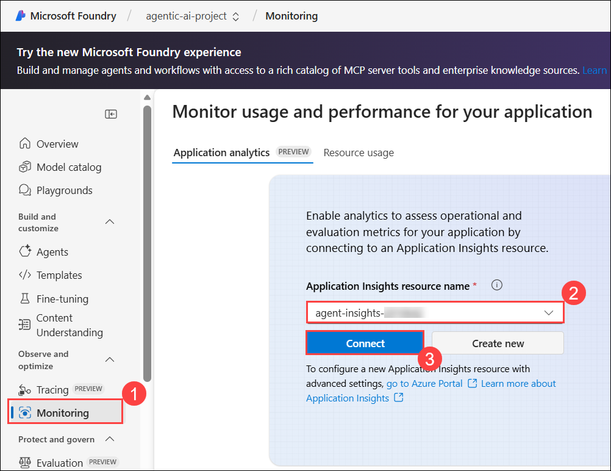

# 使用 Microsoft Foundry 和 Agent Framework 设计可扩展的 AI 代理

**概述**

这次为期三天的实践实验，利用Microsoft
Foundry和Microsoft代理框架设计和构建可扩展的AI代理。参与者将首先通过Microsoft
Foundry门户创建他们的第一个AI代理，学习如何上传企业政策文档并将其导入Azure
AI Search，以准备可搜索的知识库。研讨会随后进入使用 Microsoft Agent
Framework SDK
构建多代理系统，多个专业代理通过代理间（Agent-to-Agent，A2A）通信模式协作。
学习者将通过整合外部工具和数据源，使用模型上下文协议（MCP）扩展代理能力，连接Azure
AI搜索进行知识检索，并使用Freshdesk等外部API进行工单管理。培训进展到将代理部署到Microsoft
Foundry Agent
Service中，作为持久的云托管解决方案，具备状态管理和企业级可靠性。最后，参与者将实施先进的工作流程模式，包括集中协调的多代理系统和基于交接的系统，使对话能够根据用户意图和领域专业知识在专业代理之间无缝切换。

**目标**

到这个实验结束时，你就能:

- **搭建AI项目并从VS Code完成聊天:** 通过创建 Microsoft Foundry
  项目、部署 GPT-4 和嵌入模型，以及通过 Visual Studio Code
  建立安全连接，配置一个生产准备的 AI
  开发环境。您将通过执行聊天完成调用来验证设置，确保本地开发环境与Azure
  AI服务之间的无缝集成，并进行正确的身份验证和项目配置。

- **构建健康保险计划分析AI代理:** 开发一个专注于分析和可视化健康保险数据的智能
  AI
  代理。您将创建一个代理，处理复杂的健康福利计划信息并自动生成对比条形图，展示核心AI代理能力，包括数据解释、自然语言理解、代码执行和自动可视化生成，以支持决策。

- **开发多代理协作系统:** 设计并实现先进的多智能体架构，使专业AI智能体协同分析健康计划文档并生成全面报告。你将构建一个用于使用
  Azure AI Search
  智能文档检索的搜索代理，一个用于生成详细分析报告的报表代理，一个确保合规和准确性的验证代理，以及一个用于管理代理间通信和工作流协调的编排代理代理，展示企业级代理协作模式。

**前提条件**

参与者应当有:

- **Azure 和云经验**- 熟悉 Azure Portal、Resource Groups 和 Azure AI
  services

- **编程技能——**基础Python知识（异步/等待、环境变量、API调用）

- **AI概念**——理解大型语言模型、嵌入、RAG（检索增强生成）和提示工程

- **开发工具**——熟练掌握Visual Studio Code、终端使用和Git。

- **代理框架意识——**对代理架构、工具和编排模式的基础知识

组件说明

- **Microsoft** **Foundry**：Microsoft Foundry
  是一个用于开发、部署和管理企业级 AI
  代理的云平台。它提供托管代理服务运行时、集中项目管理和应用洞察监控，确保整个代理生命周期内企业级的可靠性、安全性和可观察性。

- **Microsoft Agent Framework SDK**：官方 Python
  SDK，用于构建智能、模块化代理，取代 AutoGen
  和语义内核。它具备原生代理间通信、模型上下文协议集成以及 Microsoft
  Foundry 支持，使得生产准备的企业代理系统能够标准化使用工具。

- **Azure AI
  搜索**：基于矢量的搜索引擎，支持检索增强生成工作流程。它提供结合向量相似度与关键词搜索的混合检索，提升相关性所需的语义排序，以及文档索引功能，确保代理从企业知识源中提供扎实、事实准确的回答。

- **Model Context
  Protocol（MCP）：**一种标准化接口，使代理能够安全地访问外部知识和工具。MCP连接企业数据源、Freshdesk等外部API，以及带有结构化结构的定制工具，确保交互可靠且可审计，并为可扩展的企业AI系统奠定基础。

- **聊天响应代理**：一种单回合、无状态代理模型，用于本地开发和测试。它独立处理请求，无需保留上下文，在本地环境中运行并立即响应。非常适合在使用持久代理进入生产环境前，进行核心逻辑原型设计和验证行为。

- **持久代理**：Microsoft Foundry
  中的一项云托管、长寿命服务，能在对话间保持状态。它支持通过MCP、代理间协作和企业级可靠性实现外部工具集成，并内置监控功能，为需要有状态、多回合对话体验的生产应用奠定基础。

- **规划代理**：一个智能编排器，分析用户查询并将其路由到合适的专业代理。它利用
  AI
  推理和关键词启发式，对人力资源、财务或合规等领域的查询进行分类，确保任务分配最优，并作为核心协调点。

- **员工代理**：在人力资源、财务或合规等特定领域拥有专业知识的领域专家。每个代理都有领域特定的指令、专业工具和相关知识来源。他们通过A2A沟通与规划代理人协作，为复杂的领域特定问题提供权威且准确的回答。

- **Azure
  OpenAI**：企业级服务，通过安全的API端点访问高级LLM。它提供聊天完成、嵌入模型、内容过滤和合规功能。它与
  Microsoft Foundry
  无缝集成，使代理能够在维护数据隐私和治理控制的同时利用 GPT-4。

# 实验5：使用Microsoft Foundry构建检索增强型AI代理

**概述**

在这个实验室中，你将使用 Microsoft Foundry 门户创建你的第一个 AI
代理。您将首先上传企业政策文档并将其导入Azure AI
Search，以准备知识库。然后，你将使用Microsoft代理框架配置代理，以启用检索增强生成（RAG）。最后，你将测试代理的响应并分析执行日志，观察其如何检索和处理信息。

**实验室目标**

你将在实验室执行以下任务。

- 任务1：创建Azure资源

- 任务二：在 Microsoft Foundry 中创建 AI 代理

- 任务3：连接Azure AI搜索RAG

- 任务4：测试并观察代理执行日志

## 任务1：创建Azure资源

在这个任务中，你将创建完成该实验室所需的所有Azure资源。

### 任务1.1：创建存储账户

1.  使用以下凭据登录 Azure 门户 +++https://portal.azure.com+++
    并选择存储账户。

- 用户名 - +++@lab.CloudPortalCredential(User1).Username+++

- TAP - <+++@lab.CloudPortalCredential(User1).TAP>+++

> 

2.  选择 **Create**。

3.  输入以下信息，选择 **Review + create**。在下一界面选择“Create”。

- 存储账户名称 - +++aistorage@lab.LabInstance.Id+++

- 首选存储类型 – 选择 **Azure Blob Storage or Azure Data Lake Storage
  Gen2**

> 
>
> 

4.  资源创建后，选择 **“Go to resource**”。

5.  选择 **Upload**，选择 **Create new** 容器以创建新容器。命名为
    +++**datasets**+++，然后选择 **Ok**。

6.  选择“**Browse for files**”，从**C:\Labfiles\Day
    2**中选择策略文件，点击**Upload**。

现在，存储账户已成功创建并加载了策略文档。

### 任务1.2：创建Foundry资源

在此任务中，您将创建一个 Foundry 资源，访问 Microsoft Foundry 是必要的。

1.  在Azure门户（+++https：//portal.azure.com+++）主页，选择
    **Foundry**。

2.  从左侧窗格选择**Foundry**，然后选择 **Create** Foundry资源。

3.  输入以下信息，选择 **Review + create**。

- 名称 – <+++agentic-@lab.LabInstance.Id>+++

- 默认项目名称 – <+++agentic-ai-project-@lab.LabInstance.Id>+++

4.  验证后选择 **Create**。

5.  确保资源已经建立。

6.  打开 **<agentic-ai-project-@lab.LabInstance.Id>** ，选择 **“Go to
    Foundry portal**”。

> 

7.  在 Microsoft Foundry 中，从左侧面板选择 Models + endpoints。选择 +
    **Deploy model** -\> **Deploy base model**。

8.  搜索 +++gpt-4o-mini+++，选择并点击确认以部署该模型。

9.  在部署窗口中选择**Deploy**。

10. 同样，搜索 +++text-embedding-ada-002+++ 并部署。

在这个任务中，你已经成功创建了Foundry资源，并在其中部署了一个聊天和一个嵌入模型。

### 任务1.3：创建应用洞察

在此任务中，您将创建应用洞察资源，这是监控所必需的。

1.  在Azure门户的主页，选择 **“Subscriptions”** 并选择分配的订阅。

2.  从左侧面板选择 **Resource providers**。

3.  搜索 +++Operational+++，选择 **Microsoft.OperationalInsights** 旁的
    3 个点，点击 **Register**。

4.  在 Microsoft Foundry 的左侧面板中，选择 **“Monitoring**”。

5.  选择 **Create New** -\>，输入名称为
    <+++agent-insights-@lab.LabInstance.Id>+++，然后选择**Create**。

在这个任务中，你创建了应用洞察资源。

### 任务1.4：创建搜索资源

在AI代理能够准确回答企业问题之前，必须访问可信的数据源。Azure AI
搜索通过索引政策、合同和手册等文档，实现检索增强生成（RAG）。索引就像一个可搜索的目录，将内容拆分成块，添加元数据，并使代理在对话中检索到正确的信息。

在此任务中，利用 Azure AI Search 索引上传的文档，创建可搜索的知识库。

1.  在 Azure 门户的主页，选择 **Foundry**。

2.  从左侧窗格选择“**AI Search**”，然后选择 **+ Create**。

3.  输入以下信息，选择 **Review + create。**

- 服务名称 - +++ai-knowledge-@lab.LabInstance.Id+++

- 地区 - East US2

> 

4.  验证通过后选择 **Create**。创建资源后选择“Go to resource”。

5.  选择 **Import data (new)**。

6.  在“**Choose data source**”下选择 **Azure Blob Storage**。

7.  在下一格，选择**RAG**选项，因为我们正在构建基于检索的代理。

> 以下是这些选项的用途 -

1.  **关键词搜索：**用于基于精确关键词的传统搜索体验。它会索引文本，让用户通过关键词匹配找到信息，无需AI推理。

2.  **RAG（检索增强生成）：**结合文档检索与 AI
    生成。它会接收文本（以及简单的OCR图像），因此AI代理能够提供扎实、具上下文感知的回答。

3.  **多模态RAG：**扩展RAG以处理复杂的视觉内容，如图表、表格、工作流程或图表。它使
    AI 能够解读文本和视觉元素，提供更丰富、基于洞察的回答。

&nbsp;

8.  在 **Storage account** 和 **datasets** **under Blob
    containe**r下选择
    <aistorage@lab.LabInstance.Id>，然后选择“**Next**”。

9.  请选择以下详情，然后选择 **“Next**”。

- Kind – Azure AI Foundry （预览版）

- Azure AI Foundry/Hub 项目 – <agentic-ai-project-@lab.LabInstance.Id>

- 模型部署 – text-embedding-002-ada

10. 在接下来的界面选择“**Next**”，直到出现 **Review and create** 界面。

11. 在“**Review and create**”屏幕中选择“**Create**”。

12. 在“Create succeeded”对话框中选择“**Close**”。

你已经成功将数据集导入 Azure AI
搜索并创建了可搜索索引。在下一个任务中，你将创建一个 AI
代理，并将该索引作为其知识来源连接起来。

## 任务二：在 Microsoft Foundry 中创建 AI 代理

在这项任务中，你将在 Microsoft Foundry 中创建一个新的 AI 代理，并通过
Microsoft 代理框架界面配置其核心目的、指令和模型。

1.  回到你的资源组，从资源列表中选择**agentic-foundry**资源。

2.  在下一页，点击“**Go to Foundry
    portal**”。现在，您将被引导到Microsoft
    Foundry门户，在那里创建您的第一个代理。

3.  进入Foundry门户后，从左侧菜单选择 **Agents
    (1)**，你会看到**已经预创建**的代理。如果没有创建，请点击**+ New
    agent (2)** ”选项以创建该代理。 

4.  选择新创建的**代理**，右侧会打开一个配置面板。请提供以下详细信息。

[TABLE]

> 

5.  你已经成功在 Microsoft Foundry
    中创建了一个代理。接下来，是时候通过连接你索引数据来丰富它。

## 任务3：连接Azure AI搜索RAG

在此任务中，您将通过知识集成面板将Azure AI
Search与代理集成，通过MCP（模型上下文协议）实现检索增强响应。

1.  在同一个代理配置窗格中，向下滚动并单击“**+ Add** **知识**参数”。

2.  在 **Add knowledge** 面板中，选择 **Azure AI
    Search**，因为你已经在AI搜索资源中准备好了索引。

3.  在下一窗格中，选择 **Azure AI Search resource
    connection** 选项，点击**下拉箭头（1）**，然后选择 **Connect other
    Azure AI Search resource (2)**。

4.  在下一栏，确认选中了正确的AI搜索资源，并点击**“Add connection**”。

5.  在 **Adding Azure AI Search** 步骤中，配置以下细节，完成后点击
    **Connect (5)**。

[TABLE]

> 

6.  该代理现已通过Azure
    AI搜索索引成功丰富知识，该索引作为可搜索的知识库，用于在对话中获取准确信息。

## 任务4：测试并观察代理执行日志

在此任务中，您将通过提出与政策相关的问题和结构化日志来测试您的客服，以验证工具使用情况、搜索调用和基于实际的响应。

1.  在测试代理之前，连接 Application
    Insights，以启用详细日志和跟踪可视化。

2.  在 Microsoft Foundry 门户中，从左侧菜单选择 **Monitoring
    (1)** ，选择 **agent-insights- (2)** ，点击 **Connect (3)**

3.  完成后，从左侧菜单选择 **Agents (1)** ，然后选择
    **EnterpriseAssistant（2）**代理，点击 **Try in playground (3)**。

4.  会打开一个聊天面板，你可以在那里输入提示。客服现在会根据你连接的文档和数据集进行响应。

示例提示 -

- +++What is the employee travel reimbursement policy?+++

- +++Summarize the contract approval rules and cite the document.+++

5.  代理回答问题后，从顶部菜单点击“**Thread
    logs** ”，查看当前线程的日志和痕迹。

6.  请查看这些指标、记录和评估，这些指标在代理日志中展示了详细的主张。

7.  现在，进入**监控**窗格，你之前已连接过应用洞察，选择 **Resource
    usage** 标签，查看所有指标和数值。

8.  你成功构建了一个基于RAG的代理，由精心策划的企业数据集驱动。接下来，你将进一步实现多代理协作，让代理能够委托、推理并智能协作。

摘要

在这个实验室里，你成功地在Microsoft
Foundry创建了你的第一个AI代理，并将其连接到一个索引知识库。你上传了文档，导入了
Azure AI 搜索，并通过 Microsoft Agent Framework 集成启用了
RAG。通过测试代理并审查执行日志，你亲身体验了代理如何获取有根据的信息并生成企业级响应。
