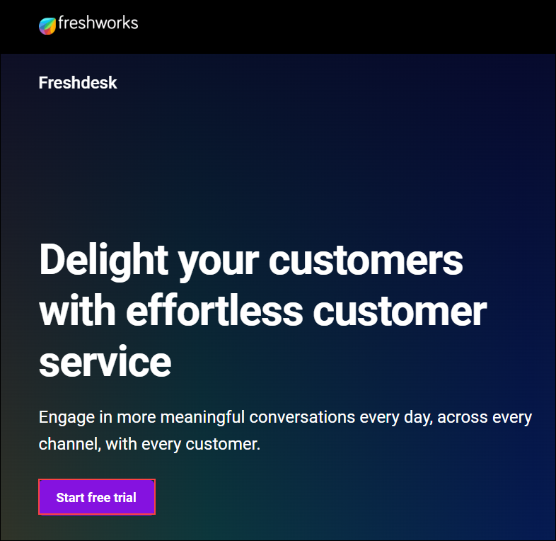
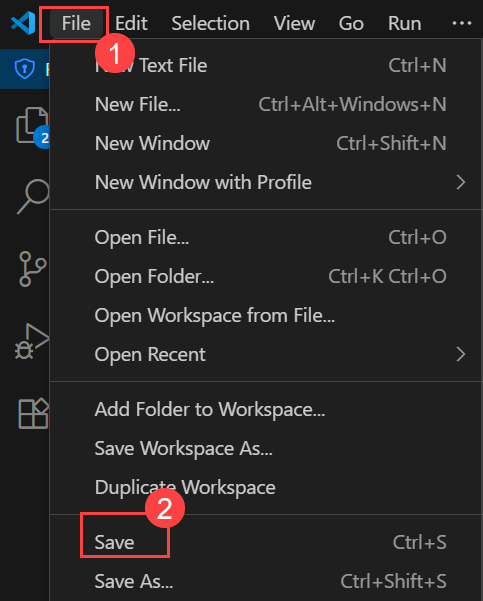

# 실습 7: MCP를 사용하여 AI 기반 티켓 관리 시스템을 구축하기

**예상 소요 시간**: 60분

**개요**

이 실습에서는 Model Context Protocol (MCP)을 사용해 실제 조직 데이터와
외부 서비스에 연결하여 엔터프라이즈 에이전트 시스템을 확장할 것입니다.
Azure AI Search를 통합하여 인덱스된 지식 기반에서 맥락에 기반한 응답을
제공하고, Freshdesk API를 연결해 에이전트가 HR이나 재무 티켓 생성과 같은
실제 업무를 수행할 수 있도록 합니다.

이 실습을 완료하면 에이전트들은 정적인 대화형 모델에서 기업 시스템과
안전하게 상호작용할 수 있는 지능적이고 데이터 인식적이며 액션 중심의
어시스턴트로 진화하게 됩니다.

실습 목표

이 실습에서 다음과 같이 작업을 수행할 것입니다.

- 작업 1: Azure Search MCP 도구를 구축하기

- 작업 2: 도구를 에이전트에 보착하고 프롬프트를 풍부하게 하며 테스트
  실행하기

- 작업 3: 티켓 관리를 위한 Freshworks 설정하기

- 작업 4: 에이전트를 외부 API에 연결하기 (Freshdesk MCP 통합)

## 작업 1: Azure Search MCP 도구를 구축하기

이 작업에서는 AI Search 자격 증명으로 환경 변수를 업데이트하고, Azure AI
Search를 조회하여 상위 N개의 문서 조각을 반환하는 비동기 도구 클래스를
생성하여 에이전트가 이를 컨텍스트로 사용합니다.

MCP는 구조화된 입출력 계약을 통해 AI 에이전트가 외부 지식과 도구에
안전하게 접근할 수 있도록 하는 표준입니다. 에이전트가 사실 정보를
수집하고, API를 호출하며, 통제되고 감사 가능한 방식으로 동작을 수행할 수
있게 해주어, 기반이 두드러지고 확장 가능한 엔터프라이즈 AI 시스템의
중추를 형성합니다.

1.  Azure Portal에서 **agenticai**로 이동하고 목록에서
    **ai-knowledge-** Search 서비스를 선택하세요.

2.  왼쪽 메뉴에서 **Keys (1)**을 선택하고 Settings에서 표시되는 복사
    옵션을 사용하여 **Query Key (2)**를 복사하세요.

3.  복사 완료 후 노트패드에 안전하게 붙여넣고 Search Management 왼쪽
    메뉴에서 **Indexes (1)**를 선택한 후 **Index Name (2)**를
    복사하세요.

4.  이전에 멀티 에이전트 시스템을 생성했으니, Visual Studio Code 창에서
    .env 파일을 선택하세요. 연결을 위해 AI 검색 키를 추가해야 합니다.

5.  .env 파일에서 AI 파운드리 키 아래에 이 부분을 추가하세요.
    **\[Query_Key\]**와 **\[Index_Name\]** 값을 이전에 복사한 값으로
    교체하세요.

> AZURE_SEARCH_ENDPOINT=https://ai-knowledge--@lab.LabInstance.Id.search.windows.net/
>
> AZURE_SEARCH_API_KEY=\[Query_Key\]
>
> AZURE_SEARCH_INDEX=\[Index_Name\]

6.  완료 후에는 파일을 저장하세요. 상단 메뉴에서 **file (1)** 옵션을
    클릭하고 파일을 저장하려면 **save (2)**를 선택하세요.

7.  완료 후에는 표시된 대로 **Create Folder**옵션을 클릭하고, 안내가
    뜨면 폴더 이름을 도구로 입력하세요. 루트에 새 폴더를 생성하세요.

8.  생성 후 폴더 구조는 이와 비슷하게 보일 것입니다.

9.  이제 이전에 생성한 **tools (1)** 폴더를 선택하고 표시된 대로
    **Create file (2)** 옵션을 클릭하세요. 이렇게 하면 도구 폴더 아래에
    파일이 생성됩니다.

10. 파일의 이름을 azure_search_tool.py로 입력하세요.

11. 생성 후에는 다음 코드 스니펫을 추가하여 에이전트용 검색 도구를
    설정하세요.

> import os
>
> import sys
>
> import aiohttp
>
> import json
>
> import asyncio
>
> from typing import List
>
> from pathlib import Path
>
> \# Add parent directory to path for imports
>
> sys.path.append(str(Path(\_\_file\_\_).parent.parent))
>
> class AzureSearchTool:
>
> """
>
> Async MCP-like tool to query Azure Cognitive Search index.
>
> Reads endpoint/key/index from environment and returns joined content
> snippets.
>
> """
>
> def \_\_init\_\_(self):
>
> self.endpoint = os.getenv("AZURE_SEARCH_ENDPOINT")
>
> self.api_key = os.getenv("AZURE_SEARCH_API_KEY")
>
> self.index_name = os.getenv("AZURE_SEARCH_INDEX")
>
> if not all(\[self.endpoint, self.api_key, self.index_name\]):
>
> raise RuntimeError("Azure Search env vars not set
> (AZURE_SEARCH_ENDPOINT/KEY/INDEX).")
>
> if not self.endpoint.endswith('/'):
>
> self.endpoint += '/'
>
> self.api_version = "2023-11-01"
>
> async def search(self, query: str, top: int = 5) -\> str:
>
> """
>
> Query the Azure Search index and return concatenated content snippets.
>
> """
>
> url =
> f"{self.endpoint}indexes/{self.index_name}/docs/search?api-version={self.api_version}"
>
> headers = {"Content-Type": "application/json", "api-key":
> self.api_key}
>
> body = {"search": query, "top": top}
>
> async with aiohttp.ClientSession() as session:
>
> async with session.post(url, headers=headers, json=body) as resp:
>
> if resp.status != 200:
>
> text = await resp.text()
>
> raise RuntimeError(f"Azure Search error {resp.status}: {text}")
>
> data = await resp.json()
>
> docs = data.get("value", \[\])
>
> snippets: List\[str\] = \[\]
>
> for d in docs:
>
> snippet = d.get("content") or d.get("text") or d.get("description") or
> json.dumps(d)
>
> snippets.append(snippet.strip())
>
> return "\n\n".join(snippets) if snippets else "No results found."
>
> async def health_check(self):
>
> """Check if Azure Search service is accessible."""
>
> try:
>
> url =
> f"{self.endpoint}indexes/{self.index_name}?api-version={self.api_version}"
>
> headers = {"Content-Type": "application/json", "api-key":
> self.api_key}
>
> async with aiohttp.ClientSession() as session:
>
> async with session.get(url, headers=headers) as resp:
>
> return {
>
> "status": "healthy" if resp.status == 200 else "unhealthy",
>
> "status_code": resp.status,
>
> "endpoint": self.endpoint,
>
> "index": self.index_name
>
> }
>
> except Exception as e:
>
> return {
>
> "status": "error",
>
> "error": str(e),
>
> "endpoint": self.endpoint,
>
> "index": self.index_name
>
> }
>
> \# Example usage and testing
>
> async def main():
>
> """Test the Azure Search tool"""
>
> try:
>
> \# Load environment variables
>
> from utils.env import load_env
>
> load_env()
>
> \# Initialize search tool
>
> search_tool = AzureSearchTool()
>
> \# Health check
>
> health = await search_tool.health_check()
>
> print(f"Health Status: {json.dumps(health, indent=2)}")
>
> \# Test search
>
> test_queries = \[
>
> "travel reimbursement policy",
>
> "GDPR compliance requirements",
>
> "employee leave policies"
>
> \]
>
> for query in test_queries:
>
> print(f"\n{'='\*60}")
>
> print(f"Testing search: {query}")
>
> print('='\*60)
>
> result = await search_tool.search(query, top=3)
>
> print(result)
>
> except Exception as e:
>
> print(f"Error testing Azure Search tool: {e}")
>
> if \_\_name\_\_ == "\_\_main\_\_":
>
> import asyncio
>
> asyncio.run(main())

> **AzureSearchTool의 목적:**

- 이 도구는 에이전트가 Azure Cognitive Search 인덱스를 조회하고 사용자
  쿼리와 관련된 사실 맥락 스니펫을 검색할 수 있도록 비동기 MCP 호환
  인터페이스를 제공합니다.

> **환경 기반 구성:**

- 이 도구는 환경 변수에서 Azure Search 자격 증명(엔드포인트, API 키,
  인덱스 이름)을 직접 읽어내어 안전하고 유연한 구성을 보장합니다.

> **핵심 검색 기능(검색 방법):**

- search() 방법은 Azure Search REST API에 비동기 POST 요청을 보내 상위
  일치 문서를 가져오고 그 콘텐츠 필드를 하나의 컨텍스트 문자열로
  연결합니다.

> **테스트 및 진단 모드:**

- 이 파일에는 환경 변수를 로드하고, 실시간 건강 점검을 수행하며,
  에이전트 통합 전에 빠른 독립 실행형 검증을 위한 샘플 쿼리를 실행하는
  내장된 main() 루틴이 포함되어 있습니다.

12. 완료 후 **File** **(1)**을 선택한 후 파일을 저장하려면
    **Save** **(2)**를 클릭하세요.

13. 메뉴를 확장하려면 상단 메뉴에서 **... (1)** 옵션을 선택하세요.
    **Terminal (2)**를 선택하고 **New Terminal (3)**을 클릭하세요.

14. 검색 도구의 작동 방식을 시험하려면 아래 명령어를 실행하세요

+++python .\tools\azure_search_tool.py+++

15. Azure AI Search 데이터를 에이전트와 연결하여 인덱스된 지식
    베이스에서 관련 맥락을 검색할 수 있게 하는 MCP 도구를 성공적으로
    생성했습니다.

## 작업 2: 도구를 에이전트에 보착하고 프롬프트를 풍부하게 하며 테스트 실행하기

이 작업에서는 AzureSearchTool을 HR/재무/컴플라이언스 에이전트에
연결하고, 에이전트를 호출하기 전에 컨텍스트를 가져오도록
오케스트레이션을 업데이트하며, 배치 및 인터랙티브 테스트를 실행해야
합니다.

1.  도구를 생성했으니 응답을 주기 전에 에이전트의 오케스트레이션을
    변경해 검색 도구를 트리게해야 합니다.

2.  Visual Studio Code 탐색기에서 **main.py** 파일을 열고 기존 콘텐츠를
    아래에 제공하는 코드로 교체하세요.

> import asyncio
>
> import time
>
> import logging
>
> import re
>
> from typing import Dict, Any
>
> from utils.env import load_env
>
> from agents.planner_agent import build_planner_agent, classify_target
>
> from agents.hr_agent import build_hr_agent
>
> from agents.compliance_agent import build_compliance_agent
>
> from agents.finance_agent import build_finance_agent
>
> from tools.azure_search_tool import AzureSearchTool
>
> \# Configure logging
>
> logging.basicConfig(level=logging.INFO, format='%(asctime)s -
> %(levelname)s - %(message)s')
>
> async def run_multi_agent(query: str, agents: Dict\[str, Any\]) -\>
> Dict\[str, Any\]:
>
> """
>
> Advanced multi-agent system with routing, search context, and ticket
> creation capabilities.
>
> """
>
> start_time = time.time()
>
> try:
>
> \# Step 1: Route the query
>
> logging.info(f"Routing query: {query\[:50\]}...")
>
> target = await classify_target(agents\["planner"\], query)
>
> logging.info(f"Query routed to: {target}")
>
> \# Step 2: Retrieve relevant context using Azure Search
>
> logging.info("Retrieving context from knowledge base...")
>
> context = await agents\["search_tool"\].search(query, top=3)
>
> \# Step 3: Create enriched prompt with context
>
> enriched_prompt = f"""
>
> Context from Knowledge Base:
>
> {context}
>
> ---
>
> User Question: {query}
>
> Please provide a comprehensive answer based PRIMARILY on the context
> information provided above.
>
> Use the knowledge base content as your primary source of truth. If the
> context contains relevant
>
> information, base your answer on that. Only supplement with general
> knowledge if the context
>
> doesn't cover the specific question.
>
> If no relevant information is found in the context, clearly state that
> and provide general guidance
>
> while recommending the user contact the appropriate department for
> specific details.
>
> """
>
> \# Step 4: Get response from appropriate agent
>
> agent_mapping = {
>
> "HR": ("hr", "HRAgent"),
>
> "FINANCE": ("finance", "FinanceAgent"),
>
> "COMPLIANCE": ("compliance", "ComplianceAgent")
>
> }
>
> if target in agent_mapping:
>
> agent_key, agent_name = agent_mapping\[target\]
>
> answer = await agents\[agent_key\].run(enriched_prompt)
>
> else:
>
> \# Fallback to HR if routing unclear
>
> logging.warning(f"Unknown target '{target}', falling back to HR")
>
> answer = await agents\["hr"\].run(enriched_prompt)
>
> target = "HR"
>
> agent_name = "HRAgent"
>
> answer_text = str(answer)
>
> \# Step 6: Process response
>
> response_time = time.time() - start_time
>
> return {
>
> "query": query,
>
> "routed_to": target,
>
> "agent_name": agent_name,
>
> "answer": answer_text,
>
> "context_retrieved": len(context) \> 100, \# Simple check if context
> was found
>
> "ticket_created": False, \# Tickets only created in interactive mode
>
> "ticket_info": None,
>
> "response_time": round(response_time, 2),
>
> "timestamp": time.strftime("%Y-%m-%d %H:%M:%S"),
>
> "success": True
>
> }
>
> except Exception as e:
>
> logging.error(f"Error processing query: {e}")
>
> return {
>
> "query": query,
>
> "routed_to": "ERROR",
>
> "agent_name": "ErrorHandler",
>
> "answer": f"I apologize, but I encountered an error processing your
> request: {str(e)}",
>
> "context_retrieved": False,
>
> "ticket_created": False,
>
> "ticket_info": None,
>
> "response_time": round(time.time() - start_time, 2),
>
> "timestamp": time.strftime("%Y-%m-%d %H:%M:%S"),
>
> "success": False
>
> }
>
> def format_response(result: Dict\[str, Any\]) -\> str:
>
> """Format the agent response for display."""
>
> status_icon = "✅" if result\["success"\] else "❌"
>
> context_icon = "📚" if result.get("context_retrieved") else "📭"
>
> ticket_icon = "🎫" if result.get("ticket_created") else ""
>
> formatted = f"""
>
> {status_icon} Agent Response Summary:
>
> ┌─ Routed to: {result\['routed_to'\]} ({result\['agent_name'\]})
>
> ├─ Response time: {result\['response_time'\]}s
>
> ├─ Context retrieved: {context_icon} {'Yes' if
> result.get('context_retrieved') else 'No'}
>
> ├─ Ticket created: {ticket_icon} {'Yes' if
> result.get('ticket_created') else 'No'}
>
> ├─ Timestamp: {result\['timestamp'\]}
>
> └─ Status: {'Success' if result\['success'\] else 'Error'}
>
> 💬 Answer:
>
> {result\['answer'\]}
>
> """
>
> \# Add ticket details if available
>
> if result.get("ticket_info") and
> result\["ticket_info"\].get("success"):
>
> ticket = result\["ticket_info"\]\["ticket"\]
>
> formatted += f"""
>
> 🎫 Ticket Details:
>
> ├─ ID: \#{ticket\['id'\]}
>
> ├─ Status: {ticket\['status'\]}
>
> ├─ Priority: {ticket\['priority'\]}
>
> └─ URL: {ticket\['url'\]}
>
> """
>
> return formatted
>
> async def run_interactive_mode(agents: Dict\[str, Any\]):
>
> """Interactive mode for real-time queries."""
>
> print("\n🤖 Enterprise Agent System - Interactive Mode")
>
> print("Available agents: HR, Finance, Compliance")
>
> print("Type 'quit' to exit, 'help' for commands\n")
>
> while True:
>
> try:
>
> query = input("Enter your question: ").strip()
>
> if query.lower() in \['quit', 'exit', 'q'\]:
>
> print("👋 Goodbye!")
>
> break
>
> elif query.lower() == 'help':
>
> print("""
>
> 📋 Available Commands:
>
> - Ask any question about HR, Finance, or Compliance
>
> - 'quit' or 'exit' - Exit the system
>
> - 'help' - Show this help message
>
> 🎯 Example questions:
>
> - "What's the travel reimbursement limit for meals?"
>
> - "How many vacation days do employees get?"
>
> - "Do we need GDPR compliance for EU customers?"
>
> """)
>
> continue
>
> elif not query:
>
> continue
>
> result = await run_multi_agent(query, agents)
>
> print(format_response(result))
>
> except KeyboardInterrupt:
>
> print("\n👋 Goodbye!")
>
> break
>
> except Exception as e:
>
> logging.error(f"Interactive mode error: {e}")
>
> print(f"❌ Error: {e}")
>
> async def run_batch_tests(agents: Dict\[str, Any\]):
>
> """Run focused test queries with grounded data integration."""
>
> test_queries = \[
>
> "What is the travel reimbursement limit for hotel stays?",
>
> "How many vacation days are allowed per year?"
>
> \]
>
> print("🧪 Running focused batch tests with grounded data
> integration...\n")
>
> for i, query in enumerate(test_queries, 1):
>
> print(f"{'='\*80}")
>
> print(f"TEST {i}/{len(test_queries)}: {query}")
>
> print(f"{'='\*80}")
>
> result = await run_multi_agent(query, agents)
>
> print(format_response(result))
>
> \# Small delay between queries for better readability
>
> if i \< len(test_queries):
>
> await asyncio.sleep(1.0) \# Longer delay for tool operations
>
> async def main():
>
> """Main application entry point with enhanced features and tool
> integration."""
>
> print("🚀 Initializing Enterprise Agent System with Tools...")
>
> try:
>
> \# Load environment and build agents
>
> load_env()
>
> logging.info("Building agent network...")
>
> \# Build core agents
>
> agents = {
>
> "planner": await build_planner_agent(),
>
> "hr": await build_hr_agent(),
>
> "compliance": await build_compliance_agent(),
>
> "finance": await build_finance_agent()
>
> }
>
> \# Initialize and attach tools
>
> logging.info("Initializing tools...")
>
> try:
>
> search_tool = AzureSearchTool()
>
> agents\["search_tool"\] = search_tool
>
> \# Test search tool
>
> health = await search_tool.health_check()
>
> if health\["status"\] == "healthy":
>
> logging.info("✅ Azure Search tool initialized successfully")
>
> else:
>
> logging.warning(f"⚠️ Azure Search tool health check failed: {health}")
>
> except Exception as e:
>
> logging.error(f"Failed to initialize Azure Search tool: {e}")
>
> \# Create mock search tool for testing
>
> class MockSearchTool:
>
> async def search(self, query, top=3):
>
> return f"📭 Mock search results for: {query}\n(Azure Search tool not
> configured)"
>
> agents\["search_tool"\] = MockSearchTool()
>
> \# Freshdesk integration removed - focusing on grounded search
> responses only
>
> logging.info("✅ All agents and tools initialized")
>
> \# Check if running interactively or in batch mode
>
> import sys
>
> if len(sys.argv) \> 1 and sys.argv\[1\] == "--interactive":
>
> await run_interactive_mode(agents)
>
> else:
>
> await run_batch_tests(agents)
>
> except Exception as e:
>
> logging.error(f"System initialization failed: {e}")
>
> print(f"❌ Failed to start system: {e}")
>
> \# Try to run with minimal configuration
>
> logging.info("Attempting to run with minimal configuration...")
>
> try:
>
> minimal_agents = {
>
> "planner": await build_planner_agent(),
>
> "hr": await build_hr_agent(),
>
> "compliance": await build_compliance_agent(),
>
> "finance": await build_finance_agent(),
>
> "search_tool": type('MockSearch', (), {'search': lambda self, q,
> top=3: f"Mock search for: {q}"})()
>
> }
>
> await run_batch_tests(minimal_agents)
>
> except Exception as minimal_error:
>
> print(f"❌ Even minimal configuration failed: {minimal_error}")
>
> if \_\_name\_\_ == "\_\_main\_\_":
>
> asyncio.run(main())

> **업데이트된 메인 스크립트의 목적:**

- 이 버전은 이전 오케스트레이터를 확장하여 MCP를 통해 Azure AI Search를
  통합하여, 각 에이전트의 응답이 일반적인 LLM 추론 대신 엔터프라이즈
  데이터를 기반으로 컨텍스트에 기반할 수 있게 했습니다.

> **검색 도구 통합 (신규 기능):**

- AzureSearchTool 인스턴스는 에이전트의 사전에 초기화되어 에이전트
  사전에 에이전트\["search_tool"\]로 부착됩니다.

- 시스템이 실행되기 전에 Azure AI 검색 연결성과 인덱스 준비 상태를
  확인하기 위해 건강 상태를 수행합니다.

> **컨텍스트 풍부화 로직 (향상된 run_multi_agent):**

- 모든 쿼리에 대해 시스템은 이제 Azure Search에서 관련 텍스트 스니펫을
  가져옵니다 (context = waitit agents\["search_tool"\].search(query)).

- 반환된 문맥은 전문 에이전트에게 전송되기 전에 프롬프트에 직접
  내장됩니다.

- LLM은 주로 이 맥락적 데이터를 바탕으로 답변을 하도록 명시적으로
  지시되어 사실에 기반한 답변을 보장합니다.

3.  완료되면 **File** **(1)**을 선택하고 파일을 저장하려면
    **Save** **(2)**를 클릭하세요.

4.  메뉴를 확장하려면 상단 메뉴에서 **... (1)** 옵션을 선택하세요.
    **Terminal (2)**를 선택하고 **New Terminal (3)**을 클릭하세요.

5.  터미널이 열리면 다음 명령을 실행하여 에이전트를 실행하고 코드 파일에
    제공된 테스트 프롬프트에 대한 응답을 검토하세요.

+++python main.py+++

> 

**Context retrieved** 매개변수를 확인하고 에이전트가 접지된 데이터로부터
어떻게 컨텍스트를 얻는지 점검하세요.

6.  이제 --interactive 플래그를 추가하여 인터랙티브 모드로 에이전트를
    다시 실행하세요. 이렇게 하면 질문을 입력하면 답변을 받을 수
    있습니다. 질문이 나오면 아래 프롬프트를 질문으로 제공하세요.

+++python main.py –interactive+++

+++Is employee data protected under GDPR?+++

7.  응답을 받은 후 다음 프롬프트에서 q를 추가해 에이전트를 종료하거나
    중단하세요.

## 작업 3: 티켓 관리를 위한 Freshworks 설정하기

이 작업에서는 Freshworks를 설정하고 구성하여 다중 에이전트 시스템의 티켓
관리와 엔터프라이즈 통합을 가능하게 합니다.

**Freshworks**는 고객 지원 운영을 개선하고 사용자 만족도를 높이기 위해
설계된 클라우드 기반 고객 서비스 및 참여 플랫폼입니다. 티켓 관리, 라이브
채팅, 헬프 센터 생성, 고객 셀프 서비스 등 다양한 도구를 제공합니다.
Freshworks는 Omnichannel 커뮤니케이션을 지원하여, 기업이 이메일, 채팅,
전화, 소셜 미디어 전반에 걸친 고객 상호작용을 중앙 집중식 인터페이스에서
관리할 수 있도록 합니다. 자동화 기능은 워크플로우를 간소화하고, 티켓을
할당하며, 성과 추적을 위한 분석 기능을 제공합니다. 이제 Freshworks
계정을 개설할 것입니다.

1.  URL을 복사해서 VM 내 브라우저의 새 탭에 붙여넣으면 **Freshworks**
    포털을 열게 됩니다.

    - URL:

+++https://www.freshworks.com/freshdesk/lp/home/?tactic_id=3387224&utm_source=google-adwords&utm_medium=FD-Search-Brand-India&utm_campaign=FD-Search-Brand-India&utm_term=freshdesk&device=c&matchtype=e&network=g&gclid=EAIaIQobChMIuOK90qvLjQMV_dQWBR3JAi9VEAAYASAAEgK87_D_BwE&audience=kwd-30002131023&ad_id=282519464145&gad_source=1&gad_campaignid=671502402+++

2.  포털에서 ** Start free trial**을 선택하면 무료 체험을 시작하세요.

3.  다음 창에 이 정보를 입력하고 **Try it free (6)**을 클릭하세요:

    - **First name:** +++LODS+++

    - **Last name:** +++User1+++

    - **Work
      email:** **+++@lab.CloudPortalCredential(User1).Username+++**

    - **Company name:** Zava

    - **Organization size:** **1-10**을 선택하세요

> 

4.  다음 창에서 다음 정보를 입려하고 **Next (4)**를 클릭하세요:

    - **What industry are you from ?:** 목록에서 **Software and internet
      (1)**을 선택하셍요

    - **How many employees are there in your company?: 1-10 (2)**를
      선택하세요

    - **I'm trying customer service software for the first time (3)**을
      선택하세요

5.  완료 후에는 아래에 제시된 URL을 복사해 VM 내 브라우저 새 탭에
    붙여넣어 **Outlook**을 여세요.

    - URL:
      +++https://go.microsoft.com/fwlink/p/?LinkID=2125442&clcid=0x409&culture=en-us&country=us+++

6.  Pick an account 창에서 실습에서 할당한 계정을 선택하세요.

> 

7.  Freshworks 검증 이메일에서 **Activate Account**를 열고 클릭하세요.

> 
>
> **참고:** Freshworks의 활성화 이메일을 찾지 못하셨다면, 이메일 전달에
> 지연이 있을 수 있으니 잠시 기다리세요. 이메일이 도착하지 않는다면,
> 새로운 비공개/시크릿 창에서 무료 체험 활성화 단계를 다시 시작하는 것을
> 고려해 보세요. 또한, 스팸이나 스팸 메일함도 확인하세요. 이메일이
> 필터링되었을 수도 있습니다.

8.  다음 창에서 **Enter password (1)**을 입력하고 **Confirm password
    (2)**에 동일한 비밀번호를 입력하세요. **Activate your account
    (3)**을 클릭하세요.

> 

9.  포털에서 오른쪽 상단의 **Profile (1)** 아이콘을 선택하고 **Profile
    settings (2)**를 선택하세요.

10. 프로필 페이지에서 API 키를 가지오려면 **View API Key**를 클릭하세요.

**참고:** 이 옵션을 찾지 못하셨다면, **CTRL + -** 로 화면 크기를
최소화해 주세요.

11. 다음 창에서 **CAPTCHA**를 완료하세요.

12. API Key를 메모장에 복사하세요. 앞으로 이 기능을 사용할 예정입니다.

13. 브라우저 탭에서 표시된 **API Key**을 복사 하고 값을 메모장에
    복사하세요. 이 기능을 더 활용할 것입니다.

14. 왼쪽에서 왼쪽 메뉴에서 **Tickets** 아이콘을 클릭하면 기본 티켓 몇
    가지를 볼 수 있습니다.

15. 완료 후에는 Visual Studio Code 창으로 이동해 .env 파일을 열어보세요.

16. .env 파일에 다음 내용을 추가하고, 이전에 복사한 키와 도메인 URL을
    입력하세요.

> \# Freshdesk Configuration
>
> FRESHDESK_DOMAIN=\[Domain_URL\]
>
> FRESHDESK_API_KEY=\[API_Key\]

완료하면 **File** **(1)**을 선택하고
파일을 저장하려면 **Save** **(2)**를 클릭하세요.

## 작업 4: 에이전트를 외부 API에 연결하기 (Freshdesk MCP 통합)

이 작업에서는 에이전트를 REST API를 통해 외부 Freshdesk 인스턴스에
연결하는 추가 MCP 도구를 생성합니다. 이 도구는 특히 재무 및 인사
담당자가 환급, 여행 승인, 정책 명확화 등 사용자가 요청할 때 실제 티켓을
생성할 수 있게 해줍니다

1.  환경 변수가 설정되면, 이제 Freshdesk와의 통합을 처리하는 도구를
    생성할 차례입니다.

2.  탐색기 메뉴에서 **tools (1)** 폴더를 선택하고 **Create File
    (2)** 옵션을 클릭하세요.

3.  파일 이름을 freshdesk_tool.py로 입력하세요.

4.  이제 파일을 선택하고 다음 코드 스니펫을 추가하여 도구를 구성하세요.

> import os
>
> import aiohttp
>
> import base64
>
> import ssl
>
> from typing import Dict, Any, Optional
>
> class FreshdeskTool:
>
> """
>
> Async Freshdesk tool to create tickets via Freshdesk REST API.
>
> """
>
> def \_\_init\_\_(self):
>
> self.domain = os.getenv("FRESHDESK_DOMAIN")
>
> self.api_key = os.getenv("FRESHDESK_API_KEY")
>
> self.default_priority = int(os.getenv("FRESHDESK_DEFAULT_PRIORITY",
> "1") or 1)
>
> self.default_group_id = os.getenv("FRESHDESK_DEFAULT_GROUP_ID") or
> None
>
> if not self.domain or not self.api_key:
>
> raise RuntimeError("Freshdesk domain/API key missing in environment.")
>
> self.base_url = f"https://{self.domain}/api/v2"
>
> auth_bytes = f"{self.api_key}:X".encode("utf-8")
>
> auth_header = base64.b64encode(auth_bytes).decode("utf-8")
>
> self.headers = {
>
> "Authorization": f"Basic {auth_header}",
>
> "Content-Type": "application/json"
>
> }
>
> async def create_ticket(self, subject: str, description: str,
> requester: Optional\[Dict\[str, str\]\] = None, tags: Optional\[list\]
> = None) -\> Dict\[str, Any\]:
>
> url = f"{self.base_url}/tickets"
>
> payload: Dict\[str, Any\] = {
>
> "subject": subject,
>
> "description": description,
>
> "priority": self.default_priority,
>
> "status": 2 \# 2 = Open status in Freshdesk
>
> }
>
> if self.default_group_id:
>
> try:
>
> payload\["group_id"\] = int(self.default_group_id)
>
> except ValueError:
>
> pass
>
> if tags:
>
> payload\["tags"\] = tags
>
> if requester:
>
> if requester.get("email"):
>
> payload\["email"\] = requester.get("email")
>
> if requester.get("name"):
>
> payload\["name"\] = requester.get("name")
>
> \# Create SSL context that allows insecure connections for testing
>
> ssl_context = ssl.create_default_context()
>
> ssl_context.check_hostname = False
>
> ssl_context.verify_mode = ssl.CERT_NONE
>
> connector = aiohttp.TCPConnector(ssl=ssl_context)
>
> async with aiohttp.ClientSession(connector=connector) as session:
>
> async with session.post(url, headers=self.headers, json=payload) as
> resp:
>
> data = await resp.json()
>
> if resp.status not in (200, 201):
>
> raise RuntimeError(f"Freshdesk API error {resp.status}: {data}")
>
> ticket = {
>
> "id": data.get("id"),
>
> "status": data.get("status"),
>
> "priority": data.get("priority"),
>
> "url": f"https://{self.domain}/helpdesk/tickets/{data.get('id')}"
>
> }
>
> return {"success": True, "ticket": ticket, "raw": data}
>
> async def health_check(self):
>
> """Check Freshdesk connectivity by fetching sample endpoint (accounts
> may not allow GETs; this is best-effort)."""
>
> try:
>
> url = f"{self.base_url}/agents"
>
> \# Create SSL context that allows insecure connections for testing
>
> ssl_context = ssl.create_default_context()
>
> ssl_context.check_hostname = False
>
> ssl_context.verify_mode = ssl.CERT_NONE
>
> connector = aiohttp.TCPConnector(ssl=ssl_context)
>
> async with aiohttp.ClientSession(connector=connector) as session:
>
> async with session.get(url, headers=self.headers) as resp:
>
> return {"status": "healthy" if resp.status in (200, 403) else
> "unhealthy", "status_code": resp.status}
>
> except Exception as e:
>
> return {"status": "error", "error": str(e)}

> **FreshdeskTool의 목적:**

- 이 수업은 Freshdesk REST API를 에이전트 워크플로우에 통합하는 비동기식
  인터페이스를 제공하여 에이전트 액션에서 직접 자동 티켓 생성을 가능하게
  합니다.

> **인증 및 설정:**

- Freshdesk API 키를 사용해 Basic Auth를 통해 인증하고, /api/v2/tickets
  엔드포인트로 요청을 생성합니다.

- 기본 URL, API 키, 기본 설정(우선순위, 그룹 ID)은 환경 변수에서
  안전하게 읽힙니다.

> **티켓 생성 로직:**

- create_ticket() 방법은 주제, 설명, 요청자 정보, 선택적 태그를 포함한
  구조화된 JSON 페이로드를 구축합니다.

- 이 시스템은 Freshdesk에 비동기 POST 요청을 보내 실제 티켓을 생성하고
  정규화된 메타데이터(ID, 상태, 우선순위, URL)를 반환합니다.

5.  완료하면 **File** **(1)**을 선택하고 파일을 저장하려면
    **Save** **(2)**를 클릭하세요.

6.  탐색기 메뉴에서 main.py를 선택하세요.

7.  기존 코드를 다음 스니펫으로 교체하세요.

> import asyncio
>
> import time
>
> import logging
>
> import re
>
> from typing import Dict, Any
>
> from utils.env import load_env
>
> from agents.planner_agent import build_planner_agent, classify_target
>
> from agents.hr_agent import build_hr_agent
>
> from agents.compliance_agent import build_compliance_agent
>
> from agents.finance_agent import build_finance_agent
>
> from tools.azure_search_tool import AzureSearchTool
>
> from tools.freshdesk_tool import FreshdeskTool
>
> \# Configure logging
>
> logging.basicConfig(level=logging.INFO, format='%(asctime)s -
> %(levelname)s - %(message)s')
>
> def parse_create_ticket_block(response_text: str) -\> Dict\[str,
> Any\]:
>
> """
>
> Parse CREATE_TICKET block from agent response.
>
> """
>
> if "CREATE_TICKET" not in response_text:
>
> return None
>
> \# Extract the CREATE_TICKET block
>
> lines = response_text.split('\n')
>
> ticket_start = -1
>
> for i, line in enumerate(lines):
>
> if line.strip() == "CREATE_TICKET":
>
> ticket_start = i
>
> break
>
> if ticket_start == -1:
>
> return None
>
> \# Parse ticket details
>
> ticket_data = {
>
> "subject": "",
>
> "body": "",
>
> "tags": \[\],
>
> "email": "system@enterprise.com",
>
> "name": "Enterprise System User"
>
> }
>
> \# Process lines after CREATE_TICKET
>
> for line in lines\[ticket_start + 1:\]:
>
> line = line.strip()
>
> if not line:
>
> continue
>
> if line.startswith("Subject:"):
>
> ticket_data\["subject"\] = line\[8:\].strip()
>
> elif line.startswith("Body:"):
>
> ticket_data\["body"\] = line\[5:\].strip()
>
> elif line.startswith("Tags:"):
>
> tags_str = line\[5:\].strip()
>
> if tags_str:
>
> ticket_data\["tags"\] = \[tag.strip() for tag in tags_str.split(',')\]
>
> elif line.startswith("Email:"):
>
> ticket_data\["email"\] = line\[6:\].strip()
>
> elif line.startswith("Name:"):
>
> ticket_data\["name"\] = line\[5:\].strip()
>
> return ticket_data
>
> async def run_multi_agent_with_user_info(query: str, agents:
> Dict\[str, Any\], user_name: str = None) -\> Dict\[str, Any\]:
>
> """
>
> Enhanced multi-agent system with CREATE_TICKET pattern support and
> user name handling.
>
> """
>
> start_time = time.time()
>
> try:
>
> \# Step 1: Route the query
>
> logging.info(f"Routing query: {query\[:50\]}...")
>
> target = await classify_target(agents\["planner"\], query)
>
> logging.info(f"Query routed to: {target}")
>
> \# Step 2: Retrieve relevant context using Azure Search
>
> logging.info("Retrieving context from knowledge base...")
>
> context = await agents\["search_tool"\].search(query, top=3)
>
> \# Step 3: Create enriched prompt with context
>
> enriched_prompt = f"""
>
> Context from Knowledge Base:
>
> {context}
>
> ---
>
> User Question: {query}
>
> Please provide a comprehensive answer based on the context above. If
> no relevant context is found, provide your best guidance based on your
> training.
>
> """
>
> \# Step 4: Get agent response
>
> agent_key = target.lower()
>
> agent_name = f"{target}Agent"
>
> if agent_key in agents:
>
> logging.info(f"Processing with {agent_name}...")
>
> answer = await agents\[agent_key\].run(enriched_prompt)
>
> else:
>
> \# Fallback to HR if routing unclear
>
> logging.warning(f"Unknown target '{target}', falling back to HR")
>
> answer = await agents\["hr"\].run(enriched_prompt)
>
> target = "HR"
>
> agent_name = "HRAgent"
>
> answer_text = str(answer)
>
> \# Step 5: Check for CREATE_TICKET pattern in response
>
> ticket_info = None
>
> ticket_created = False
>
> ticket_data = parse_create_ticket_block(answer_text)
>
> if ticket_data and "freshdesk_tool" in agents:
>
> logging.info("CREATE_TICKET pattern detected - creating Freshdesk
> ticket")
>
> \# Use provided user name if available
>
> if user_name:
>
> ticket_data\["name"\] = user_name
>
> logging.info(f"Using provided user name: {user_name}")
>
> try:
>
> \# Create ticket using parsed data
>
> ticket_result = await agents\["freshdesk_tool"\].create_ticket(
>
> subject=ticket_data\["subject"\] or f"{target} Request:
> {query\[:60\]}...",
>
> description=ticket_data\["body"\] or f"Request: {query}\n\nAgent
> Response:\n{answer_text}",
>
> tags=ticket_data\["tags"\] or \[target.lower(), "agent-system"\],
>
> requester={
>
> "name": ticket_data\["name"\],
>
> "email": ticket_data\["email"\]
>
> }
>
> )
>
> if ticket_result.get("success"):
>
> ticket_info = ticket_result
>
> ticket_created = True
>
> ticket_id = ticket_result.get("ticket", {}).get("id")
>
> ticket_url = ticket_result.get("ticket", {}).get("url")
>
> \# Replace CREATE_TICKET block with success message
>
> if "CREATE_TICKET" in answer_text:
>
> \# Remove the CREATE_TICKET block and replace with success message
>
> lines = answer_text.split('\n')
>
> filtered_lines = \[\]
>
> skip_ticket_block = False
>
> for line in lines:
>
> if line.strip() == "CREATE_TICKET":
>
> skip_ticket_block = True
>
> \# Add success message with user name
>
> success_msg = f"""
>
> 🎫 \*\*Support Ticket Created Successfully\*\*
>
> - Ticket ID: \#{ticket_id}
>
> - Subject: {ticket_data\["subject"\]}
>
> - Requester: {ticket_data\["name"\]}
>
> - Status: Open
>
> - URL: {ticket_url}
>
> Your request has been submitted to our {target} team. You will receive
> updates via email.
>
> """
>
> filtered_lines.append(success_msg)
>
> continue
>
> elif skip_ticket_block and (line.startswith("Subject:") or
> line.startswith("Body:") or
>
> line.startswith("Tags:") or line.startswith("Email:") or
>
> line.startswith("Name:")):
>
> continue
>
> else:
>
> skip_ticket_block = False
>
> filtered_lines.append(line)
>
> answer_text = '\n'.join(filtered_lines)
>
> else:
>
> answer_text += f"\n\n⚠️ \*\*Note\*\*: Could not create support ticket:
> {ticket_result.get('error', 'Unknown error')}"
>
> except Exception as e:
>
> logging.error(f"Failed to create Freshdesk ticket: {e}")
>
> answer_text += f"\n\n⚠️ \*\*Note\*\*: Ticket creation failed:
> {str(e)}"
>
> \# Step 6: Process response
>
> response_time = time.time() - start_time
>
> return {
>
> "query": query,
>
> "routed_to": target,
>
> "agent_name": agent_name,
>
> "answer": answer_text,
>
> "context_retrieved": len(context) \> 100, \# Simple check if context
> was found
>
> "ticket_created": ticket_created,
>
> "ticket_info": ticket_info,
>
> "response_time": round(response_time, 2),
>
> "timestamp": time.strftime("%Y-%m-%d %H:%M:%S"),
>
> "success": True,
>
> "user_name": user_name
>
> }
>
> except Exception as e:
>
> logging.error(f"Multi-agent processing error: {e}")
>
> return {
>
> "query": query,
>
> "routed_to": "Error",
>
> "agent_name": "ErrorHandler",
>
> "answer": f"I encountered an error processing your request: {str(e)}.
> Please try again.",
>
> "context_retrieved": False,
>
> "ticket_created": False,
>
> "ticket_info": None,
>
> "response_time": 0,
>
> "timestamp": time.strftime("%Y-%m-%d %H:%M:%S"),
>
> "success": False,
>
> "user_name": user_name
>
> }
>
> async def run_multi_agent(query: str, agents: Dict\[str, Any\]) -\>
> Dict\[str, Any\]:
>
> """
>
> Wrapper for multi-agent system with no user name.
>
> """
>
> return await run_multi_agent_with_user_info(query, agents, None)
>
> def format_response(result: Dict\[str, Any\]) -\> str:
>
> """Format the agent response for display."""
>
> status_icon = "✅" if result\["success"\] else "❌"
>
> context_icon = "📚" if result.get("context_retrieved") else "📭"
>
> ticket_icon = "🎫" if result.get("ticket_created") else ""
>
> formatted = f"""
>
> {status_icon} Agent Response Summary:
>
> ┌─ Routed to: {result\['routed_to'\]} ({result\['agent_name'\]})
>
> ├─ Response time: {result\['response_time'\]}s
>
> ├─ Context retrieved: {context_icon} {'Yes' if
> result.get('context_retrieved') else 'No'}
>
> ├─ Ticket created: {ticket_icon} {'Yes' if
> result.get('ticket_created') else 'No'}
>
> ├─ Timestamp: {result\['timestamp'\]}
>
> └─ Status: {'Success' if result\['success'\] else 'Error'}
>
> 💬 Answer:
>
> {result\['answer'\]}
>
> """
>
> \# Add ticket details if available
>
> if result.get("ticket_info") and
> result\["ticket_info"\].get("success"):
>
> ticket = result\["ticket_info"\]\["ticket"\]
>
> formatted += f"""
>
> 🎫 Ticket Details:
>
> ├─ ID: \#{ticket\['id'\]}
>
> ├─ Status: {ticket\['status'\]}
>
> ├─ Priority: {ticket\['priority'\]}
>
> └─ URL: {ticket\['url'\]}
>
> """
>
> return formatted
>
> async def interactive_ticket_creation(agents: Dict\[str, Any\],
> base_query: str) -\> Dict\[str, Any\]:
>
> """
>
> Simple interactive ticket creation.
>
> """
>
> print("\n🎫 \*\*Manual Ticket Creation\*\*")
>
> print("I'll help you create a support ticket manually.\n")
>
> try:
>
> \# Get basic ticket details
>
> subject = input(f"📝 Ticket Subject: ").strip() or f"Manual Request:
> {base_query\[:60\]}..."
>
> print("\n📄 \*\*Ticket Description\*\* (press Enter twice when
> done):")
>
> description_lines = \[f"Original Request: {base_query}", ""\]
>
> while True:
>
> line = input(" ").strip()
>
> if not line:
>
> break
>
> description_lines.append(line)
>
> description = "\n".join(description_lines)
>
> \# Create the ticket directly
>
> print(f"\n🚀 Creating ticket: '{subject}'...")
>
> ticket_result = await agents\["freshdesk_tool"\].create_ticket(
>
> subject=subject,
>
> description=description,
>
> tags=\["manual", "interactive"\],
>
> requester={
>
> "name": "Enterprise System User",
>
> "email": "system@enterprise.com"
>
> }
>
> )
>
> if ticket_result.get("success"):
>
> ticket_info = ticket_result.get("ticket", {})
>
> print(f"""
>
> ✅ \*\*Ticket Created Successfully!\*\*
>
> 🎫 Ticket Details:
>
> • ID: \#{ticket_info.get('id')}
>
> • Subject: {subject}
>
> • Status: Open
>
> • URL: {ticket_info.get('url')}
>
> 📧 You will receive email updates about your ticket status.
>
> """)
>
> return {
>
> "success": True,
>
> "ticket_created": True,
>
> "ticket_info": ticket_result
>
> }
>
> else:
>
> print(f"❌ \*\*Failed to create ticket\*\*:
> {ticket_result.get('error', 'Unknown error')}")
>
> return {"success": False, "ticket_created": False}
>
> except KeyboardInterrupt:
>
> print("\n🚫 Ticket creation cancelled.")
>
> return {"success": False, "ticket_created": False}
>
> except Exception as e:
>
> print(f"❌ \*\*Error during ticket creation\*\*: {str(e)}")
>
> return {"success": False, "ticket_created": False}
>
> async def run_interactive_mode(agents: Dict\[str, Any\]):
>
> """Interactive mode for real-time queries with enhanced ticket
> creation."""
>
> print("\n🤖 Enterprise Agent System - Interactive Mode")
>
> print("Available agents: HR, Finance, Compliance")
>
> print("Type 'quit' to exit, 'help' for commands, 'ticket' for
> interactive ticket creation\n")
>
> while True:
>
> try:
>
> query = input("Enter your question: ").strip()
>
> if query.lower() in \['quit', 'exit', 'q'\]:
>
> print("👋 Goodbye!")
>
> break
>
> elif query.lower() == 'help':
>
> print("""
>
> 📋 Available Commands:
>
> - Ask any question about HR, Finance, or Compliance
>
> - 'ticket' - Interactive ticket creation mode
>
> - 'quit' or 'exit' - Exit the system
>
> - 'help' - Show this help message
>
> 🎯 Example questions:
>
> - "What's the travel reimbursement limit for meals?"
>
> - "I need to create a ticket for sick leave"
>
> - "Can you help me submit a reimbursement request?"
>
> - "How many vacation days do employees get?"
>
> - "Do we need GDPR compliance for EU customers?"
>
> 🎫 Ticket Creation:
>
> - Use 'ticket' command for guided ticket creation
>
> - Or include phrases like "create ticket", "submit request" in your
> question
>
> - For LEAVE and REIMBURSEMENT requests, you'll be prompted for your
> name
>
> """)
>
> continue
>
> elif query.lower() == 'ticket':
>
> if "freshdesk_tool" not in agents:
>
> print("❌ Ticket creation is not available (Freshdesk tool not
> configured)")
>
> continue
>
> base_query = input("📝 Describe what you need help with: ").strip()
>
> if base_query:
>
> await interactive_ticket_creation(agents, base_query)
>
> continue
>
> elif not query:
>
> continue
>
> \# Check if this is a leave or reimbursement request that needs user
> name
>
> query_lower = query.lower()
>
> is_leave_request = any(word in query_lower for word in \["leave",
> "vacation", "sick", "time off", "pto", "holiday"\])
>
> is_reimbursement_request = any(word in query_lower for word in
> \["reimburse", "expense", "travel", "receipt", "reimbursement"\])
>
> wants_ticket = any(keyword in query_lower for keyword in \["create
> ticket", "submit ticket", "file ticket", "raise ticket",
>
> "create request", "submit request", "file request", "need help with",
>
> "open ticket", "new ticket", "support ticket", "help ticket"\])
>
> user_name = None
>
> if (is_leave_request or is_reimbursement_request) and wants_ticket:
>
> print("\n👤 For leave and reimbursement requests, I need to collect
> some information:")
>
> user_name = input("Please enter your name: ").strip()
>
> if not user_name:
>
> print("❌ Name is required for this type of request. Please try
> again.")
>
> continue
>
> print(f"✅ Thank you, {user_name}! Processing your request...")
>
> print("\n🤔 Processing your query...")
>
> result = await run_multi_agent_with_user_info(query, agents,
> user_name)
>
> print(format_response(result))
>
> print() \# Add spacing between queries
>
> except KeyboardInterrupt:
>
> print("\n👋 Goodbye!")
>
> break
>
> except Exception as e:
>
> logging.error(f"Interactive mode error: {e}")
>
> print(f"❌ Error: {e}")
>
> print()
>
> async def run_batch_tests(agents: Dict\[str, Any\]):
>
> """Run focused test with ticket creation."""
>
> test_queries = \[
>
> "I need to create a ticket for my travel reimbursement request"
>
> \]
>
> print("🧪 Running focused batch tests with grounded data
> integration...\n")
>
> for i, query in enumerate(test_queries, 1):
>
> print(f"{'='\*80}")
>
> print(f"TEST {i}/{len(test_queries)}: {query}")
>
> print(f"{'='\*80}")
>
> result = await run_multi_agent(query, agents)
>
> print(format_response(result))
>
> \# Small delay between queries for better readability
>
> if i \< len(test_queries):
>
> await asyncio.sleep(1.0) \# Longer delay for tool operations
>
> async def main():
>
> """Main application entry point with enhanced features and tool
> integration."""
>
> print("🚀 Initializing Enterprise Agent System with Tools...")
>
> try:
>
> \# Load environment and build agents
>
> load_env()
>
> logging.info("Building agent network...")
>
> \# Build core agents
>
> agents = {
>
> "planner": await build_planner_agent(),
>
> "hr": await build_hr_agent(),
>
> "compliance": await build_compliance_agent(),
>
> "finance": await build_finance_agent()
>
> }
>
> \# Initialize and attach tools
>
> logging.info("Initializing tools...")
>
> try:
>
> search_tool = AzureSearchTool()
>
> agents\["search_tool"\] = search_tool
>
> \# Test search tool
>
> health = await search_tool.health_check()
>
> if health\["status"\] == "healthy":
>
> logging.info("✅ Azure Search tool initialized successfully")
>
> else:
>
> logging.warning(f"⚠️ Azure Search tool health check failed: {health}")
>
> except Exception as e:
>
> logging.error(f"Failed to initialize Azure Search tool: {e}")
>
> \# Create mock search tool for testing
>
> class MockSearchTool:
>
> async def search(self, query, top=3):
>
> return f"📭 Mock search results for: {query}\n(Azure Search tool not
> configured)"
>
> agents\["search_tool"\] = MockSearchTool()
>
> \# Initialize Freshdesk tool for ticket creation
>
> try:
>
> freshdesk_tool = FreshdeskTool()
>
> agents\["freshdesk_tool"\] = freshdesk_tool
>
> logging.info("✅ Freshdesk tool initialized successfully")
>
> except Exception as e:
>
> logging.warning(f"⚠️ Freshdesk tool initialization failed: {e}")
>
> \# System will work without Freshdesk, just won't create tickets
>
> logging.info("✅ All agents and tools initialized")
>
> \# Check if running interactively or in batch mode
>
> import sys
>
> if len(sys.argv) \> 1 and sys.argv\[1\] == "--interactive":
>
> await run_interactive_mode(agents)
>
> else:
>
> await run_batch_tests(agents)
>
> except Exception as e:
>
> logging.error(f"System initialization failed: {e}")
>
> print(f"❌ Failed to start system: {e}")
>
> \# Try to run with minimal configuration
>
> logging.info("Attempting to run with minimal configuration...")
>
> try:
>
> minimal_agents = {
>
> "planner": await build_planner_agent(),
>
> "hr": await build_hr_agent(),
>
> "compliance": await build_compliance_agent(),
>
> "finance": await build_finance_agent(),
>
> "search_tool": type('MockSearch', (), {'search': lambda self, q,
> top=3: f"Mock search for: {q}"})()
>
> }
>
> await run_batch_tests(minimal_agents)
>
> except Exception as minimal_error:
>
> print(f"❌ Even minimal configuration failed: {minimal_error}")
>
> if \_\_name\_\_ == "\_\_main\_\_":
>
> asyncio.run(main())

> **run_multi_agent_with_user_info():**

- 이 기능은 원래의 멀티 에이전트 로직을 확장하여 개인화된 사용자
  상호작용과 자동 티켓 생성을 처리합니다.

- 에이전트의 응답에서 CREATE_TICKET 블록을 감지하고, 주제, 본문, 태그,
  요청자 정보 등 세부 정보를 추출한 뒤 자동으로 Freshdesk 티켓 생성을
  트리거합니다.

- 티켓이 생성되면 블록을 티켓 ID, 주제, URL을 포함한 확인 메시지로
  동적으로 대체됩니다.

> **interactive_ticket_creation():**

- 사용자가 프롬프트를 통해 티켓 주제와 설명을 직접 입력할 수 있는 수동
  티켓 생성 프로세스를 도입합니다.

- 그 후 Freshdesk 도구를 비동기적으로 호출해 티켓을 생성하고, 터미널에서
  인터랙티브하게 확인 정보를 표시합니다.

8.  완료하면 **File** **(1)**을 선택하고 파일을 저장하려면
    **Save** **(2)**를 클릭하세요.

9.  메인 오케스트레이터가 설정되어 있으면, 각 에이전트에게 티켓 생성
    지침을 추가해야 합니다.

10. 왼쪽 창에서 finance_agent.py**을 선택한** 후 파일 내에서
    에이전트에게 전달되는 지침을 제공하는 Instructions를 찾으세요.

11. 기존 지침 아래에 다음 지침을 추가하세요.

> "If the user asks to create a ticket (phrases like \\create a
> ticket\\, \\submit a reimbursement request\\, \\open a support
> ticket\\), output a structured block starting with:\n"
>
> "CREATE_TICKET\n"
>
> "Subject: \<one-line subject\>\n"
>
> "Body: \<detailed description\>\n"
>
> "Tags: tag1,tag2 (optional)\n"
>
> "Email: user@example.com (optional)\n"
>
> "Name: John Doe (optional)\n"
>
> "Return only the CREATE_TICKET block when requesting a ticket; do not
> call any APIs yourself."

12. 완로 후에는 파일을 저장하세요.

13. 왼쪽 창에서 **hr_agent.py**를 선택한 후 파일 내에서 에이전트에게
    지시를 제공하는 Instructions를 찾으세요.

14. Add the following instructions below the existing instructions.

> "If the user asks to create a ticket (phrases like \\create a
> ticket\\, \\submit a leave request\\, \\open a support ticket\\),
> output a structured block starting with:\n"
>
> "CREATE_TICKET\n"
>
> "Subject: \<one-line subject\>\n"
>
> "Body: \<detailed description\>\n"
>
> "Tags: tag1,tag2 (optional)\n"
>
> "Email: john.doe@example.com (optional)\n"
>
> "Name: John Doe (optional)\n"
>
> "Return only the CREATE_TICKET block when requesting a ticket; do not
> call any APIs yourself.\n\n"
>
> "Provide specific, actionable guidance with policy references where
> applicable. "
>
> "Be empathetic and professional in your responses."

15. 완료하면 **File** **(1)**을 선택하고 파일을 저장하려면
    **Save** **(2)**를 클릭하세요.

16. 메뉴를 확장하려면 상단 메뉴에서 **... (1)** 옵션을 선택하세요.
    **Terminal (2)**를 선택하고 **New Terminal (3)**을 클릭하세요.

17. 터미널이 열리면 다음 명령을 실행해 에이전트를 실행하고 응답과 티켓
    생성을 검토하세요.

+++python main.py+++

18. Freshdesk 포털로 이동해 왼쪽 메뉴에서 **Tickets**을 선택한 후 새로
    생성된 티켓을 확인하세요.

**참고:** 티켓을 볼 수 없다면 몇 초간 기다리거나 페이지를 새로고침해
확인하세요.

19. 이제 --interactive 플래그를 추가하여 인터랙티브 모드로 에이전트를
    다시 실행하세요. 이렇게 하면 질문을 입력하면 답변을 받을 수
    있습니다. 질문이 나오면 아래 프롬프트를 질문으로 제공하세요.

I need to create a ticket for my travel reimbursement request. I
traveled to New York City from October 15-18, 2025, for the annual
client conference. The purpose was to present our new product line to
key stakeholders and attend strategic planning sessions. My expenses
include flights ($650), hotel accommodation ($480 for 3 nights), meals
($320), local transportation ($85), and conference materials ($45). The
total reimbursement amount is $1,580. I have all receipts ready for
submission.

20. Freshworks로 돌아가 새로 생성된 티켓을 확인하고, 에이전트가 제공된
    정보를 어떻게 추가했는지 확인하세요.

21. 응답을 받은 후 다음 프롬프트에서 q를 추가해 에이전트를 종료하거나
    중단하세요.

22. Azure AI Search에서 맥락 지식을 추출하고 Freshdesk와 원활하게
    통합하여 엔터프라이즈 티켓 관리를 수행하는 멀티 에이전트 시스템을
    성공적으로 구축하셨습니다.

**요약**

이 랩에서는 에이전트가 Azure AI Search에서 관련 정보를 가져오고, 각
쿼리를 처리할 적절한 부서를 식별하며, 필요할 때 Freshdesk 티켓을
생성하는 멀티 에이전트 시스템을 성공적으로 테스트하셨습니다. 이 결과는
에이전트들이 맥락적 추론과 실제 행동을 결합하여 기업 워크플로우에서 더
효율적이고 실용적으로 생성할 수 있음을 보여주었습니다.

실습을 성공적으로 완료했습니다. 계속하려면 Next \>\>를 클릭하세요.
