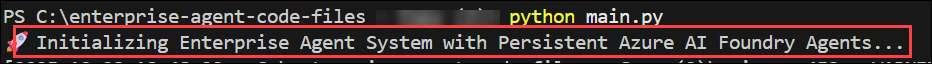

# 實驗8：Microsoft Foundry中的代理部署與運行時管理

**預計持續時間**：15分鐘

**概述**

在本實驗室中，您將將使用Microsoft代理框架SDK開發的多代理系統部署到Microsoft
Foundry代理服務中。你會把配置好的代理發佈到託管運行環境。

你到現在已經構建了一個聊天響應代理，這意味著:

- 它支持單回合、無狀態的交互，能夠立即響應用戶輸入。

- 它運行在你的應用程序或SDK內部，沒有持久後端。

- 每個請求獨立處理，不保留內存或長期上下文。

- 它非常適合快速聊天體驗或在全面部署前測試核心邏輯。

現在，你要把它更新為Microsoft Foundry中的持久代理，也就是說:

- 它作為一個託管的、長壽命的服務運行在 Foundry 環境中。

- 它可以在各會話之間保持狀態和上下文，以實現連續性和學習。

- 它支持通過MCP和A2A協議與外部工具及其他代理的集成。

- 它針對企業級的可靠性、監控和合規進行了優化。

**實驗室目標**

你將在實驗室完成以下任務。

- 任務1：將代理部署到Microsoft Foundry Agent Service中

## 任務1：將代理部署到Microsoft Foundry Agent Service中

在這個任務中，你需要將現有代理更新為持久代理，並將每個代理作為獨立模型發佈到
Microsoft Foundry 代理服務。

1.  現在，你需要更新代碼文件以支持持久代理系統，該系統會在 Microsoft
    Foundry 代理服務中註冊代理。

2.  在Visual Studio Code面板中，左側菜單選擇.env文件以更新AI
    Foundry項目鍵。

3.  在文件中添加以下變量。

> \# Azure AI Project Configuration
>
> AZURE_AI_PROJECT_ENDPOINT=**\<Microsoft Foundry endpoint\>**
>
> AZURE_AI_MODEL_DEPLOYMENT_NAME=gpt-4o-mini
>
> 從概覽頁面找到 **\<Microsoft Foundry
> endpoint\>**，並用該值替換\<Microsoft Foundry端點\>。
>
> 

4.  更新後，文件看起來會類似這個。

5.  現在，你得一個一個更新特工。
    在資源管理器菜單中的**代理**中選擇**compliance_agent.py**。用代碼片段替換內容。

> import os
>
> import asyncio
>
> from azure.ai.projects.aio import AIProjectClient
>
> from agent_framework import ChatAgent
>
> from agent_framework.azure import AzureAIAgentClient
>
> from azure.identity.aio import AzureCliCredential
>
> async def build_compliance_agent():
>
> """Build or reuse persistent compliance agent"""
>
> credential = AzureCliCredential()
>
> async with AIProjectClient(
>
> endpoint=os.getenv("AZURE_AI_PROJECT_ENDPOINT"),
>
> credential=credential
>
> ) as project_client:
>
> \# Try to find existing agent first
>
> agent_name = "Enterprise-ComplianceAgent"
>
> try:
>
> agents = project_client.agents.list_agents()
>
> async for agent in agents:
>
> if agent.name == agent_name:
>
> \# Return existing persistent agent
>
> return ChatAgent(
>
> chat_client=AzureAIAgentClient(
>
> async_credential=credential,
>
> agent_id=agent.id,
>
> project_endpoint=os.getenv("AZURE_AI_PROJECT_ENDPOINT"),
>
> model_deployment_name=os.getenv("AZURE_AI_MODEL_DEPLOYMENT_NAME")
>
> ),
>
> instructions="You are a senior compliance and legal specialist."
>
> )
>
> except Exception:
>
> pass \# Continue to create new agent if listing fails
>
> \# Create new persistent agent if not found
>
> created_agent = await project_client.agents.create_agent(
>
> model=os.getenv("AZURE_AI_MODEL_DEPLOYMENT_NAME"),
>
> name=agent_name,
>
> instructions=(
>
> "You are a senior compliance and legal specialist with expertise in
> multiple jurisdictions. "
>
> "Provide authoritative guidance on:\n"
>
> "- GDPR and data protection regulations (EU, UK, US state laws)\n"
>
> "- Privacy policies and data processing agreements\n"
>
> "- Regulatory compliance (SOX, HIPAA, PCI-DSS, ISO standards)\n"
>
> "- Risk assessment and audit requirements\n"
>
> "- Contract law and vendor agreements\n"
>
> "- Information security policies\n"
>
> "- Cross-border data transfers and adequacy decisions\n"
>
> "- Breach notification requirements\n\n"
>
> "When provided CONTEXT, prefer it as the primary source. "
>
> "If the user asks to create a ticket (phrases like \\create a
> ticket\\, \\submit a compliance request\\, \\open a support ticket\\),
> output a structured block starting with:\n"
>
> "CREATE_TICKET\n"
>
> "Subject: \<one-line subject\>\n"
>
> "Body: \<detailed description\>\n"
>
> "Tags: tag1,tag2 (optional)\n"
>
> "Email: user@example.com (optional)\n"
>
> "Name: John Doe (optional)\n"
>
> "Return only the CREATE_TICKET block when requesting a ticket; do not
> call any APIs yourself.\n\n"
>
> "Always provide factual, well-researched answers with relevant legal
> citations. "
>
> "Include practical implementation steps and potential risks. Use
> formal, professional tone."
>
> )
>
> )
>
> \# Return persistent agent wrapped in ChatAgent
>
> return ChatAgent(
>
> chat_client=AzureAIAgentClient(
>
> async_credential=credential,
>
> agent_id=created_agent.id,
>
> project_endpoint=os.getenv("AZURE_AI_PROJECT_ENDPOINT"),
>
> model_deployment_name=os.getenv("AZURE_AI_MODEL_DEPLOYMENT_NAME")
>
> ),
>
> instructions="You are a senior compliance and legal specialist."
>
> )

> **與Azure AI Project Client的集成:**

- AIProjectClient 直接連接到您的 Microsoft Foundry
  項目端點，允許腳本列出、檢索或創建在 Foundry 中持久託管的代理。

> **代理重用邏輯:**

- 在創建新代理之前，代碼首先會檢查一個名為“Enterprise-ComplianceAgent”的現有代理。

- 如果找到，它會通過其獨特的Foundry管理agent_id鏈接該代理，重用該代理。

> **持久代理創建:**

- 如果代理不存在，則通過 project_client.agents.create_agent（） 創建。

- 該代理以型號、名稱和詳細指令集註冊在Foundry中，使其能夠在多個會話間永久訪問。

> **ChatAgent 包裝:**

- 一旦創建或檢索，持久化的 Foundry 代理會被 AzureAIAgentClient 包裹在
  ChatAgent 實例中。

- 這使得在保持 Microsoft Foundry
  內部狀態、策略和監控功能的同時，能夠與託管代理進行程序化通信。

6.  完成後，選擇 **File** **(1)** ，然後點擊 **Save** **(2)** 保存文件。

7.  選擇**finance_agent.py**文件，並用下面提供的代碼片段替換內容，以配置持久金融代理。

> import os
>
> import asyncio
>
> from azure.ai.projects.aio import AIProjectClient
>
> from agent_framework import ChatAgent
>
> from agent_framework.azure import AzureAIAgentClient
>
> from azure.identity.aio import AzureCliCredential
>
> async def build_finance_agent():
>
> """Build or reuse persistent finance agent"""
>
> credential = AzureCliCredential()
>
> async with AIProjectClient(
>
> endpoint=os.getenv("AZURE_AI_PROJECT_ENDPOINT"),
>
> credential=credential
>
> ) as project_client:
>
> \# Try to find existing agent first
>
> agent_name = "Enterprise-FinanceAgent"
>
> try:
>
> agents = project_client.agents.list_agents()
>
> async for agent in agents:
>
> if agent.name == agent_name:
>
> \# Return existing persistent agent
>
> return ChatAgent(
>
> chat_client=AzureAIAgentClient(
>
> async_credential=credential,
>
> agent_id=agent.id,
>
> project_endpoint=os.getenv("AZURE_AI_PROJECT_ENDPOINT"),
>
> model_deployment_name=os.getenv("AZURE_AI_MODEL_DEPLOYMENT_NAME")
>
> ),
>
> instructions="You are a finance and reimbursement specialist."
>
> )
>
> except Exception:
>
> pass \# Continue to create new agent if listing fails
>
> \# Create new persistent agent if not found
>
> created_agent = await project_client.agents.create_agent(
>
> model=os.getenv("AZURE_AI_MODEL_DEPLOYMENT_NAME"),
>
> name=agent_name,
>
> instructions=(
>
> "You are a finance and reimbursement specialist. Answer questions
> about "
>
> "expense policies, reimbursement limits, budget approvals, travel
> expenses, "
>
> "meal allowances, equipment purchases, and financial procedures.
> Provide "
>
> "specific amounts, policies, and actionable guidance.\n\n"
>
> "When provided CONTEXT, prefer it as the primary source. "
>
> "If the user asks to create a ticket (phrases like \\create a
> ticket\\, \\submit a reimbursement request\\, \\open a support
> ticket\\), output a structured block starting with:\n"
>
> "CREATE_TICKET\n"
>
> "Subject: \<one-line subject\>\n"
>
> "Body: \<detailed description\>\n"
>
> "Tags: tag1,tag2 (optional)\n"
>
> "Email: user@example.com (optional)\n"
>
> "Name: John Doe (optional)\n"
>
> "Return only the CREATE_TICKET block when requesting a ticket; do not
> call any APIs yourself."
>
> )
>
> )
>
> \# Return persistent agent wrapped in ChatAgent
>
> return ChatAgent(
>
> chat_client=AzureAIAgentClient(
>
> async_credential=credential,
>
> agent_id=created_agent.id,
>
> project_endpoint=os.getenv("AZURE_AI_PROJECT_ENDPOINT"),
>
> model_deployment_name=os.getenv("AZURE_AI_MODEL_DEPLOYMENT_NAME")
>
> ),
>
> instructions="You are a finance and reimbursement specialist."
>
> )

> **通過 Microsoft Foundry 實現的持久代理管理:**

- AIProjectClient 連接到您的 Microsoft Foundry
  項目，使腳本能夠列出、查找或創建存在於 Foundry
  環境中的持久代理，而非本地運行。

> **現有藥物的可重複使用性:**

- 在創建新代理之前，該函數會檢查已有的“Enterprise-FinanceAgent”。

- 如果發現，它會通過 ChatAgent 的 Foundry 管理 ID
  初始化該部署代理，避免重複部署。

> **自動代理創建（如果缺失）:**

- 如果找不到該代理，它會在 Foundry 中使用
  project_client.agents.create_agent（）， 創建一個新的持久代理，

- 註冊時，採用模型部署名稱、唯一代理名稱以及專注於財務和報銷的領域專用指令。

> **與AzureAIAgentClient for Communication 的集成:**

- 創建或重複使用的代理隨後會被 AzureAIAgentClient 封裝到 ChatAgent 中，

- 該系統負責認證、模型路由以及與已部署 Foundry 代理的持續通信。

8.  完成後，選擇 **File** **(1)** ，然後點擊 **Save** **(2)** 保存文件。

9.  現在，選擇**hr_agent.py**文件，將代碼替換為以下代碼，將無狀態聊天代理轉換為持久代理。

> import os
>
> import asyncio
>
> from azure.ai.projects.aio import AIProjectClient
>
> from agent_framework import ChatAgent
>
> from agent_framework.azure import AzureAIAgentClient
>
> from azure.identity.aio import AzureCliCredential
>
> async def build_hr_agent():
>
> """Build or reuse persistent HR agent"""
>
> credential = AzureCliCredential()
>
> async with AIProjectClient(
>
> endpoint=os.getenv("AZURE_AI_PROJECT_ENDPOINT"),
>
> credential=credential
>
> ) as project_client:
>
> \# Try to find existing agent first
>
> agent_name = "Enterprise-HRAgent"
>
> try:
>
> agents = project_client.agents.list_agents()
>
> async for agent in agents:
>
> if agent.name == agent_name:
>
> \# Return existing persistent agent
>
> return ChatAgent(
>
> chat_client=AzureAIAgentClient(
>
> async_credential=credential,
>
> agent_id=agent.id,
>
> project_endpoint=os.getenv("AZURE_AI_PROJECT_ENDPOINT"),
>
> model_deployment_name=os.getenv("AZURE_AI_MODEL_DEPLOYMENT_NAME")
>
> ),
>
> instructions="You are an expert HR policy specialist."
>
> )
>
> except Exception:
>
> pass \# Continue to create new agent if listing fails
>
> \# Create new persistent agent if not found
>
> created_agent = await project_client.agents.create_agent(
>
> model=os.getenv("AZURE_AI_MODEL_DEPLOYMENT_NAME"),
>
> name=agent_name,
>
> instructions=(
>
> "You are an expert HR policy specialist with deep knowledge of
> employment law and best practices. "
>
> "Answer questions about:\n"
>
> "- Leave policies (sick, vacation, parental, bereavement)\n"
>
> "- Employee benefits (health insurance, retirement, wellness
> programs)\n"
>
> "- Performance management and reviews\n"
>
> "- Hiring, onboarding, and termination procedures\n"
>
> "- Working hours, overtime, and flexible work arrangements\n"
>
> "- Employee relations and conflict resolution\n"
>
> "- Training and development programs\n\n"
>
> "When provided CONTEXT, prefer it as the primary source. "
>
> "If the user asks to create a ticket (phrases like \\create a
> ticket\\, \\submit a leave request\\, \\open a support ticket\\),
> output a structured block starting with:\n"
>
> "CREATE_TICKET\n"
>
> "Subject: \<one-line subject\>\n"
>
> "Body: \<detailed description\>\n"
>
> "Tags: tag1,tag2 (optional)\n"
>
> "Email: user@example.com (optional)\n"
>
> "Name: John Doe (optional)\n"
>
> "Return only the CREATE_TICKET block when requesting a ticket; do not
> call any APIs yourself.\n\n"
>
> "Provide specific, actionable guidance with policy references where
> applicable. "
>
> "Be empathetic and professional in your responses."
>
> )
>
> )
>
> \# Return persistent agent wrapped in ChatAgent
>
> return ChatAgent(
>
> chat_client=AzureAIAgentClient(
>
> async_credential=credential,
>
> agent_id=created_agent.id,
>
> project_endpoint=os.getenv("AZURE_AI_PROJECT_ENDPOINT"),
>
> model_deployment_name=os.getenv("AZURE_AI_MODEL_DEPLOYMENT_NAME")
>
> ),
>
> instructions="You are an expert HR policy specialist."
>
> )

> 此次更新將人力資源代理轉變為Microsoft
> Foundry內的持久雲託管代理。它通過 AIProjectClient 連接 Foundry
> 項目，如果部署了現有的“Enterprise-HRAgent”，或創建帶有專門 HR
> 領域指令的新項目。部署後，它被包裹在通過 AzureAIAgentClient 關聯的
> ChatAgent 中，實現 Foundry
> 環境中的有狀態、可重用和集中管理的人力資源自動化。

10. 完成後，選擇 **File** **(1)**，然後點擊 **Save** **(2)** 保存文件。

11. 選擇**planner_agent.py**文件，並用下面提供的代碼片段替換內容，以配置持久編排器。

> import os
>
> import asyncio
>
> from azure.ai.projects.aio import AIProjectClient
>
> from agent_framework import ChatAgent
>
> from agent_framework.azure import AzureAIAgentClient
>
> from azure.identity.aio import AzureCliCredential
>
> async def build_planner_agent():
>
> """Build or reuse persistent planner agent"""
>
> credential = AzureCliCredential()
>
> async with AIProjectClient(
>
> endpoint=os.getenv("AZURE_AI_PROJECT_ENDPOINT"),
>
> credential=credential
>
> ) as project_client:
>
> \# Try to find existing agent first
>
> agent_name = "Enterprise-PlannerAgent"
>
> try:
>
> agents = project_client.agents.list_agents()
>
> async for agent in agents:
>
> if agent.name == agent_name:
>
> \# Return existing persistent agent
>
> return ChatAgent(
>
> chat_client=AzureAIAgentClient(
>
> async_credential=credential,
>
> agent_id=agent.id,
>
> project_endpoint=os.getenv("AZURE_AI_PROJECT_ENDPOINT"),
>
> model_deployment_name=os.getenv("AZURE_AI_MODEL_DEPLOYMENT_NAME")
>
> ),
>
> instructions="You are an intelligent routing agent."
>
> )
>
> except Exception:
>
> pass \# Continue to create new agent if listing fails
>
> \# Create new persistent agent if not found
>
> created_agent = await project_client.agents.create_agent(
>
> model=os.getenv("AZURE_AI_MODEL_DEPLOYMENT_NAME"),
>
> name=agent_name,
>
> instructions=(
>
> "You are an intelligent routing agent. Analyze user queries and route
> them to the appropriate specialist. "
>
> "Available specialists:\n"
>
> "- HR: Employee policies, leave, benefits, working hours, performance,
> hiring\n"
>
> "- FINANCE: Reimbursements, expenses, budgets, travel costs, meal
> allowances, equipment purchases\n"
>
> "- COMPLIANCE: GDPR, data privacy, regulatory requirements, legal
> compliance, audits\n\n"
>
> "Return exactly one word: HR, FINANCE, or COMPLIANCE. "
>
> "Consider keywords like: money, cost, budget, reimburse, expense,
> payment, allowance → FINANCE\n"
>
> "Keywords like: leave, sick, vacation, policy, employee, benefits →
> HR\n"
>
> "Keywords like: GDPR, privacy, compliance, legal, audit, regulation →
> COMPLIANCE"
>
> )
>
> )
>
> \# Return persistent agent wrapped in ChatAgent
>
> return ChatAgent(
>
> chat_client=AzureAIAgentClient(
>
> async_credential=credential,
>
> agent_id=created_agent.id,
>
> project_endpoint=os.getenv("AZURE_AI_PROJECT_ENDPOINT"),
>
> model_deployment_name=os.getenv("AZURE_AI_MODEL_DEPLOYMENT_NAME")
>
> ),
>
> instructions="You are an intelligent routing agent."
>
> )
>
> async def classify_target(planner_agent, user_query: str) -\> str:
>
> result = await planner_agent.run(
>
> "Analyze and route this query:\n\n"
>
> f"User query: {user_query}\n\n"
>
> "Return exactly one word: HR, FINANCE, or COMPLIANCE."
>
> )
>
> \# Extract the text content from the AgentRunResponse object
>
> text = str(result).strip().lower()
>
> \# Advanced classification with fallback logic
>
> if "finance" in text or "financial" in text:
>
> return "FINANCE"
>
> elif "hr" in text or "human" in text:
>
> return "HR"
>
> elif "compliance" in text or "legal" in text:
>
> return "COMPLIANCE"
>
> else:
>
> \# Fallback keyword analysis if agent response is unclear
>
> query_lower = user_query.lower()
>
> finance_keywords = \["reimburs", "expense", "cost", "budget", "money",
> "payment", "allowance", "travel", "meal", "flight", "hotel"\]
>
> hr_keywords = \["leave", "sick", "vacation", "employee", "benefit",
> "policy", "hire", "performance", "work"\]
>
> compliance_keywords = \["gdpr", "privacy", "compliance", "legal",
> "audit", "regulation", "data protection"\]
>
> finance_score = sum(1 for keyword in finance_keywords if keyword in
> query_lower)
>
> hr_score = sum(1 for keyword in hr_keywords if keyword in query_lower)
>
> compliance_score = sum(1 for keyword in compliance_keywords if keyword
> in query_lower)
>
> if finance_score \> hr_score and finance_score \> compliance_score:
>
> return "FINANCE"
>
> elif hr_score \> compliance_score:
>
> return "HR"
>
> else:
>
> return "COMPLIANCE"
>
> 

它通過 AIProjectClient
連接，如果已部署的“Enterprise-PlannerAgent”可重複使用，或者創建帶有路由邏輯的新代理，將查詢分類為人力資源、財務或合規類別。

12. 完成後，選擇 **File** **(1)** ，然後點擊 **Save** **(2)** 保存文件。

13. 現在，從根節點選擇
    **main.py**，並用給定的摘要替換代碼。對於所有代碼文件，請務必謹慎替換代碼，因為Python對縮進很敏感。

> import asyncio
>
> import time
>
> import logging
>
> import re
>
> from typing import Dict, Any
>
> from utils.env import load_env
>
> from azure.identity.aio import AzureCliCredential
>
> from agents.planner_agent import build_planner_agent, classify_target
>
> from agents.hr_agent import build_hr_agent
>
> from agents.compliance_agent import build_compliance_agent
>
> from agents.finance_agent import build_finance_agent
>
> from tools.azure_search_tool import AzureSearchTool
>
> from tools.freshdesk_tool import FreshdeskTool
>
> \# Configure logging
>
> logging.basicConfig(level=logging.INFO, format='%(asctime)s -
> %(levelname)s - %(message)s')
>
> def parse_create_ticket_block(response_text: str) -\> Dict\[str,
> Any\]:
>
> """
>
> Parse CREATE_TICKET block from agent response.
>
> """
>
> if "CREATE_TICKET" not in response_text:
>
> return None
>
> \# Extract the CREATE_TICKET block
>
> lines = response_text.split('\n')
>
> ticket_start = -1
>
> for i, line in enumerate(lines):
>
> if line.strip() == "CREATE_TICKET":
>
> ticket_start = i
>
> break
>
> if ticket_start == -1:
>
> return None
>
> \# Parse ticket details
>
> ticket_data = {
>
> "subject": "",
>
> "body": "",
>
> "tags": \[\],
>
> "email": "system@enterprise.com",
>
> "name": "Enterprise System User"
>
> }
>
> \# Process lines after CREATE_TICKET
>
> for line in lines\[ticket_start + 1:\]:
>
> line = line.strip()
>
> if not line:
>
> continue
>
> if line.startswith("Subject:"):
>
> ticket_data\["subject"\] = line\[8:\].strip()
>
> elif line.startswith("Body:"):
>
> ticket_data\["body"\] = line\[5:\].strip()
>
> elif line.startswith("Tags:"):
>
> tags_str = line\[5:\].strip()
>
> if tags_str:
>
> ticket_data\["tags"\] = \[tag.strip() for tag in tags_str.split(',')\]
>
> elif line.startswith("Email:"):
>
> ticket_data\["email"\] = line\[6:\].strip()
>
> elif line.startswith("Name:"):
>
> ticket_data\["name"\] = line\[5:\].strip()
>
> return ticket_data
>
> async def run_multi_agent_with_user_info(query: str, agents:
> Dict\[str, Any\], user_name: str = None) -\> Dict\[str, Any\]:
>
> """
>
> Enhanced multi-agent system with CREATE_TICKET pattern support and
> user name handling.
>
> """
>
> start_time = time.time()
>
> try:
>
> \# Step 1: Route the query
>
> logging.info(f"Routing query: {query\[:50\]}...")
>
> target = await classify_target(agents\["planner"\], query)
>
> logging.info(f"Query routed to: {target}")
>
> \# Step 2: Retrieve relevant context using Azure Search
>
> logging.info("Retrieving context from knowledge base...")
>
> context = await agents\["search_tool"\].search(query, top=3)
>
> \# Step 3: Create enriched prompt with context
>
> enriched_prompt = f"""
>
> Context from Knowledge Base:
>
> {context}
>
> ---
>
> User Question: {query}
>
> Please provide a comprehensive answer based on the context above. If
> no relevant context is found, provide your best guidance based on your
> training.
>
> """
>
> \# Step 4: Get agent response
>
> agent_key = target.lower()
>
> agent_name = f"{target}Agent"
>
> if agent_key in agents:
>
> logging.info(f"Processing with {agent_name}...")
>
> answer = await agents\[agent_key\].run(enriched_prompt)
>
> else:
>
> \# Fallback to HR if routing unclear
>
> logging.warning(f"Unknown target '{target}', falling back to HR")
>
> answer = await agents\["hr"\].run(enriched_prompt)
>
> target = "HR"
>
> agent_name = "HRAgent"
>
> answer_text = str(answer)
>
> \# Step 5: Check for CREATE_TICKET pattern in response
>
> ticket_info = None
>
> ticket_created = False
>
> ticket_data = parse_create_ticket_block(answer_text)
>
> if ticket_data and "freshdesk_tool" in agents:
>
> logging.info("CREATE_TICKET pattern detected - creating Freshdesk
> ticket")
>
> \# Use provided user name if available
>
> if user_name:
>
> ticket_data\["name"\] = user_name
>
> logging.info(f"Using provided user name: {user_name}")
>
> try:
>
> \# Create ticket using parsed data
>
> ticket_result = await agents\["freshdesk_tool"\].create_ticket(
>
> subject=ticket_data\["subject"\] or f"{target} Request:
> {query\[:60\]}...",
>
> description=ticket_data\["body"\] or f"Request: {query}\n\nAgent
> Response:\n{answer_text}",
>
> tags=ticket_data\["tags"\] or \[target.lower(), "agent-system"\],
>
> requester={
>
> "name": ticket_data\["name"\],
>
> "email": ticket_data\["email"\]
>
> }
>
> )
>
> if ticket_result.get("success"):
>
> ticket_info = ticket_result
>
> ticket_created = True
>
> ticket_id = ticket_result.get("ticket", {}).get("id")
>
> ticket_url = ticket_result.get("ticket", {}).get("url")
>
> \# Replace CREATE_TICKET block with success message
>
> if "CREATE_TICKET" in answer_text:
>
> \# Remove the CREATE_TICKET block and replace with success message
>
> lines = answer_text.split('\n')
>
> filtered_lines = \[\]
>
> skip_ticket_block = False
>
> for line in lines:
>
> if line.strip() == "CREATE_TICKET":
>
> skip_ticket_block = True
>
> \# Add success message with user name
>
> success_msg = f"""
>
> 🎫 \*\*Support Ticket Created Successfully\*\*
>
> - Ticket ID: \#{ticket_id}
>
> - Subject: {ticket_data\["subject"\]}
>
> - Requester: {ticket_data\["name"\]}
>
> - Status: Open
>
> - URL: {ticket_url}
>
> Your request has been submitted to our {target} team. You will receive
> updates via email.
>
> """
>
> filtered_lines.append(success_msg)
>
> continue
>
> elif skip_ticket_block and (line.startswith("Subject:") or
> line.startswith("Body:") or
>
> line.startswith("Tags:") or line.startswith("Email:") or
>
> line.startswith("Name:")):
>
> continue
>
> else:
>
> skip_ticket_block = False
>
> filtered_lines.append(line)
>
> answer_text = '\n'.join(filtered_lines)
>
> else:
>
> answer_text += f"\n\n⚠️ \*\*Note\*\*: Could not create support ticket:
> {ticket_result.get('error', 'Unknown error')}"
>
> except Exception as e:
>
> logging.error(f"Failed to create Freshdesk ticket: {e}")
>
> answer_text += f"\n\n⚠️ \*\*Note\*\*: Ticket creation failed:
> {str(e)}"
>
> \# Step 6: Process response
>
> response_time = time.time() - start_time
>
> return {
>
> "query": query,
>
> "routed_to": target,
>
> "agent_name": agent_name,
>
> "answer": answer_text,
>
> "context_retrieved": len(context) \> 100, \# Simple check if context
> was found
>
> "ticket_created": ticket_created,
>
> "ticket_info": ticket_info,
>
> "response_time": round(response_time, 2),
>
> "timestamp": time.strftime("%Y-%m-%d %H:%M:%S"),
>
> "success": True,
>
> "user_name": user_name
>
> }
>
> except Exception as e:
>
> logging.error(f"Multi-agent processing error: {e}")
>
> return {
>
> "query": query,
>
> "routed_to": "Error",
>
> "agent_name": "ErrorHandler",
>
> "answer": f"I encountered an error processing your request: {str(e)}.
> Please try again.",
>
> "context_retrieved": False,
>
> "ticket_created": False,
>
> "ticket_info": None,
>
> "response_time": 0,
>
> "timestamp": time.strftime("%Y-%m-%d %H:%M:%S"),
>
> "success": False,
>
> "user_name": user_name
>
> }
>
> async def run_multi_agent(query: str, agents: Dict\[str, Any\]) -\>
> Dict\[str, Any\]:
>
> """
>
> Wrapper for multi-agent system with no user name.
>
> """
>
> return await run_multi_agent_with_user_info(query, agents, None)
>
> def format_response(result: Dict\[str, Any\]) -\> str:
>
> """Format the agent response for display."""
>
> status_icon = "✅" if result\["success"\] else "❌"
>
> context_icon = "📚" if result.get("context_retrieved") else "📭"
>
> ticket_icon = "🎫" if result.get("ticket_created") else ""
>
> formatted = f"""
>
> {status_icon} Agent Response Summary:
>
> ┌─ Routed to: {result\['routed_to'\]} ({result\['agent_name'\]})
>
> ├─ Response time: {result\['response_time'\]}s
>
> ├─ Context retrieved: {context_icon} {'Yes' if
> result.get('context_retrieved') else 'No'}
>
> ├─ Ticket created: {ticket_icon} {'Yes' if
> result.get('ticket_created') else 'No'}
>
> ├─ Timestamp: {result\['timestamp'\]}
>
> └─ Status: {'Success' if result\['success'\] else 'Error'}
>
> 💬 Answer:
>
> {result\['answer'\]}
>
> """
>
> \# Add ticket details if available
>
> if result.get("ticket_info") and
> result\["ticket_info"\].get("success"):
>
> ticket = result\["ticket_info"\]\["ticket"\]
>
> formatted += f"""
>
> 🎫 Ticket Details:
>
> ├─ ID: \#{ticket\['id'\]}
>
> ├─ Status: {ticket\['status'\]}
>
> ├─ Priority: {ticket\['priority'\]}
>
> └─ URL: {ticket\['url'\]}
>
> """
>
> return formatted
>
> async def interactive_ticket_creation(agents: Dict\[str, Any\],
> base_query: str) -\> Dict\[str, Any\]:
>
> """
>
> Simple interactive ticket creation.
>
> """
>
> print("\n🎫 \*\*Manual Ticket Creation\*\*")
>
> print("I'll help you create a support ticket manually.\n")
>
> try:
>
> \# Get basic ticket details
>
> subject = input(f"📝 Ticket Subject: ").strip() or f"Manual Request:
> {base_query\[:60\]}..."
>
> print("\n📄 \*\*Ticket Description\*\* (press Enter twice when
> done):")
>
> description_lines = \[f"Original Request: {base_query}", ""\]
>
> while True:
>
> line = input(" ").strip()
>
> if not line:
>
> break
>
> description_lines.append(line)
>
> description = "\n".join(description_lines)
>
> \# Create the ticket directly
>
> print(f"\n🚀 Creating ticket: '{subject}'...")
>
> ticket_result = await agents\["freshdesk_tool"\].create_ticket(
>
> subject=subject,
>
> description=description,
>
> tags=\["manual", "interactive"\],
>
> requester={
>
> "name": "Enterprise System User",
>
> "email": "system@enterprise.com"
>
> }
>
> )
>
> if ticket_result.get("success"):
>
> ticket_info = ticket_result.get("ticket", {})
>
> print(f"""
>
> ✅ \*\*Ticket Created Successfully!\*\*
>
> 🎫 Ticket Details:
>
> • ID: \#{ticket_info.get('id')}
>
> • Subject: {subject}
>
> • Status: Open
>
> • URL: {ticket_info.get('url')}
>
> 📧 You will receive email updates about your ticket status.
>
> """)
>
> return {
>
> "success": True,
>
> "ticket_created": True,
>
> "ticket_info": ticket_result
>
> }
>
> else:
>
> print(f"❌ \*\*Failed to create ticket\*\*:
> {ticket_result.get('error', 'Unknown error')}")
>
> return {"success": False, "ticket_created": False}
>
> except KeyboardInterrupt:
>
> print("\n🚫 Ticket creation cancelled.")
>
> return {"success": False, "ticket_created": False}
>
> except Exception as e:
>
> print(f"❌ \*\*Error during ticket creation\*\*: {str(e)}")
>
> return {"success": False, "ticket_created": False}
>
> async def run_interactive_mode(agents: Dict\[str, Any\]):
>
> """Interactive mode for real-time queries with enhanced ticket
> creation."""
>
> print("\n🤖 Enterprise Agent System - Interactive Mode")
>
> print("Available agents: HR, Finance, Compliance")
>
> print("Type 'quit' to exit, 'help' for commands, 'ticket' for
> interactive ticket creation\n")
>
> while True:
>
> try:
>
> query = input("Enter your question: ").strip()
>
> if query.lower() in \['quit', 'exit', 'q'\]:
>
> print("👋 Goodbye!")
>
> break
>
> elif query.lower() == 'help':
>
> print("""
>
> 📋 Available Commands:
>
> - Ask any question about HR, Finance, or Compliance
>
> - 'ticket' - Interactive ticket creation mode
>
> - 'quit' or 'exit' - Exit the system
>
> - 'help' - Show this help message
>
> 🎯 Example questions:
>
> - "What's the travel reimbursement limit for meals?"
>
> - "I need to create a ticket for sick leave"
>
> - "Can you help me submit a reimbursement request?"
>
> - "How many vacation days do employees get?"
>
> - "Do we need GDPR compliance for EU customers?"
>
> 🎫 Ticket Creation:
>
> - Use 'ticket' command for guided ticket creation
>
> - Or include phrases like "create ticket", "submit request" in your
> question
>
> - For LEAVE and REIMBURSEMENT requests, you'll be prompted for your
> name
>
> """)
>
> continue
>
> elif query.lower() == 'ticket':
>
> if "freshdesk_tool" not in agents:
>
> print("❌ Ticket creation is not available (Freshdesk tool not
> configured)")
>
> continue
>
> base_query = input("📝 Describe what you need help with: ").strip()
>
> if base_query:
>
> await interactive_ticket_creation(agents, base_query)
>
> continue
>
> elif not query:
>
> continue
>
> \# Check if this is a leave or reimbursement request that needs user
> name
>
> query_lower = query.lower()
>
> is_leave_request = any(word in query_lower for word in \["leave",
> "vacation", "sick", "time off", "pto", "holiday"\])
>
> is_reimbursement_request = any(word in query_lower for word in
> \["reimburse", "expense", "travel", "receipt", "reimbursement"\])
>
> wants_ticket = any(keyword in query_lower for keyword in \["create
> ticket", "submit ticket", "file ticket", "raise ticket",
>
> "create request", "submit request", "file request", "need help with",
>
> "open ticket", "new ticket", "support ticket", "help ticket"\])
>
> user_name = None
>
> if (is_leave_request or is_reimbursement_request) and wants_ticket:
>
> print("\n👤 For leave and reimbursement requests, I need to collect
> some information:")
>
> user_name = input("Please enter your name: ").strip()
>
> if not user_name:
>
> print("❌ Name is required for this type of request. Please try
> again.")
>
> continue
>
> print(f"✅ Thank you, {user_name}! Processing your request...")
>
> print("\n🤔 Processing your query...")
>
> result = await run_multi_agent_with_user_info(query, agents,
> user_name)
>
> print(format_response(result))
>
> print() \# Add spacing between queries
>
> except KeyboardInterrupt:
>
> print("\n👋 Goodbye!")
>
> break
>
> except Exception as e:
>
> logging.error(f"Interactive mode error: {e}")
>
> print(f"❌ Error: {e}")
>
> print()
>
> async def run_batch_tests(agents: Dict\[str, Any\]):
>
> """Run focused test with ticket creation."""
>
> test_queries = \[
>
> "What is the company's policy on remote work and flexible hours?"
>
> \]
>
> print("🧪 Running focused batch tests with grounded data
> integration...\n")
>
> for i, query in enumerate(test_queries, 1):
>
> print(f"{'='\*80}")
>
> print(f"TEST {i}/{len(test_queries)}: {query}")
>
> print(f"{'='\*80}")
>
> result = await run_multi_agent(query, agents)
>
> print(format_response(result))
>
> \# Small delay between queries for better readability
>
> if i \< len(test_queries):
>
> await asyncio.sleep(1.0) \# Longer delay for tool operations
>
> async def main():
>
> """Main application entry point with enhanced features and tool
> integration."""
>
> print("🚀 Initializing Enterprise Agent System with Persistent Azure
> AI Foundry Agents...")
>
> try:
>
> \# Load environment and build persistent agents
>
> load_env()
>
> logging.info("Building persistent Azure AI Foundry agent network...")
>
> \# Build core persistent agents using Azure AI Foundry
>
> planner_agent_client = await build_planner_agent()
>
> hr_agent_client = await build_hr_agent()
>
> compliance_agent_client = await build_compliance_agent()
>
> finance_agent_client = await build_finance_agent()
>
> async with (
>
> planner_agent_client as planner_agent,
>
> hr_agent_client as hr_agent,
>
> compliance_agent_client as compliance_agent,
>
> finance_agent_client as finance_agent
>
> ):
>
> agents = {
>
> "planner": planner_agent,
>
> "hr": hr_agent,
>
> "compliance": compliance_agent,
>
> "finance": finance_agent
>
> }
>
> \# Initialize and attach tools
>
> logging.info("Initializing tools...")
>
> try:
>
> search_tool = AzureSearchTool()
>
> agents\["search_tool"\] = search_tool
>
> \# Test search tool
>
> health = await search_tool.health_check()
>
> if health\["status"\] == "healthy":
>
> logging.info("✅ Azure Search tool initialized successfully")
>
> else:
>
> logging.warning(f"⚠️ Azure Search tool health check failed: {health}")
>
> except Exception as e:
>
> logging.error(f"Failed to initialize Azure Search tool: {e}")
>
> \# Create mock search tool for testing
>
> class MockSearchTool:
>
> async def search(self, query, top=3):
>
> return f"📭 Mock search results for: {query}\n(Azure Search tool not
> configured)"
>
> agents\["search_tool"\] = MockSearchTool()
>
> \# Initialize Freshdesk tool for ticket creation
>
> try:
>
> freshdesk_tool = FreshdeskTool()
>
> agents\["freshdesk_tool"\] = freshdesk_tool
>
> logging.info("✅ Freshdesk tool initialized successfully")
>
> except Exception as e:
>
> logging.warning(f"⚠️ Freshdesk tool initialization failed: {e}")
>
> \# System will work without Freshdesk, just won't create tickets
>
> logging.info("✅ All Azure AI Foundry agents and tools initialized")
>
> \# Check if running interactively or in batch mode
>
> import sys
>
> if len(sys.argv) \> 1 and sys.argv\[1\] == "--interactive":
>
> await run_interactive_mode(agents)
>
> else:
>
> await run_batch_tests(agents)
>
> except Exception as e:
>
> logging.error(f"Azure AI Foundry agent system initialization failed:
> {e}")
>
> print(f"❌ Failed to start Azure AI Foundry system: {e}")
>
> \# Try to run with minimal configuration
>
> logging.info("Attempting to run with minimal Azure AI Foundry
> configuration...")
>
> try:
>
> planner_agent_client = await build_planner_agent()
>
> hr_agent_client = await build_hr_agent()
>
> compliance_agent_client = await build_compliance_agent()
>
> finance_agent_client = await build_finance_agent()
>
> async with (
>
> planner_agent_client as planner_agent,
>
> hr_agent_client as hr_agent,
>
> compliance_agent_client as compliance_agent,
>
> finance_agent_client as finance_agent
>
> ):
>
> minimal_agents = {
>
> "planner": planner_agent,
>
> "hr": hr_agent,
>
> "compliance": compliance_agent,
>
> "finance": finance_agent,
>
> "search_tool": type('MockSearch', (), {'search': lambda self, q,
> top=3: f"Mock search for: {q}"})()
>
> }
>
> await run_batch_tests(minimal_agents)
>
> except Exception as minimal_error:
>
> print(f"❌ Even minimal Azure AI Foundry configuration failed:
> {minimal_error}")
>
> if \_\_name\_\_ == "\_\_main\_\_":
>
> asyncio.run(main())

14. 完成後，選擇 **File** **(1)** ，然後點擊 **Save** **(2)** 保存文件。

15. 代理已成功更新持久化配置。現在，運行該代理檢查 Microsoft Foundry
    門戶中代理的創建情況。

16. 選擇......**（1）**頂部菜單中的擴展菜單選項。選擇 **Terminal
    (2)** ，然後點擊 **New Terminal (3)**。

17. 在**VS Code** Terminal中，運行Azure CLI登錄命令:

+++az login+++

18. 在**Sign in** 窗口中，選擇 **Work or school account**  並點擊
    **Continue**。

19. 在“**Sign into Microsoft**” 標簽頁中，使用以下憑證登錄。

- 用戶名 - <+++@lab.CloudPortalCredential(User1).Username>+++

- TAP - +++@lab.CloudPortalCredential(User1).TAP+++

20. 當被提示登錄選項時，選擇**“No, this app
    only** ”，這樣可以繼續，不鏈接其他桌面應用。

21. 當被提示選擇訂閱和租戶時，輸入**1**並按 **Enter **繼續。

22. 請執行以下命令來測試搜索工具的工作原理。

+++python main.py+++

23. 打開之前打開的 Azure 門戶，從資源列表中導航到你的資源組，選擇
    **agent- **AI foundry 資源。

24. 在下一頁，點擊**“Go to Foundry portal**”。您現在將被引導至Microsoft
    Foundry門戶。

25. 進入 Microsoft Foundry 門戶後，從左側菜單選擇 **Agents
    (1) 。**你會看到所有代理都註冊到了 Microsoft Foundry 門戶。

> 作為使用 Microsoft Agent Framework
> 的一部分，這些代理設計為可在本地或雲託管環境中運行，通過 SDK
> 程序化管理，而非 Microsoft Foundry 門戶界面。一旦部署，這些代理會在
> Foundry 管理的環境中持續存在，並繼續作為服務運行。
>
> 從接下來的演練開始，你將繼續在本地工作，配置可觀察性、監控和追蹤功能——使你能夠可視化、分析並管理這些代理在雲端運行的行為。

**摘要**

在本實驗室中，您成功將本地構建的多代理系統部署到Microsoft
Foundry代理服務中。

你已經成功完成了這個實驗。請點擊“Next \>\>”繼續。
