# Enterprise-Ready Azure Deployment Guide

This guide provides comprehensive instructions for deploying the OpenAI Workshop application to Azure with **enterprise-grade security features** including VNet integration, private endpoints, managed identity authentication, and CI/CD automation.

## 📋 Table of Contents

- [Architecture Overview](#architecture-overview)
- [Security Features](#security-features)
- [Deployment Options](#deployment-options)
- [Manual Deployment (PowerShell)](#manual-deployment-powershell)
- [Automated CI/CD (GitHub Actions)](#automated-cicd-github-actions)
- [Security Profiles](#security-profiles)
- [Configuration Reference](#configuration-reference)
- [Troubleshooting](#troubleshooting)

---

## Architecture Overview

### High-Level Architecture

```mermaid
flowchart TB
    subgraph Internet
        User["👤 Users"]
    end

    subgraph Azure["☁️ Azure Resource Group"]
        subgraph VNet["🔒 Virtual Network"]
            subgraph CASubnet["Container Apps Subnet"]
                subgraph CAE["Container Apps Environment"]
                    Backend["🖥️ Backend App"]
                    MCP["🔧 MCP Service"]
                end
            end
            
            subgraph PESubnet["Private Endpoints Subnet"]
                CosmosPE["🔗 Cosmos DB PE"]
                OpenAIPE["🔗 OpenAI PE"]
            end
        end
        
        ACR["📦 Container Registry"]
        LogAnalytics["📊 Log Analytics"]
        
        subgraph Services["Azure PaaS Services"]
            CosmosDB["🗄️ Cosmos DB"]
            OpenAI["🧠 Azure OpenAI"]
        end
        
        ManagedID["🔐 Managed Identities"]
    end

    User -->|HTTPS| Backend
    Backend -->|Internal HTTP| MCP
    Backend -.->|Private Link| CosmosPE
    Backend -.->|Private Link| OpenAIPE
    MCP -.->|Private Link| CosmosPE
    CosmosPE --> CosmosDB
    OpenAIPE --> OpenAI
    Backend -->|Managed Identity| ManagedID
    MCP -->|Managed Identity| ManagedID
    ACR -->|Pull Images| CAE
```



### Data Flow Architecture


### Authentication Flow


---

## Security Features

### 🔐 Network Security

| Feature | Description | Terraform | Bicep |
|---------|-------------|-----------|-------|
| **VNet Integration** | Container Apps run inside a dedicated VNet | `enable_networking = true` | `enableNetworking: true` |
| **Private Endpoints** | Cosmos DB and OpenAI accessed via private endpoints | `enable_private_endpoint = true` | `enablePrivateEndpoints: true` |
| **Internal MCP** | MCP service not exposed to internet | `mcp_internal_only = true` | `mcpInternalOnly: true` |
| **Subnet Isolation** | Separate subnets for apps and private endpoints | `/23` for apps, `/24` for PEs | Same |

### 🔑 Identity & Access (Zero Trust)

| Feature | Description | Configuration |
|---------|-------------|---------------|
| **Managed Identity** | Apps use managed identity for all Azure service access | `use_cosmos_managed_identity = true` |
| **RBAC for Cosmos DB** | Data plane access via built-in Cosmos DB RBAC roles | Automatic |
| **RBAC for OpenAI** | Cognitive Services OpenAI User role assignment | Automatic |
| **RBAC for ACR** | AcrPull role for container image access | Automatic |
| **No API Keys** | Zero secrets stored in environment variables | Managed identity only |

### 📦 Container Security

| Feature | Description |
|---------|-------------|
| **User-Assigned Identity** | Each Container App has its own dedicated managed identity |
| **ACR Pull via Identity** | Images pulled using managed identity (no registry passwords) |
| **Internal Communication** | Backend reaches MCP via internal URL (HTTP, not exposed) |
| **HTTPS Ingress** | Public endpoints use HTTPS with managed TLS certificates |

---

## Deployment Options

Choose the deployment method that best fits your workflow:

| Method | Best For | Complexity | Automation |
|--------|----------|------------|------------|
| **[Azure Developer CLI (azd)](#azure-developer-cli-azd)** | Quick start, demos | Lowest | Partial |
| **[Manual (PowerShell)](#manual-deployment-powershell)** | Local development, testing | Low | None |
| **[GitHub Actions](#automated-cicd-github-actions)** | CI/CD, team collaboration | Medium | Full |

---

## Azure Developer CLI (azd)

The fastest way to get started. Uses ACR remote builds (no local Docker required).

### Prerequisites

1. **Azure Developer CLI**: https://aka.ms/azd-install
2. **Azure CLI** (v2.50+): https://aka.ms/azure-cli

### Quick Start

```powershell
# Login to Azure
azd auth login

# Initialize environment
azd env new agenticaiworkshop
azd env set AZURE_LOCATION eastus2

# Deploy everything (infrastructure + containers)
azd up
```

### What azd up Does

1. ✅ Provisions Azure infrastructure (OpenAI, Cosmos DB, Container Apps, ACR)
2. ✅ Builds Docker images using ACR remote builds (no local Docker needed)
3. ✅ Deploys Container Apps with the built images

### Useful Commands

```powershell
# View deployment outputs
azd env get-values

# Rebuild and redeploy after code changes
azd deploy

# Stream container logs
azd monitor --logs

# Clean up all resources
azd down
```

> **Note**: For enterprise security features (VNet, Private Endpoints, Managed Identity), use the [Manual Deployment](#manual-deployment-powershell) with Terraform/Bicep and configure the security profile parameters.

---

## Manual Deployment (PowerShell)

### Prerequisites

1. **Azure CLI** (v2.50+): https://aka.ms/azure-cli
2. **Terraform** (v1.5+): https://terraform.io (for Terraform deployment)
3. **Docker Desktop**: https://docker.com
4. **PowerShell 7+**: https://github.com/PowerShell/PowerShell
5. **Azure Subscription** with:
   - Owner role, OR
   - Contributor + User Access Administrator roles

### Step 1: Login to Azure

```powershell
# Login to Azure
az login

# Set your subscription
az account set --subscription "<your-subscription-id>"

# Verify
az account show
```

### Step 2: Configure Deployment

#### Terraform

Edit `infra/terraform/dev.tfvars` for enterprise-ready deployment:

```hcl
# Core settings
environment      = "dev"
location         = "eastus2"
project_name     = "OpenAIWorkshop"
iteration        = "002"

# Enterprise Security: Managed Identity (RECOMMENDED)
use_cosmos_managed_identity = true

# Enterprise Security: Network Isolation
enable_networking       = true
enable_private_endpoint = true
vnet_address_prefix            = "10.10.0.0/16"
container_apps_subnet_prefix   = "10.10.0.0/23"
private_endpoint_subnet_prefix = "10.10.2.0/24"

# Enterprise Security: Internal MCP Service
mcp_internal_only = true

# OpenAI Configuration
create_openai_deployment = true
openai_deployment_name   = "gpt-4.1"
openai_model_name        = "gpt-4.1"
openai_model_version     = "2025-04-14"

# Embedding Model (optional)
create_openai_embedding_deployment = true
openai_embedding_deployment_name   = "text-embedding-ada-002"
```

#### Bicep

Edit `infra/bicep/parameters/dev.bicepparam`:

```bicep
using '../main.bicep'

param location = 'eastus2'
param environmentName = 'dev'
param baseName = 'openai-workshop'

// Enterprise Security Settings
param useCosmosManagedIdentity = true
param enableNetworking = true
param enablePrivateEndpoints = true
param mcpInternalOnly = true
```

### Step 3: Deploy

#### Terraform Deployment

```powershell
cd infra/terraform

# Full deployment (infrastructure + containers)
./deploy.ps1 -Environment dev

# Infrastructure only (skip container builds)
./deploy.ps1 -Environment dev -InfraOnly

# Plan only (no changes)
./deploy.ps1 -Environment dev -PlanOnly
```

#### Bicep Deployment

```powershell
cd infra/bicep

# Deploy with default settings
./deploy.ps1 -Environment dev

# Deploy with security features
./deploy.ps1 -Environment dev -EnableNetworking -EnablePrivateEndpoints -McpInternalOnly
```

### Step 4: Verify Deployment

```powershell
# Get deployment outputs
cd infra/terraform
terraform output

# Test backend endpoint
$backendUrl = terraform output -raw be_aca_url
Invoke-WebRequest -Uri "$backendUrl/docs" -UseBasicParsing | Select-Object StatusCode

# View container logs
az containerapp logs show --name ca-be-002 --resource-group rg-OpenAIWorkshop-dev-002 --tail 50
```

---

## Automated CI/CD (GitHub Actions)

The project uses a fully automated CI/CD pipeline with **per-developer environments** and **OIDC authentication** (no stored secrets).

### Pipeline Flow

```
*-dev push → CI/CD Pipeline → auto-merge → int-agentic → PR to main → human review → production deploy
```

Doc-only changes (`.md`, `docs/`, `LICENSE`) are ignored and do not trigger the pipeline.

### Setup

1. **Azure**: App Registration with OIDC federated credentials — see [GITHUB_ACTIONS_SETUP.md](./GITHUB_ACTIONS_SETUP.md)
2. **GitHub**: Create an Environment (`integration-<name>`) with environment-level variables (no repo-level vars)
3. **Terraform state**: Storage account in Azure — see [GITHUB_ACTIONS_SETUP.md](./GITHUB_ACTIONS_SETUP.md)

### Required Environment Variables

| Variable | Example |
|----------|---------|
| `AZURE_CLIENT_ID` | `1d34c51d-...` |
| `AZURE_TENANT_ID` | `0fbe7234-...` |
| `AZURE_SUBSCRIPTION_ID` | `840b5c5c-...` |
| `AZ_REGION` | `eastus2` |
| `PROJECT_NAME` | `OpenAIWorkshop` |
| `ITERATION` | `002` |
| `TFSTATE_RG` / `TFSTATE_ACCOUNT` / `TFSTATE_CONTAINER` | TF state storage |
| `AZURE_AI_PROJECT_ENDPOINT` | AI Foundry endpoint |
| `AZURE_OPENAI_EVAL_DEPLOYMENT` | Eval model name |

### 📖 Full Pipeline Documentation

See **[../.github/workflows/readme.md](../.github/workflows/readme.md)** for complete details on:
- Pipeline stages and promotion flow
- Workflow file reference
- Per-developer environment architecture
- Path filtering rules

---

## Security Profiles

### 🟢 Development (Minimal Security)

For rapid development and testing. **Not recommended for production.**

```hcl
use_cosmos_managed_identity = true   # ✅ Still use managed identity
enable_networking           = false  # ❌ Public network
enable_private_endpoint     = false  # ❌ Public endpoints
mcp_internal_only          = false   # ❌ MCP publicly accessible
```

### 🟡 Staging (Enhanced Security)

For pre-production testing with some security features enabled.

```hcl
use_cosmos_managed_identity = true   # ✅ Managed identity
enable_networking           = true   # ✅ VNet integration
enable_private_endpoint     = false  # ❌ Public endpoints (for debugging)
mcp_internal_only          = true    # ✅ MCP internal only
```

### 🔴 Production (Full Security)

Enterprise-grade security for production workloads.

```hcl
use_cosmos_managed_identity = true   # ✅ No API keys
enable_networking           = true   # ✅ VNet integration
enable_private_endpoint     = true   # ✅ Private endpoints
mcp_internal_only          = true    # ✅ MCP internal only
```

### Security Feature Matrix

```mermaid
graph LR
    subgraph Dev["Development"]
        D1["✅ Managed Identity"]
        D2["❌ Public Network"]
        D3["❌ Public Endpoints"]
    end
    
    subgraph Staging["Staging"]
        S1["✅ Managed Identity"]
        S2["✅ VNet Integration"]
        S3["✅ Internal MCP"]
    end
    
    subgraph Prod["Production"]
        P1["✅ Managed Identity"]
        P2["✅ VNet Integration"]
        P3["✅ Private Endpoints"]
        P4["✅ Internal MCP"]
        P5["✅ Zero Trust"]
    end
    
    Dev --> Staging --> Prod
```



---

## Configuration Reference

### Directory Structure

```
infra/
├── README.md                    # This file
├── GITHUB_ACTIONS_SETUP.md      # GitHub Actions setup guide
│
├── terraform/                   # Terraform configuration
│   ├── deploy.ps1              # Deployment script
│   ├── dev.tfvars              # Development environment
│   ├── main.tf                 # Core resources
│   ├── network.tf              # VNet, subnets, private endpoints
│   ├── cosmosdb.tf             # Cosmos DB
│   ├── _aca.tf                 # Container Apps Environment
│   ├── _aca-be.tf              # Backend Container App
│   ├── _aca-mcp.tf             # MCP Container App
│   ├── acr.tf                  # Container Registry
│   ├── variables.tf            # Variable definitions
│   ├── outputs.tf              # Output values
│   └── providers.tf            # Provider configuration
│
├── bicep/                       # Bicep configuration
│   ├── deploy.ps1              # Deployment script
│   ├── main.bicep              # Main orchestrator
│   ├── parameters/             # Environment parameters
│   │   ├── dev.bicepparam
│   │   ├── staging.bicepparam
│   │   └── prod.bicepparam
│   └── modules/                # Modular templates
│       ├── openai.bicep
│       ├── cosmosdb.bicep
│       ├── network.bicep
│       ├── container-apps-environment.bicep
│       ├── mcp-service.bicep
│       └── application.bicep
│
└── scripts/                     # Setup scripts
    ├── setup-github-oidc.ps1   # GitHub OIDC setup
    └── setup-tfstate.ps1       # Terraform state storage setup
```

### Terraform Variables

#### Core Settings

| Variable | Type | Default | Description |
|----------|------|---------|-------------|
| `project_name` | string | `OpenAIWorkshop` | Base name for all resources |
| `location` | string | `eastus2` | Azure region |
| `environment` | string | `dev` | Environment name (dev/staging/prod) |
| `iteration` | string | `001` | Iteration suffix (prevents soft-delete conflicts) |

#### Security Settings

| Variable | Type | Default | Description |
|----------|------|---------|-------------|
| `use_cosmos_managed_identity` | bool | `true` | Use managed identity for Cosmos DB |
| `enable_networking` | bool | `false` | Deploy VNet with Container Apps integration |
| `enable_private_endpoint` | bool | `false` | Use private endpoints for Cosmos DB and OpenAI |
| `mcp_internal_only` | bool | `false` | Make MCP service internal-only |
| `disable_auth` | bool | `true` | Disable AAD authentication (dev only) |

#### Networking Settings

| Variable | Type | Default | Description |
|----------|------|---------|-------------|
| `vnet_address_prefix` | string | `10.10.0.0/16` | VNet address space |
| `container_apps_subnet_prefix` | string | `10.10.0.0/23` | Container Apps subnet (min /23 required) |
| `private_endpoint_subnet_prefix` | string | `10.10.2.0/24` | Private endpoints subnet |

#### OpenAI Settings

| Variable | Type | Default | Description |
|----------|------|---------|-------------|
| `create_openai_deployment` | bool | `true` | Create OpenAI model deployment |
| `openai_deployment_name` | string | `gpt-4.1` | Deployment name |
| `openai_model_name` | string | `gpt-4.1` | Model name |
| `openai_model_version` | string | `2025-04-14` | Model version |
| `create_openai_embedding_deployment` | bool | `false` | Create embedding deployment |

#### MCP Backend & Data Seeding Settings

| Variable | Type | Default | Description |
|----------|------|---------|-------------|
| `seed_cosmos_data` | bool | `false` | Seed sample data on MCP startup |

---

## MCP Backend Options

The MCP service supports two backend storage options:

### SQLite Backend (Local Development)

For local development, the MCP service uses a local SQLite database (`contoso.db`):

```bash
# Default - uses SQLite
cd mcp
uv run python mcp_service.py
```

To create the SQLite database with sample data:
```bash
cd mcp/data
python create_db.py  # Creates contoso.db with 250 customers + 9 scenarios
```

### Cosmos DB Backend (Azure Deployment)

For Azure deployments, the MCP service uses Cosmos DB with managed identity authentication:

| Environment Variable | Default | Description |
|---------------------|---------|-------------|
| `USE_COSMOSDB` | `false` | Set to `true` to use Cosmos DB backend |
| `COSMOSDB_ENDPOINT` | - | Cosmos DB account endpoint URL |
| `COSMOS_DATABASE_NAME` | `contoso` | Database name in Cosmos DB |
| `SEED_ON_STARTUP` | `true` | Automatically seed data if containers are empty |
| `FORCE_SEED` | `false` | Force re-seeding even if data exists |
| `SEED_CUSTOMER_COUNT` | `250` | Number of customers to seed |

#### Cosmos DB Containers

The following containers are created automatically:

| Container | Partition Key | Description |
|-----------|---------------|-------------|
| `Customers` | `/id` | Customer profiles |
| `Products` | `/id` | Product catalog |
| `Subscriptions` | `/customer_id` | Customer subscriptions |
| `Invoices` | `/subscription_id` | Billing invoices |
| `Payments` | `/invoice_id` | Payment records |
| `Promotions` | `/id` | Active promotions |
| `SecurityLogs` | `/customer_id` | Security audit logs |
| `Orders` | `/customer_id` | Customer orders |
| `SupportTickets` | `/customer_id` | Support tickets |
| `DataUsage` | `/subscription_id` | Data usage records |
| `ServiceIncidents` | `/subscription_id` | Service incidents |
| `KnowledgeDocuments` | `/category` | Knowledge base for semantic search |

#### Data Seeding

When `SEED_ON_STARTUP=true` and the Customers container is empty, the MCP service automatically seeds sample data:

- **250 customers** with subscriptions, invoices, payments
- **9 deterministic scenarios** for testing agent capabilities
- **Knowledge base documents** for semantic search
- **Security logs**, support tickets, data usage records

To force re-seeding (e.g., after schema changes):
```powershell
az containerapp update --name <mcp-app-name> --resource-group <rg> --set-env-vars "FORCE_SEED=true"
# Wait for container restart, then remove the flag:
az containerapp update --name <mcp-app-name> --resource-group <rg> --remove-env-vars "FORCE_SEED"
```

---

## Troubleshooting

### View Container Logs

```powershell
# Backend application logs
az containerapp logs show `
  --name ca-be-002 `
  --resource-group rg-OpenAIWorkshop-dev-002 `
  --type console `
  --tail 100

# MCP service logs
az containerapp logs show `
  --name ca-mcp-002 `
  --resource-group rg-OpenAIWorkshop-dev-002 `
  --type console `
  --tail 100

# System events (deployment issues)
az containerapp logs show `
  --name ca-be-002 `
  --resource-group rg-OpenAIWorkshop-dev-002 `
  --type system `
  --tail 50
```

### Common Issues

| Issue | Cause | Solution |
|-------|-------|----------|
| **ImagePullBackOff** | ACR authentication failed | Verify managed identity has AcrPull role |
| **Container won't start** | Missing role assignments | Wait ~2 minutes for RBAC propagation |
| **Cannot reach Cosmos DB** | Private endpoint DNS issue | Verify private DNS zone linked to VNet |
| **MCP unreachable** | Wrong URL format | Use internal URL when `mcp_internal_only=true` |
| **Deployment quota exceeded** | OpenAI TPM limits | Reduce capacity or request quota increase |
| **Terraform state locked** | Previous run failed | `terraform force-unlock <lock-id>` |

### Validate Configuration

```powershell
# Terraform
cd infra/terraform
terraform validate
terraform plan -var-file="dev.tfvars"

# Bicep
cd infra/bicep
az deployment sub validate `
  --location eastus2 `
  --template-file main.bicep `
  --parameters parameters/dev.bicepparam
```

### Cleanup Resources

```powershell
# Terraform - Destroy all resources
cd infra/terraform
terraform destroy -var-file=dev.tfvars

# Bicep - Delete resource group
az group delete --name openai-workshop-dev-rg --yes --no-wait

# Delete soft-deleted Cosmos DB account (if exists)
az cosmosdb restorable-database-account list -o table
```

---

## Additional Resources

- [Azure Container Apps Documentation](https://learn.microsoft.com/azure/container-apps/)
- [Azure OpenAI Documentation](https://learn.microsoft.com/azure/ai-services/openai/)
- [Azure Private Link Documentation](https://learn.microsoft.com/azure/private-link/)
- [Managed Identities for Azure Resources](https://learn.microsoft.com/azure/active-directory/managed-identities-azure-resources/)
- [GitHub OIDC with Azure](https://docs.github.com/en/actions/deployment/security-hardening-your-deployments/configuring-openid-connect-in-azure)
- [Terraform AzureRM Provider](https://registry.terraform.io/providers/hashicorp/azurerm/latest/docs)
- [Bicep Documentation](https://learn.microsoft.com/azure/azure-resource-manager/bicep/)
