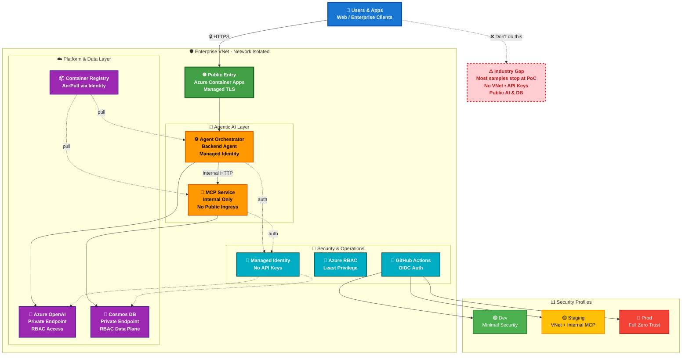

# Enterprise-Ready Agentic AI Architecture

**From prototype to production: a secure, end-to-end blueprint for agentic AI on Azure**

---

## What We Added

| Feature | Description |
|---------|-------------|
| ✅ End-to-end agentic AI reference architecture | Complete stack from MCP tools → Agent orchestration → Backend → Frontend |
| ✅ Enterprise security by default | VNet integration, private endpoints, zero-trust managed identity |
| ✅ No secrets, no public exposure | Internal MCP, RBAC everywhere, HTTPS ingress only |
| ✅ Production-ready automation | Terraform/Bicep IaC + GitHub Actions CI/CD with OIDC |

## Why It Matters

| Gap | Solution |
|-----|----------|
| ❗ Industry lacks clear guidance for enterprise-grade agentic AI | ✅ Repeatable, opinionated blueprint from Dev → Prod |

---

## Architecture Diagram

