# Enterprise-Ready Agentic AI  Workshop

**Build and deploy secure, end-to-end agentic AI solutions on Azure**

---

## Who Is This For

Infrastructure engineers and enterprise architects with in-depth Azure knowledge who need to deploy agentic AI in an enterprise-grade manner.

---

## What You'll Learn

- ✅ **End-to-end agentic architecture** — Database → MCP tools → Agent orchestration → Backend → Frontend
- ✅ **Your choice of IaC** — Bicep or Terraform, manual scripts or GitHub Actions
- ✅ **Modern identity principles** — OIDC for GitHub Actions, Managed Identity for Azure services (no keys)
- ✅ **Network isolation** — VNet with private endpoints, only frontend exposed to internet
- ✅ **Automated CI/CD pipelines** — GitHub Actions, parallel container builds, integration testing, multi-environment deployment
- ✅ **Enterprise-ready template** — Scalable, reusable blueprint for standalone or landing zone deployment

---

## Why It Matters

Most agentic AI samples stop at proof-of-concept — public endpoints, API keys, no network isolation. This workshop provides a **repeatable, production-ready blueprint** from Dev → Prod.

---

## Architecture Diagram

```mermaid
flowchart TB

    %% User / Client Layer
    User["👤 Users & Apps<br/>Web / Enterprise Clients"]
    User -->|"🔒 HTTPS"| FE["🌐 Public Entry<br/>Azure Container Apps<br/>Managed TLS"]

    %% Enterprise VNet Boundary
    subgraph VNET["🛡️ Enterprise VNet - Network Isolated"]
        direction TB

        %% Agentic AI Layer
        subgraph AGENTS["🤖 Agentic AI Layer"]
            BE["⚙️ Agent Orchestrator<br/>Backend Agent<br/>Managed Identity"]
            MCP["🔧 MCP Service<br/>Internal Only<br/>No Public Ingress"]
            BE -->|"Internal HTTP"| MCP
        end

        %% Platform & Data Layer
        subgraph PLATFORM["☁️ Platform & Data Layer"]
            AOAI["🧠 Azure OpenAI<br/>Private Endpoint<br/>RBAC Access"]
            COSMOS["💾 Cosmos DB<br/>Private Endpoint<br/>RBAC Data Plane"]
            ACR["📦 Container Registry<br/>AcrPull via Identity"]
        end

        %% Security & Ops
        subgraph SECURITY["🔐 Security & Operations"]
            MI["🎫 Managed Identity<br/>No API Keys"]
            RBAC["👥 Azure RBAC<br/>Least Privilege"]
            CICD["🚀 GitHub Actions<br/>OIDC Auth"]
        end

        %% Connections
        FE --> BE
        BE --> AOAI
        MCP --> COSMOS

        BE -.->|"auth"| MI
        MCP -.->|"auth"| MI
        MI -.-> AOAI
        MI -.-> COSMOS

        ACR -.->|"pull"| BE
        ACR -.->|"pull"| MCP
    end

    %% Environments
    subgraph ENV["📊 Security Profiles"]
        DEV["🟢 Dev<br/>Minimal Security"]
        STAGE["🟡 Staging<br/>VNet + Internal MCP"]
        PROD["🔴 Prod<br/>Full Zero Trust"]
    end

    CICD --> DEV
    CICD --> STAGE
    CICD --> PROD

    %% Guidance Gap
    GAP["⚠️ Industry Gap<br/>Most samples stop at PoC<br/>No VNet • API Keys<br/>Public AI & DB"]
    User -.->|"❌ Don't do this"| GAP

    %% Styling - Vibrant colors
    classDef user fill:#1976D2,stroke:#0D47A1,stroke-width:3px,color:#fff,font-weight:bold
    classDef entry fill:#43A047,stroke:#1B5E20,stroke-width:3px,color:#fff,font-weight:bold
    classDef agents fill:#FF9800,stroke:#E65100,stroke-width:2px,color:#000,font-weight:bold
    classDef platform fill:#9C27B0,stroke:#4A148C,stroke-width:2px,color:#fff,font-weight:bold
    classDef security fill:#00ACC1,stroke:#006064,stroke-width:2px,color:#fff,font-weight:bold
    classDef envDev fill:#4CAF50,stroke:#2E7D32,stroke-width:2px,color:#fff
    classDef envStage fill:#FFC107,stroke:#FF8F00,stroke-width:2px,color:#000
    classDef envProd fill:#F44336,stroke:#B71C1C,stroke-width:2px,color:#fff
    classDef gap fill:#FFCDD2,stroke:#D32F2F,stroke-width:3px,stroke-dasharray:5 5,color:#B71C1C,font-weight:bold

    class User user
    class FE entry
    class BE,MCP agents
    class AOAI,COSMOS,ACR platform
    class MI,RBAC,CICD security
    class DEV envDev
    class STAGE envStage
    class PROD envProd
    class GAP gap
```

